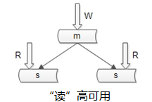
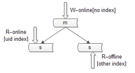

>[《数据库软件架构设计些什么》](https://www.w3cschool.cn/architectroad/architectroad-database-architecture-design.html)

-------

# 基本概念

### 概念一“单库”

### 概念二“分片”

分片解决的是“数据量太大”的问题，也就是通常所说的**水平切分**

一旦引入分片，势必有“数据路由”的概念，即哪个数据访问哪个库！

路由规则通常由3种方法：

* 范围：range
	* 优点：简单，容易扩展
	* 缺点：各库压力不均（新号段更活跃）
* 哈希：hash
	* 优点：简单、数据均衡、负载均匀
	* 缺点：迁移麻烦（2库扩展3库数据需要迁移）
* 路由服务：router-config-server
	* 优点：灵活性强，业务与路由算法解耦
	* 缺点：每次访问数据库前多一次查询

大部分互联网公司采用的方案二：哈希分库，哈希路由

### 概念三“分组”

分组解决“可用性”问题，分组通常通过主从复制的方式实现

互联网公司数据库实际软件架构是：又分片，又分组

# 数据库架构设计思路

数据库软件架构师平时设计些什么东西呢？至少要考虑以下四点：

* 如何保证数据可用性
* 如何提高数据库读性能（大部分应用是读多写少，读会先成为瓶颈）
* 如何保证一致性
* 如何提高扩展性

### 如何保证数据的可用性？

>解决可用性问题的思路是：冗余

如何保证站点的可用性？复制站点，冗余站点

如何保证服务的可用性？复制服务，冗余服务

如何保证数据的可用性？复制数据，冗余数据

>数据的冗余，会带来一个副作用：引发一致性问题

### 如何保证数据库“读”高可用？

冗余读库

冗余读库带来的副作用？读写有延时，可能不一致

上面这个图是很多互联网公司MySQL的架构，写仍然是单点，不能保证写高可用

### 如何保证数据库“写”高可用？

冗余写库

采用双主互备的方式，可以冗余写库

带来的副作用？双写同步，数据可能冲突（例如“自增id”同步冲突），如何解决同步冲突，有两种常见的解决方案：

* 两个写库使用不同的初始值，相同的步长来增加id：1写库的id为0、2、4、……；2写库的id为1、3、5、……
* 不使用数据的id，业务层自己生成唯一id，保证数据不冲突

58同城没有使用上述两种架构来做读写的“高可用”，58同城采用的是“双主当主从用”的方式

仍是双主，但只有一个主提供服务（读+写），另一个主是“shadow-master”，只用来保证高可用，平时不提供服务

master挂了，shadow-master顶上（vip漂移，对业务层透明，不需要人工介入）

这种方式的好处：

* 读写没有延时
* 读写高可用

缺点是：

* 不能通过增加从库的方式扩展读性能
* 资源利用率是50%，一台冗余主没有提供服务

那么如何提高读性能呢？进入第二个话题，如何提升读性能

### 如何扩展读性能？

提高读性能的方式大致有三种，第一种是建立索引。这种方式不展开，要提到的一点是：不同的库可以建立不同的索引

写库不建立索引

线上读库建立线上访问索引，例如uid

线下读库建立线下访问索引，例如time

第二种扩充度性能的方式是：增加从库，这种方法大家用的比较多，但是，存在两个缺点：

* 从库越多，同步越慢
* 同步越慢，数据不一致窗口越大

58同城没有采用这种方法提高数据库读性能（没有从库），采用的是增加缓存。常见的缓存架构如下

上游是业务应用，下游是主库，从库（读写分离），缓存

58同城的玩法是：服务 + 数据库 + 缓存一套

业务层不直接面向DB和Cache，服务层屏蔽了底层DB、Cache的复杂性。为什么要引入服务层，今天不展开。58采用了“服务 + 数据库 + 缓存一套”的方式提供数据访问，用Cache提高读性能

不管采用主从的方式扩展读性能，还是缓存的方式扩展读性能，数据都要复制多份（主 + 从、DB + Cache），一定会引发一致性问题

### 如何保证一致性？

主从数据库的一致性，通常有两种解决方案：

1.中间件

如果某一个key有写操作，在不一致时间窗口内，中间件会将这个key的读操作也路由到主库上

这个方案的缺点是，数据库中间件的门槛较高（百度、腾讯、阿里、369等一些公司有）

2.强制读主

58的“双主当主从用”的架构，不存在主从不一致的问题

第二类不一致，是**DB与Cache间的不一致**

常见的缓存架构如上，此时写操作的顺序是：

* 淘汰Cache
* 写数据库

读操作的顺序是：

* 读Cache，如果Cache hit则返回
* 如果Cache miss，则读从库
* 读从库后，将数据放回Cache

在一些异常时序情况下，有可能从【从库读到旧数据（同步还没有完成），旧数据如Cache后】，数据会长期不一致

解决办法是“缓存双淘汰”，写操作时序升级为：

* 淘汰Cache
* 写数据库
* 在经验“主从同步延时窗口时间”后，再次发起一个异步淘汰Cache的请求

这样，即使有脏数据和Cache，一个小的时间窗口之后，脏数据还是会被淘汰。带来的代价是：多引入一次读miss（成本可以忽略）

初次之外，58同城的最佳实践之一是：建议为所有Cache中的item设置一个超时时间

### 如何提高数据库的扩展性？

原来是Hash的方式路由，分为2个库，数据量还是太大，要分为3个库，势必需要进行数据迁移，58同城有一个很帅气的“数据库秒级扩容”方案

首先，我们不做2库到3库的扩容，我们做2库变4库（库加倍）的扩容（未来4->8->16）

服务 + 数据库是一套（省去了缓存），数据库采用“双主”的模式

扩容步骤：

第一步，将主库提升

第二步，修改配置，2库变4库（原来MOD2，现在配置修改后MOD4）

扩容完成

原来MOD2为偶的部分，现在会MOD4余0或2

原来MOD2为奇的部分，现在会MOD4余1或3

数据不需要迁移，同时，双主互相同步，一边是余0，一边余2，两边数据同步也不会冲突，秒级完成扩容

最后做一些收尾工作：

* 将旧的双主同步解除
* 增加新的双主（双主是保证可用性的，shadow-master平时不提供服务）
* 删除多余的数据（余0的主，可以将余2的数据删除掉）

这样，秒级别内，我们就完成了2库变4库的扩容
