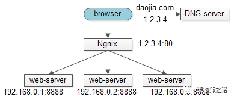
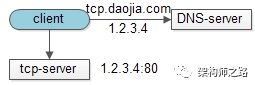
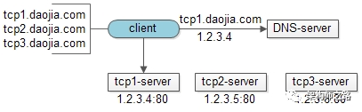
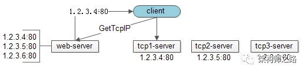
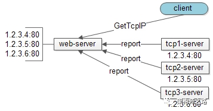
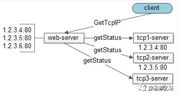

## tag

nginx tcp http 短连接 反向依赖 负载均衡 推 拉

## web-server的负载均衡

互联网架构中，web-server接入一般使用nginx来做反向代理，实施负载均衡。整个架构分为三层：

* 上游调用层：一般是brower或者APP
* 中间反向代理层：nginx
* 下游真实接入集群：web-server，常见web-server有tomcat、apache

整个访问过程如下：

* browser向daojia.com发起请求
* DNS服务器将daojia.com解析为外网IP(1.2.3.4)
* browser通过外网IP(1.2.3.4)访问nginx
* nginx实施负载均衡策略，常见策略有轮询、随机、IP-hash等
* nginx将请求转发给内网IP(192.168.0.1)的web-server

由于HTTP短连接，以及web应用无状态的特性，理论上任何一个HTTP请求落在任意一台web-server都应该得到正常处理（如果必须落在一台，说明架构 不合理，不能水平扩展）

问题来了，tcp是有状态的连接，客户端和服务端一旦建立连接，一个client发起的请求必须落在同一台web-server上，此时如何做负载均衡，如何保证水平扩展呢？

## 单机法tcp-server

单个tcp-server显然是可以保证请求一致性：

* client向tcp.daojia.com发起TCP请求
* DNS服务器将tcp.daojia.com解析为外网IP(1.2.3.4)
* client通过外网IP(1.2.3.4)向tcp-server发起请求

方案的缺点？

无法保证高可用

## 集群法tcp-server

通过搭建tcp-server集群来保证高可用，客户端来实现负载均衡：

* client内配置有tcp1/tcp2/tcp3.daojia.com三个tcp-server的外网IP
* 客户端通过“随机”的方式选择tcp-server，假设选择到的是tcp1.daojia.com
* 通过DNS解析tcp1.daojia.com
* 通过外网IP连接真实的tcp-server

**如何保证高可用性？**

如果client发现某个tcp-server连接不上，则选择另一个

**潜在的缺点**

每次连接前，需要多实施一次DNS访问：

* 难以预防DNS劫持
* 多一次DNS访问意味着更长的连接事件，这个不足在手机端更为明显

**如何解决DNS问题？**

直接将IP配置在客户端，可以解决上述两个问题，很多公司也就是这么做的（俗称“IP直通车”）

**“IP直通车”有什么新问题？**

将IP写死在客户端，在客户端实施负载均衡，扩展性很差：

* 如果原有IP发生变化，客户端得不到实时通知
* 如果新增IP，及tcp-server扩容，客户端也得不到实时通知
* 如果负载均衡策略发生变化，需要升级客户端

## 服务端实施负载均衡

只有将复杂的策略下沉到服务端，才能根本上解决扩展性的问题

增加一个http接口，将客户端的“IP配置”与“均衡策略”放到服务端是一个不错的方案：

* client每次访问tcp-server前，先调用一个新增的get-tcp-ip接口，对于client而言，这个http接口只返回一个tcp-server的IP
* 这个http接口，实现的是原client的IP均衡策略
* 拿到tcp-server的IP之后，和原来一样想tcp-server发起TCP长连接

这样的话，扩展性的问题就解决了：

* 如果原IP发生变化，只需要修改get-tcp-ip接口的配置
* 如果新增IP，也是修改get-tcp-ip接口的配置
* 如果负载均衡策略发生变化，需要升级客户端

然而，新的问题又产生了，如果所有IP放在客户端，当有一个IP挂掉的时候，client可以再换一个IP连接，保证可用性，而get-tcp-ip接口只是维护静态的tcp-server集群IP，对于这些IP对应的tcp-server是否可用，是完全不知情的，怎么办？

## tcp-server状态上报

get-tcp-ip接口怎么知道tcp-server集群中各台服务器是否可用呢？tcp-server主动上报是一个潜在方案，如果某一个tcp-server挂了，则会终止上报，对于停止上报状态的tcp-server，get-tcp-ip接口将不返回给tcp-server的外网IP

**该设计的存在的问题？**

诚然，状态上报解决了tcp-server高可用的问题，但这个设计犯了一个“反向依赖”的耦合小错误：使得tcp-server要依赖于一个与本身业务无关的web-server

## tcp-server状态拉取

更优的方案是：web-server通过“拉”的方式获取各个tcp-server的状态，而不是tcp-server通过“推”的方式上报自己的状态

这样的话，每个tcp-server都独立与解耦，只需专注于资深的tcp业务功能即可

高可用、负载均衡、扩展性等任务由get-tcp-ip的web-server专注来执行

多说一句，将负载均衡实现在服务端，还有一个好处，可以实现异构tcp-server的负载均衡，以及过载保护：

* 静态实施：web-server下的多个tcp-server的IP可以配置负载权重，根据tcp-server的机器配置分配负载（nginx也有类似的功能）
* 动态实施：web-server可以根据“拉”回来的tcp-server的状态，动态分配负载，并在tcp-server性能急剧下降时实施过载保护

## 总结

**web-server如何实施负载均衡？**

利用nginx反向代理来轮询、随机、ip-hash

**tcp-server再怎么快速保证请求一致性？**

单机

**如何保证高可用？**

客户配置多个tcp-server的域名

**如何防止DNS劫持，以及加速？**

IP直通车，客户端配置多个tcp-server的IP

**如何保证扩展性？**

服务端提供get-tcp-ip接口，向client屏蔽负载均衡策略，并实施便捷扩容

**如何保证高可用？**

tcp-server“推”状态给get-tcp-ip接口

或者

get-tcp-ip“拉”tcp-server状态

## 反思

我做的黄金多进程报盘、进程化框架共享内存改造，其多进程之间的交互逻辑看起来和这种负载均衡策略有些类似，只是在本机上、且规模小而已
