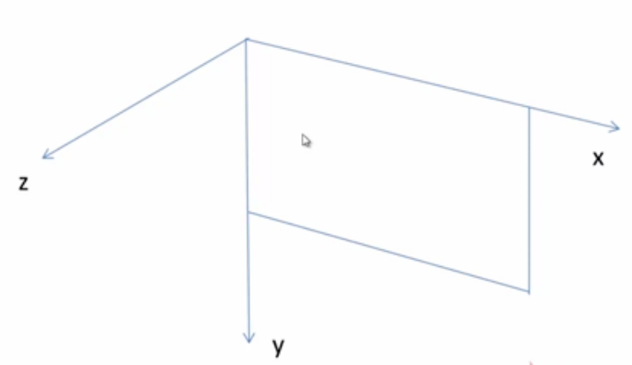
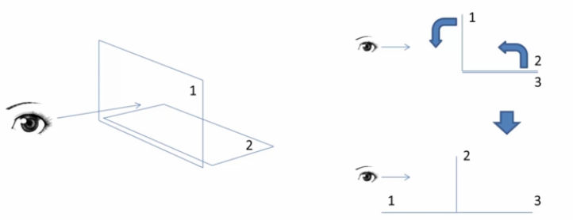

## 说明

使用CSS3 创建一个3D 的动画效果。以前，网页设计主要是基于平面进行设计的，但自从HTML5 以及CSS3 横空出世之后，前端工程师也可以作出三维动画效果了

>其中也有涉及到JavaScript的代码，目前对其的掌握很浅显、很初步！还有很多需要学习的！

>本次练习使用的浏览器是Chrome，暂时没有做兼容其他浏览器的考虑

>通过HTML 的练习，对于理解HTTP、网络都是很有帮助的！

>本次练习中对于div 元素的组织比上一个《CSS3扁平化博客》练习的代码要更清晰、易管理

## 使用transition创建一个简单的动画效果

CSS3 中动画的功能可以使用以下两种方式实现

* transition：从一个属性值平滑地过渡到另一个属性值
* animation：通过关键帧的技术在网页上产生更加复杂的动画效果

```
transition: <过渡属性名称> <过渡时间>;
```

或者分开设置

```
transition-property: <过渡属性名称>;
transition-duration: <过渡时间>;
```

不同浏览器的差异，所以实际开发中需要考虑不同浏览器的兼容性：

* Chrome、Safari：-webkit-transition
* FireFox：-moz-transition
* Opera：-o-transition

本次练习中暂时不考虑不同浏览器的兼容性，只用Chrome 浏览器进行实验：01-transition-chrome.html 实现一个颜色渐变的练习实例

## transition扩展了解

**transition对多个属性做过渡效果**

方法一

```
transition: <过渡属性名称1> <过渡时间1>, <过渡属性名称2> <过渡时间2>;
```

方法二

```
transition: <过渡属性名称1> <过渡时间1>;
transition: <过渡属性名称2> <过渡时间2>;
```

**transition的第三个属性值**

```
transition: <过渡属性名称> <过渡时间> <过渡模式>;
```

或者

```
transition-timing-function: <过渡模式>;
```

取值

* ease：缓慢开始，缓慢结束。默认值
* linear：匀速
* ease-in：缓慢开始
* ease-out：缓慢结束
* ease-in-out：缓慢开始，缓慢结束（和ease稍有区别）

相关的练习在02-transition-timing-function.html 中

## 使用CSS3搭建一个简单的动画场景

平常在浏览器中我们看到的就是一个平面的效果，要想实现3D 效果，就需要增加一个维度，也就是在原来的长和宽的基础上增加一个深度（相对于屏幕平面的深度）

* 使用perspective、perspective-origin 属性创建一个三维场景
* 使用transform 属性对三维空间的物体进行变换操作，translate、rotate

**设置3D场景，主要针对Chrome 浏览器**

```
-webkit-perspective: 800;		/*物体具体屏幕的距离*/
-webkit-perspective-origin: 50% 50%;	/*设置视点在屏幕的X、Y轴的位置*/
```


这样就告诉了浏览器我们要如何看浏览器中的世界

**使用transform 属性调整元素**

```
/*告诉浏览器之后要做的transform 的操作是在3D 场景设置，而不是在2D*/
-webkit-transform-style: -webkit-preserve-3d;

/*位移操作：x, y轴是浏览器所在的平面，z轴从屏幕冲向我们的*/
translateX(xpx)
translateY(ypx)
translateZ(zpx)

/*旋转操作*/
rotateX(xdeg)
rotateY(tdeg)
rotateZ(zdeg)
```



相关的练习在03-transform-rotate.html、04-transform-rotate.html 和05-transform-transform.html 中

主要的动态效果都在04-transform-rotate.html 和05-transform-transform.html 中，注意目前的代码只在Chrome、Safari 浏览器有效，未对其他浏览器做兼容！

**使用transform-origin调整旋转中心**

默认情况下，旋转操作的中心就是物体的正中心，不过这个是可以改变的


## 结合上面几部分创建3D动画效果



* 先用HTML 搭建好页面的基本骨架
* 再用CSS 填充基本的样式
* 然后用JavaScript 实现一些动态变化效果

对应的练习代码在 06-3d-practice.html

