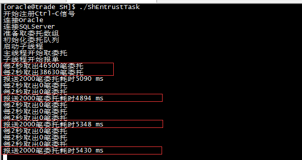
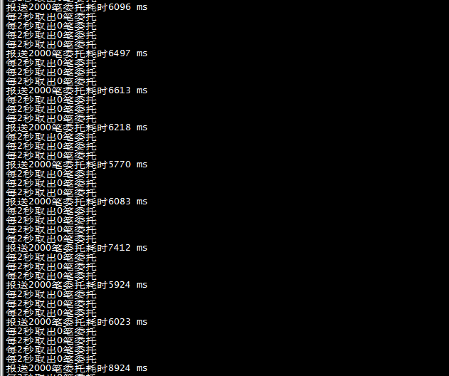
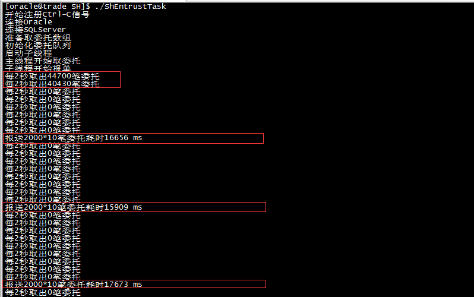
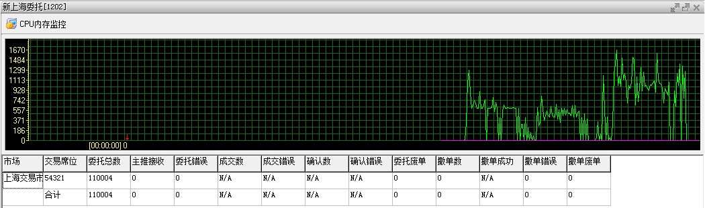

实现程序从Oracle中取数据，然后写到SQL Server中

和Oracle交互的部分使用Proc程序开发实现，相关语法参见：[《Linux下进行Proc开发》](http://www.xumenger.com/linux-pc-20170516/)

和SQL Server的交互部分使用freetds开发实现，相关语法参见：[《Linux下使用FreeTDS访问MS SQL Server 2005数据库(包含C测试源码)》](http://blog.csdn.net/zhangm168/article/details/6859112)

## 队列数据结构实现

因为多线程之间需要通过队列来传递数据，所以我先实现了一个基础的队列数据结构

不加锁队列的运行性能大概这样


加锁队列的运行性能大概这样


## 编译运行程序

直接make编译程序，不过因为我的环境设置问题，需要用root编译程序

接下来运行程序，因为要访问Oracle数据库，使用的Oracle用户也是在linux的oracle用户下创建的，所以运行程序需要用oracle用户。当然这些是和Linux的权限管理有关，这里只是简单提一下

运行程序的效果大概是这样的！



Proc取委托性能超好，2W笔/s；但是报单到SQL Server就比较慢了，单线程、单表、每次insert一笔大概也就是400笔/s

而且报单的速度越来越慢



## 修改一下程序，每次批量insert 10笔

修改程序（详细看代码）每次insert10条记录到SQL Server数据库，每2000*10笔耗时16.5s左右



程序持续运行，性能还算是稳定


## Windows下写SQL Server的性能

Windows下现有的程序测试一下写SQL Server的性能，同样只配置为单线程、单表。下面这种是使用绑定变量法、每次insert 10条的性能，最好也就1600左右，但是很不稳定，一般也就在900这样（当然可能我现在的Windows机器性能本身比不上Linux也会有影响！）



>综上，Linux下使用freetds写SQL Server的性能完全可以替代现有的Windows Delphi ADO写SQL Server的程序！

## 待完善

另外还有一个问题，为什么Proc执行的更新语句最终在PLSQL中查看数据并没有更新（但是Proc更新的返回值显示确实是更新了的？！）！Why？！

现在队列、链表的实现，稳定程度还是不够！

freetds有没有绑定变量法？

## 补充

SQL Server建表语句

```
USE [oiw03]
GO

/****** Object:  Table [dbo].[ashare_ordwth]    Script Date: 2014-11-24 19:59:01 ******/
SET ANSI_NULLS ON
GO

SET QUOTED_IDENTIFIER ON
GO

SET ANSI_PADDING ON
GO

CREATE TABLE [dbo].[ashare_ordwth](
	[rec_num] [int] NOT NULL,
	[date] [char](8) NULL,
	[time] [char](8) NULL,
	[reff] [char](10) NULL,
	[acc] [char](10) NULL,
	[stock] [char](6) NULL,
	[bs] [char](1) NULL,
	[price] [char](8) NULL,
	[qty] [char](8) NULL,
	[status] [char](1) NULL,
	[owflag] [char](3) NULL,
	[ordrec] [char](8) NULL,
	[firmid] [char](5) NULL,
	[checkord] [binary](16) NULL,
	[branchid] [char](5) NULL,
 CONSTRAINT [PK_ordwth] PRIMARY KEY CLUSTERED 
(
	[rec_num] ASC
)WITH (PAD_INDEX = OFF, STATISTICS_NORECOMPUTE = OFF, IGNORE_DUP_KEY = OFF, ALLOW_ROW_LOCKS = ON, ALLOW_PAGE_LOCKS = ON) ON [PRIMARY]
) ON [PRIMARY]

GO

SET ANSI_PADDING OFF
GO
```
