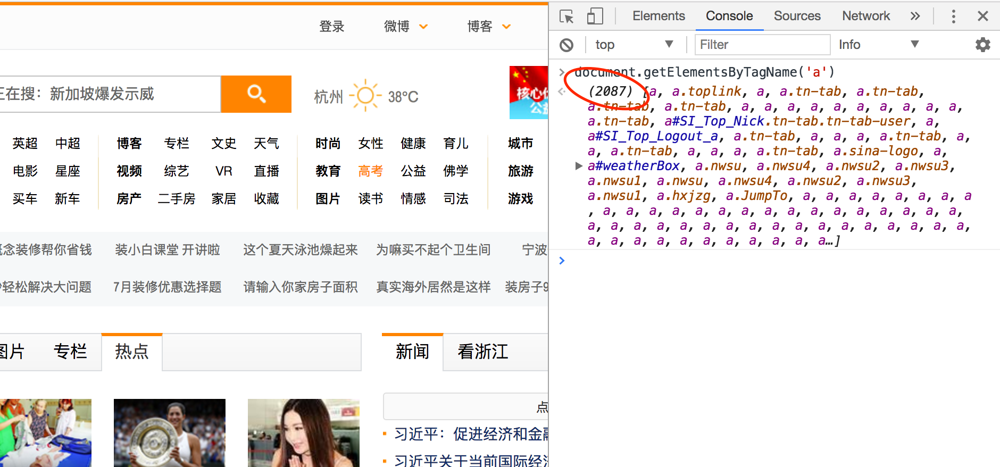
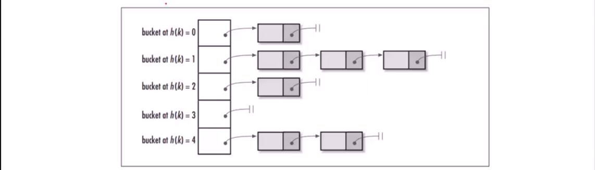

何谓大数据？！

自己平时做过各种乱七八糟的联系也挺多的，但细想想都是一些本地化的、玩具性的程序，自己一个人玩玩还行，可是一旦针对同样的功能将数据量扩大100倍、1000倍、10000倍……那么这些玩具程序在功能、性能上可能都完全无法适应了，这就是程序的可扩展性很差，也说明其完全没有应对大数据的能力

多少数量级才是大数据？100W？1000W？1WW？10WW？……

我之前做过一个简单的爬虫框架，实现了对我的个人网站[www.xumenger.com](www.xumenger.com)的爬取功能

* 网页下载使用的是Python自带的urllib
* 网页解析使用的是Python自带的正则表达式模块
* URL判重使用的是Python自带的集合set
* URL调度使用的是Python自带的队列

想想我的个人网站，也就400篇文章不到，所以以上所有的东西都直接在内存中处理完全没有问题

但是想想一个大型化的网站呢？

就如[新浪首页](www.sina.com.cn)，光这个首页就有2000多个子URL



就拿URL的判重这个步骤来说，假如每个URL有16Byte，那么2000个就有32KB，所以如果还是存储在Set里面，那么光这一个网页就要耗费掉32KB，那继续爬10000个网页呢，那就要320MB……

而互联网上的数据和网页绝对不止10000这个级别，那么用这种方式很容易就把内存刷爆了

好，直接用内存不行，那么我用数据库呢？

一个网页有2000个URL，那么为了判重，解析每个网页的2000个URL后，必需首先执行2000次select判断是否已经存在于数据库中，另外没有存储的还要insert到数据库中，那查询要2000次，插入在最坏的情况下也要2000次

单纯的处理这1个页面，就需要大量的数据库操作，很明显是极其耗时的，那么试想要处理上万、上千万的网页，那个时间的耗费将是个什么程度啊！

>这还只是大数据下的一个简单的场景而已！

## 有什么好的解决方案呢？

可以将URL通过MD5单向哈希之后（得到一个16字节的数据），或其他单向哈希方式，再保存到Set或数据库

或者使用Bit-Map方法。建立一个BitSet，将每个URL通过一个哈希函数映射到某一位

MD5签名是一个哈希函数，可以将任意长度的数据量转换称为一个固定长度的数字（通常是4个整形，128位）。计算机不可能有2^128这个大的内存，因此实际的哈希表都会是URL.MD5再%n（即取模）。现实世界的URL组合必然超越哈希表的槽位数，因此碰撞是一定存在的，一般的Hash函数，例如Java的HashTable是一个Hash表再跟上一个链表，链表里存的是碰撞结果



所以使用Bit-Map存储的话，就要求有足够大的内存来放Bit-Map，否则碰撞的概率会很高！

比如有2个桶，3个URL，URL1放到桶1中，URL2放到桶2，那么URL3经过计算Hash值，要放到桶2中，结果发现桶2中已经有数据了，就会误以为URL3已经处理过了，如此就可能出现漏处理URL的情况！

## 如何提高效率

评估网站的网页数量，比如通过百度，可以在搜索框中输入`site: www.mafengwo.cn`查看马蜂窝这个网站的大概网页数


>这个信息对于评估爬虫的工作量、评估需要处理的数据量很有用！

选择合适的Hash算法和空间阀值，降低碰撞几率

选择合适的存储结构和算法

比如评估，网站A有3000W个网页，那么我给3000W个桶，最理想状态其是不会发生碰撞的，但是还是存在可能性，那么我把间距再拉大30倍，给90000W个桶，这样的碰撞概率就会更低

给一个简单的Python代码实现

```
from bitarray import bitarray
import mmh3

offset = 2147483647 // 2^31 - 1
bit_array = bitarray(4*1024*1024*1024)
bit_array.setall(0)

b1 = mmh3.hash(url, 42) + offset
bit_array[b1] = 1
```

当然绝对还有更好的处理方案，这些我会在后续的学习中继续整理，比如Bloom Filter等更好的算法

单机版本的话使用HashSet、Bloom Filter可以有效的使用内存并提升性能；如果是多机分布式的话，可以使用Redis来实现！

>如何在数据量极大的情况下保证内存的合理使用、运行的性能足够高、再扩大数据后的如何能尽可能简单的实现扩展，这些都是更为核心和重要的部分！

爬虫这个技术本身也比较特殊，如果有100W个网页，你重复抓取了其中的100个、或者漏了100个，那么对整体的大数据的影响是很小的。具体可容忍的出错率还是要看具体的项目要求

