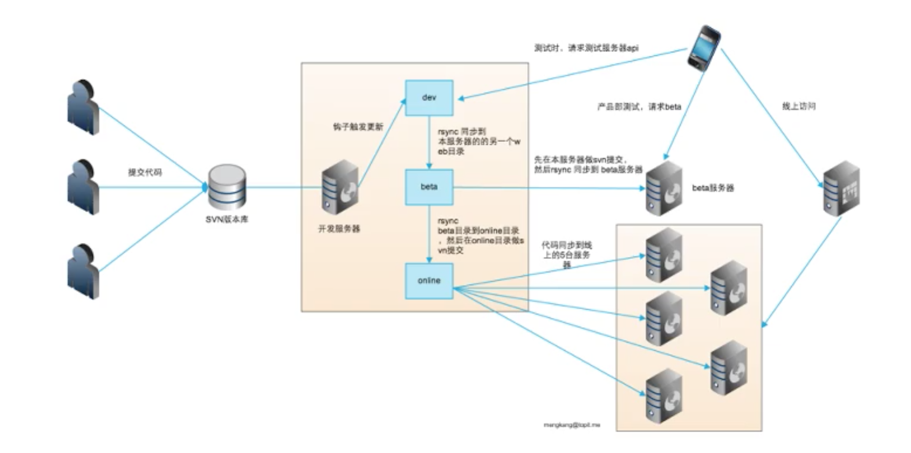

购买的segmentfault的课程[亿级 pv 网站架构的技术细节与套路](https://segmentfault.com/l/1500000009978736/play)

我现在是很希望在分布式爬虫、数据分析、大型网站架构、大数据高并发处理方面能开始进行开发和研究，但无奈几乎没有经验，所以现在是只要有相关的资料、文章、视频等，无论质量，我都会首先去先进行了解、学习，其质量问题在后续再思考，现在主要是为了开眼界、长见识，购买此课程也是一样的道理，希望通过本课程了解到一些不一样的东西，至少可以指导我下一步具体的开发实践计划

PV(page view)即页面浏览量，通常是衡量一个网站的主要指标。来自浏览器的一次HTML内容请求会被看作一个PV，逐渐累计成为PV总数

## 后端架构的套路

比如一个简单的场景：现在要访问一个网站，这个网站有Web浏览、登录、附件上传的功能。最开始的时候可能会将这3个功能都做在一个集群上，如果用户在上传附件的时候很卡，那么新进来的请求就会导致Web访问、登录等功能都特别卡，会出现阻塞等待等问题。用户在登录的时候往往会加载一些冷数据，比如一个用户1年没有登录了，系统在他没有登录期间也不能一直缓存其数据，只有在他下次登录的时候才会把他的数据从数据库拉到Redis或其他容器中，这个过程其实也是很耗时的；或者用户第一次注册，那么他的第三方头像等信息需要进行抓取存到我们的服务器上，这些都是非常耗时的！

所以我们要将这些有可能导致服务特别卡的、网络IO阻塞的东西解耦出来，一方面加快网络的访问，保证了大部分读服务的正常进行。下面就是一种解耦方式，将三个不同的功能拆分出来，不过session通过Redis实现共享

为什么要业务拆分：

* 各请求耗时不一样，防止请求阻塞
* 功能属性、登录重启冷数据、重组feed流，计算密集；上传文件IO密集
* 不同的功能模块出现问题了，也方便问题的定位和排查
* 不过代码不一定要拆分，比如上传时会调用用户信息，Web浏览时也会调用用户信息，所以这部分可以封装为公共模块，供其他各个功能部分进行调用

下面继续介绍一种后端架构常见的套路：负载均衡、动静分离、读写分离、缓存、分布式

用户在访问网站的时候，首先通过负载均衡或反向代理到达动态Web集群。读的服务先通过分布式缓存到达一个个缓存，如果命中则从缓存中获取数据，否则从分布式数据库中获取；写服务直接落到数据库，数据库会分为多个库，先写到某个主库，然后由主库来同步到各个从库，再同步到缓存。这是负载均衡的架构

上面介绍的负载均衡对应上图的左边部分。整个大图是一个动静分离的架构，左边的负载均衡是动态内容的访问逻辑，右边是静态内容的访问逻辑。用户访问的都是CDN的边缘节点，然后再请求服务商的多级缓存，最后是请求我们自己的分布式存储。因为如果是边缘节点直接请求我们自己的存储的话，可能会导致在某些CDN失效的情况下，所有的请求都落到我们自己的分布式存储上，IO就会很高。所以一般服务商在中间做一个代理！

问题：什么叫集群、分布式，分布式和集群的区别？

* 集群是物理形态，分布式是工作方式
* 只要一堆机器放在那里，就是集群。比如nginx后面的10台web服务器
* 分布式将任务放在多个物理隔离的节点上进行
* 分布式中各个子节点互不通信，统一受管控中心管理调度。比如各个后端服务器它们是不会进行通信的，但是它们受nginx调度，比如权重、如果某个挂掉了能即使被nginx剔除
* 分布式管控中心指定路由、负载均衡，发现并剔除故障设备，方便扩容。比如当前负载过高，可以很方便的增加一台服务器来均衡负载

实践举例：实现一个分布式服务器

写操作主库，然后通过BinLog同步到线上的从库；读操作全都读线上的从库；还有一个专门运算统计专用的从库

还是基于上图中的数据库情况，有多个数据库数据库（作为主从数据库，同步存储相同的数据），比如请求TUSER这张表，它在经过一个代理之后去读这些数据库中的数据。怎么做到自动把压力分配呢？发现了一些故障怎么将对应的数据库剔除呢？

有一些比较简单的方案，比如每分钟收集一次从库的负载，或者线程数据，通过一些Linux命令、数据库命令可以监控系统负载情况（CPU、线程、内存、数据库锁等），如果某个机器的负载特别高，那么就降低分配到该机器的请求数，让其他的机器协助分担一些请求处理；比如某台数据库服务器阻塞的很严重，出现了严重的死锁，那么就可以将其从服务器链表中摘除，后续的请求将不再分配到该服务器，等到处理完该服务器的死锁后，再将其添加到分布式系统中

一些典型的面试题：

* 如何保证读写分离
    * SQL预处理，如果是select则是读，如果是insert、delete、update则是写。这是代码层面的判断 
    * 账户权限配置，从库操作账户只拥有读权限
* 数据库服务器负载高，如何排查如何解决
    * `mysql -uroot -e "show processlist;" |grep -i 'delete'|awk '{printf "mysql -uroot -e \"kill %d;\"",$1}'|sh`
    * 如果现在数据库锁住了，那怎么快速的把这台机器的负载降低呢？
    * 一般锁表了都是相同的问题，比如在删除一个东西、查询一个东西，可以将SQL语句中的关键字打印出来，获取MySQL任务号，执行kill将所有的阻塞任务处理掉了
    * 记得检查分析MySQL慢日志，不能说现在暂时解决问题就把问题解决了，要分析问题的产生场景，保证后续在相同场景再出现的时候能避免

扩展学习：

* 自己动手使用BinLog实现数据库主从的同步
* 搞高并发，把多个数据库中的一个或几个搞崩，研究如何实现快速切换、快速恢复、自动摘除
* 搭建一个分布式系统，MySQL、Redis、nginx的应用
* 在压力下，让MySQL死锁，练习如何解锁、如何分析慢日志
* CDN切片会常在面试中提到：https://mengkang.net/641.html
* 搭建分布式系统，实现服务器的动态随意添加和摘除，而不影响现有系统的工作

## 架构和性能优化的核心原则

* 分离
    * 动静分离
        * 静态资源、动态页面的分离
        * 比如一个页面上有很多静态图片、动态数据、静态js、静态css。图片一般会用CDN，但静态资源在使用域名的时候，也要尽可能多的将它切片（不要用一个静态域名，而是多个静态域名），因为浏览器它会有一些限制，它会限制同一个域名下的同步请求数，比如这4张图片用一个域名，另外4张图片用另一个域名，这样可以让浏览器更快的同步请求静态资源
        * 推荐：雅虎军规29条
        * 数据库字段的动静分离
    * 读写分离
        * MySQL主从
        * NoSQL主从，比如Redis主从
    * 业务分离
        * 数据分库，比如表1、2放在数据库服务器A1、A2、A3主从上，表3、4放在数据库B1、B2、B3主从上。当然这种将不同的表分在不同的数据库上会导致联合查询出现问题，但毕竟鱼和熊掌不可兼得
        * 集群分离
        * 服务化。比如上面提到的将登录、文件上传、web浏览分服务
* 分层
    * 硬件部署的分层：比如从前端进来，先经过Nginx，再经过Web服务器，再经过缓存服务器，再经过数据库服务器
    * 业务代码分层，比如MVC模型
    * 数据分层：多级缓存、CDN
* 分布
    * 分布式数据库
    * 分布式缓存
    * 分布式存储
    * 分布式计算

>很多人在面试时候就是以一种整天写增删改查功能的状态来准备的，完全不是一种学习、思考、总结、实践的状态，而是一种重复工作的状态

## 服务治理的实现

什么是服务治理？服务治理是如何出现的？为什么需要服务治理？

推荐文章[《我们坐在高高的谷堆上面听康哥讲 - 服务治理》](https://segmentfault.com/a/1190000010224335)

假如最开始京东是由我来开发的，最开始可能就像EasyShop这样的购物网站，由A团队迭代开发，突然有一天发现，我们需要和用户打成一片，需要一个社区，最粗暴的解决方法就是招兵买马招聘一个B团队开发BBS。那BBS也需要用户登录，我们不能再重复劳动去开发一个新的用户系统吧，所以我们需要调用A团队的接口

随着业务的发展，账号体系越来越复杂，账号要做社交网站账号绑定、邮箱绑定、手机号登录、会员等级等等，这时候就需要将账号体系单独提取出来

所以当在系统开发的过程中，某个部分变的越来越大、越来越复杂，那么就需要将这部分拆分出来。比如上面将账号体系拆分出来！

同样的像订单服务、客服服务等都有必要拆分出来。比如对于订单系统而言，我们知道每个公司的财务要是透明的，年底好结算，所以所有的订单不管有多少个销售渠道，不管是京东电器，还是京东药房，还是京东图书都希望将订单落到一个系统中，那么就需要对这些都统一调用一个服务的接口，不能每个销售模块都开发自己的订单系统！所以订单服务就会独立出来！

但是服务在运行的过程中一定会出现这样那样的问题，比如某一天订单服务突然挂了，所有人都不知道，那么APP A在调用订单服务的时候卡死了，APP B在调用订单服务的时候同样也卡死了……

所以可能会出现某个公共服务一旦出现问题，就会影响所有调用该服务的模块！

那么怎么解决这个问题呢？于是可能APP A开发一个针对订单服务的监控，每分钟访问一次，检查其是否可用，如果服务挂了，那么就把服务不可用的状态先缓存住，在不可用的状态下一直抛异常，然后继续每分钟检查，直到什么时候其可用了再去继续调用

>很多时候，不要怕抛异常，高效的使用异常机制可以让服务器快速地响应！而不是一直阻塞

但是APP B同样也需要做一套；APP C也需要做一套……明显又是一种重复的冗余的工作！

还有可能出现这样的情况，订单系统的IP换了，那么需要告诉所有调用它的程序：我的IP换了，你们都更新一下！这样所有调用这个服务的程序都需要更新代码或配置文件；或者哪天订单系统要压测，需要告诉所有调用的程序：不要调用我的192.168.1.1了，都去调用我的192.168.1.2，这样又得改

所以就想到上面这些修改的东西能不能自动化的完成，或者由订单服务自己实现，而不要影响我们所有调用订单服务的程序？

这个时候就促使了服务治理的过程！

订单服务就是服务的提供者，所有调用订单服务的都是服务的消费者！现在的服务治理逻辑大概如下：

* 订单服务启动后，告诉注册中心，我的IP是多少，调用的端口是多少？当然它不只有一台服务器，它会将所有的服务器信息告诉注册中心
* 服务消费者启动的时候订阅注册中心
* 然后注册中心就会将服务的IP、端口信息推送给订阅了的服务消费者。可能会推送给它多个IP端口，服务消费者就会选择其中一台服务器，建立长连接，和服务提供者之间走自己的通信协议（RPC请求）
* 一个完善的服务治理系统还需要一个监控中心，监控服务接受了多少请求、请求的处理速度等元数据

负载均衡也是我们治理的一个方面，比如上图中提到的：接口路由配置、方法路由配置、参数路由配置。比如我们对A服务做了接口路由的配置，它有两台服务器，我们希望调用A服务的时候都路由到服务器1，那么治理中心就会告诉注册中心，当注册中心推送给消费者的时候，就只推送服务器1的信息；所谓的同机房规则，就是比如我这个服务在北京部署了服务器，上面有一套代码，在杭州部署了服务器也有一套代码，现在有一个消费者在北京，那么在路由的时候还要路由到杭州吗，显然应该路由到北京，那么在调用的时候，注册中心应该返回北京服务器的信息

>其实并不是服务的自动发现，本质就是在服务启动的时候，服务连接到注册中心，将服务的端口信息告诉注册中心，并不是注册中心自动发现服务！

**练习题目**

* 搭建一个服务治理系统，运用到Web系统中
* 针对本节介绍的服务治理框架，可以参考这个框架自己实现一个服务治理程序
* 服务提供者和服务消费者之间通过RPC进行请求应答。RPC简单的理解就是定义一份网络协议，供某种场景下使用，比如我在报盘开发中常用到的，定义头和体，头固定长度，头里面存储体的长度，这样就可以在Socket通信时知道自己要读多少字节的内容才能读到完整的信息。所以RPC就可以理解为一种通信协议，我在报盘开发中接触的FIX、Binary等各种协议，所以这部分我是很熟的，只是第一次看到RPC这个新名词有些困惑而已，不过是对一个熟悉领域的新包装而已，本质上的东西我在现在工作中用的还是很多的！

## 日志收集与分析

日志在整个架构中是极其重要的。简单有以下这些分类

比如监控日志，采集CPU负载、采集网络负载、采集IO等信息

比如某个文章在被删除的时候对是谁、在什么时候删除了这篇文章进行记录，那么后续在需要的时候查文章被谁删除的等都会很容易！

比如在写博客的时候，阿里有一个服务叫做高防，有可能用户在写博客的时候还没有提交表单呢就出现了异常，这时候高防必需要做文件的备份，用户写文章找不到了，博客系统还没有接收到，那么就去高防那里要数据

在一个大型的Web系统中，知道各种资源是否还在被使用的信息很重要，比如我想知道磁盘中的一些文件还有没有被使用，那么就可以在AJAX中记录日志，看还有没有对这个磁盘中文件的调用等

记录用户购买行为、点击行为，然后针对性的进行个性化推荐等

什么是运营的埋点？打个比方，我现在在segmentfault上发起直播，我想在后续推广我的直播，那我就需要知道用户是通过哪个渠道报名的，就需要进行运营埋点，看用户是通过微信，还是通过微博，还是哪个途径过来的。需要统计有哪些用户点击了、有哪些用户报名了、用户是在哪里点击的、用户在微信/微博等各个渠道点击后的转化率（也就是有多少人付费了）……这些对于运营、宣传、做产品是极其重要的！

>日志极其重要，尤其是对于一个企业级的网站，一旦出现问题，那么日志就是唯一的排查手段！这是一个健壮的系统必需有的部分！

>就现在的工作而言，进行转换机开发的时候就必须对委托数据进行日志记录，一旦出现问题就必须通过日志来进行排查了！

**练习题目**

* 日志分析也是在面试中的一个重点
* nginx日志怎么看？怎么分析？
* redis日志怎么看？怎么分析？
* mysql日志怎么看？怎么分析？
* awk、正则表达式、grep、sort、sed等工具的使用。整理到\_Manual中

## 完善的监控系统

老牌的监控系统：zabbix

现代监控：grafana+influxdb。https://mengkang.net/836.html

现在在恒生，报盘上的监控界面不就是一种简单的监控吗？还有风控参数的监控也是一种。Windows资源管理器的CPU、内存、网络、IO统计就是一种对操作系统的监控

对于一个完善的Web系统需要监控哪些数据？

* 系统层：CPU、内存、负载、网卡、IO
* 应用层：QPS、API响应时长、Redis内存使用量、队列任务数、进程数、MySQL线程数
* 健康巡查：dns解析、IP是否访问、硬盘、各种基础服务

怎么进行优化、怎么做服务稳定性的保障？其实都是建立在通过监控拿到第一手系统信息的情况下才能继续进行下一步的分析。假如Redis的内存你不监控，最后内存满了，不停的刷新缓存，缓存被不停的更新，那还有缓存的意义吗？比如裁剪图片，用户上传的图片已经上传完了，但他的小图一直没出来，任务队列一直阻塞，如果你不加监控，这些遗留的潜在的问题你可能不能马上发现，但极有可能造成血崩！还有像API响应时间，这个很重要，你可以有多种方法监控，或者在业务逻辑里面加代码，或者通过session、分析nginx日志得出响应时间信息

尤其是在快速迭代的过程中，你很可能就忘记关注SQL的优化，你今天加了个索引，明天运营又需要改需求，很可能就忘记了，因为不可能保证表总是建的非常的好！所以通过实时监控就容易发现因为自己的疏忽导致的性能下降等问题，以快速解决！

**练习题目**

* 搭建一套监控系统，使其运行起来
* 怎么查看mysql的线程数
* 怎么查看Redis内存

## 分布式计划任务的实现

比如我们现在要做一些计划式任务，最开始可能就是最简单的在服务器上不停的添加，当一台服务区不能支撑了，就在另一台服务添加……

最后我们想要找到某个服务到底在哪个服务器上，都可能无法找到！

所以最好的方式就是将各个任务分布到各个服务器，并且有一个中心可以进行管控（其实分布式并不是什么高大上的技术，分布式就是各个节点之间不通信，然后由一个master管理各个节点、将任务分发给它们）

可以通过一个MySQL，记录命令、服务器的IP、服务器执行的时间周期，然后在每台服务器上只运行一个脚本，然后这个脚本不停的检测这一分钟有哪些任务需要执行，还检测这个任务的IP是不是当前的IP，不停的判断，以在每台服务器上执行各个任务。这样既能保证服务的可控、后台又能清晰的看到服务的调度情况

为什么这么多计划任务服务器？

* 一台服务器多个用处，比如一台lvs的备用机平常只是用做容灾的作用，这时候可以用来做存储、做缓存、做计划任务，不能让它只是作为一个备用机，一天到晚不干活
* 不要因为是后台运行就不考虑性能，比如有的人不加条件直接把整个表的数据查询出来，再做排序，明显这样的性能、内存消耗是很大的

## 性能的压测

我们在平常做一些流量分析的时候，可以通过日志采集到一些渠道的流量，通过日志获取该渠道用户的访问习惯（比如现在和今日头条合作，因为几乎大家都是在早上上班的时候看今日头条，所以通过今日头条导过来的高峰就是在早上！）

[《不谈响应时间的吞吐量都是耍流氓》](http://coolshell.cn/articles/17381.html)，因为你在不停的增加并发的时候，你的QPS(每秒查询率)一定会上去，但是你的响应时间也上去了

在预估流量的时候要遵循2-8原则：80%的流量会在20%的时间内抵达！和正态分布类似！所以有必要对流量的时间分布进行统计和分析

## 轻巧的发布系统 

我们怎么去发布自己的代码？

比较古老的方式是基于SVN的代码发布系统：递交代码、有一个钩子触发到开发服务器、到日常环境、然后把代码同步到另外一个目录、然后发布到测试服务器进行测试、然后再同步到另外一个目录、然后再上线！

SVN也有分支，但是相对于git相当难受

现在主要使用一个基于git的发布系统。比如以master作为主干，大家都不在这上面开发，切出一个开发分支A，大家都在分支A上开发，提交完成后更新到测试服务器，在测试服务器上测试OK了，然后合并到master分支！然后checkout到预发服务器，在预发服务器上运行OK后再checkout到正式服务器集群！

