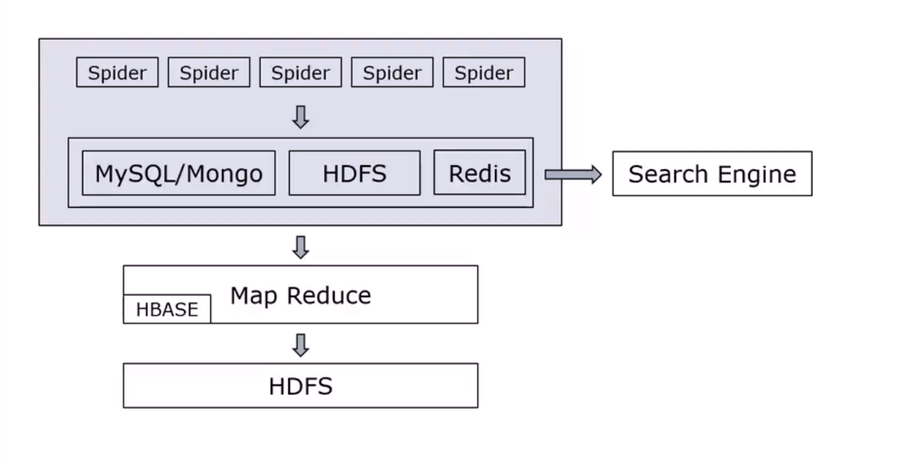
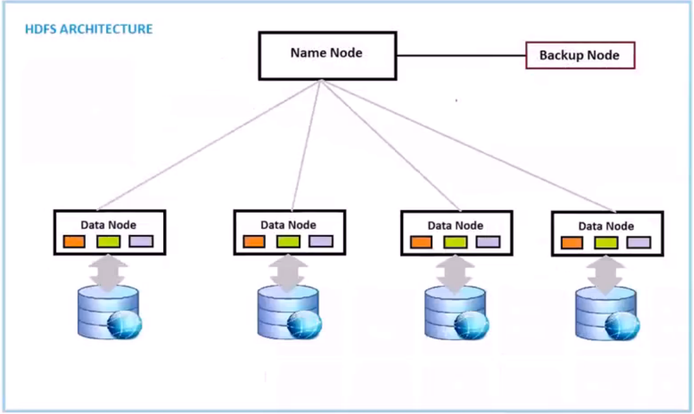
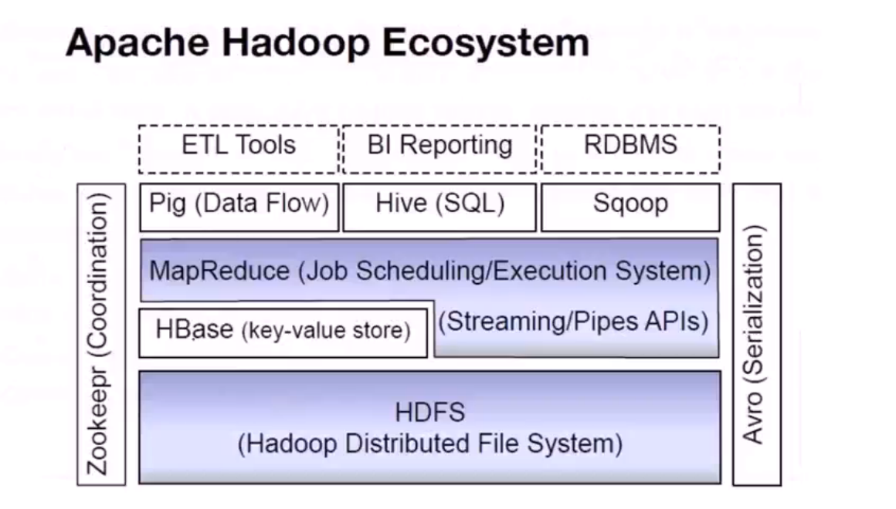
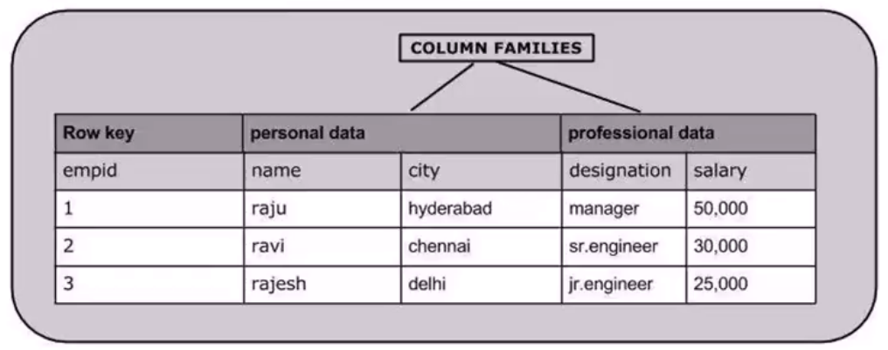
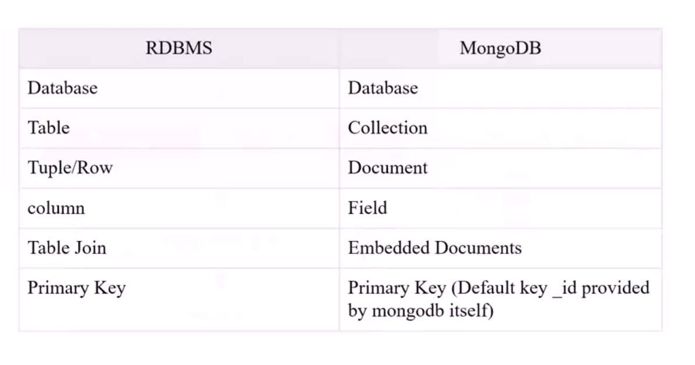

>整理自[分布式爬虫实战](http://www.chinahadoop.cn/classroom/49/courses)

>通过学习爬虫，一方面是学习爬虫本身，另一方面会分析网站，那么可以很好的了解一些Web网站的架构技巧，从前端的HTML/CSS/JavaScript，到后端的数据库/文件管理/URL设计/接口设计，以及整个Web系统的性能调优、网络调优等等

>自己做分布式系统设计开发的时候，可能没有这么多机器，那么可以用虚拟机或者Docker来模拟分布式环境！

## 静态网页抓取

分析网页结构、分析URL结构

调用Python的一些库比如urllib、request等，下载网页

然后根据之前分析的网页结构，使用xpath、beautifulSoup或者正则表达式等工具来解析HTML字符串中的内容

## 动态网页抓取

动态网页当然是以静态网页为基础的，动态网页本身一般还有以下的特点：

* 登录和表单
* 通过AJAX实现根据需要获取数据，比如“加载更多”等等

Selenium是一个浏览器，它和普通浏览器的唯一区别就是它是不可见的，所以可以作为服务程序实现普通浏览器的各种功能

使用JavaScript在表单中填写数据，然后使用JavaScript完成点击按钮即可实现登录操作。所以需要对HTML、Javascript的语法和用法熟悉一些！

通过使用Selenium+Phantomjs可以实现在Python中操作Javascript

通过Selenium+Phantomjs的方式处理动态网页，其实CPU、内存的占用会很高的，如果能够逆向分析出Web网站的接口，直接通过调用接口来获取数据，那么在效率上会高得多得多！

>针对Web网站的接口进行逆向分析，是一个很有意思的技术专题

>Web网站的接口一般是这样的：通过一个URL，发送Get请求，返回JSON格式的Response，客户端解析JSON获取数据

如果有些Web网站的接口分析难度太大，可能还是要选择Selenium+Phantomjs这种比较“笨方法”

## 微博爬虫的例子

爬虫1，负责从第一个用户开始，抓取“它”关注的人，获取更多用户的名字、关注量、粉丝数、地址等信息，整个微博上用户的关系类似一张图，那么这个爬虫的作用就是来遍历这张图

爬虫2，负责根据爬虫1获取的用户URL，抓取该用户的更多信息，解析存储到DB

爬虫2在根据用户URL抓取用户信息的时候，需要访问用户主页，但是很多网站都有“加载更多”的功能，只有在向下拖动滚动条的时候才会继续加载，那么这个爬虫也要模拟向下拖动滚动条的效果！

微博爬取的策略选择用户的关注者爬，而不是选择从用户的分析爬，这样分支少、数据质量更少！而且还存在一个问题，比如一个用户有8000W个粉丝，一页展示100个粉丝，那么展示8000W个粉丝要80W页，但很多网站根本不可能做到80W页的分页，像百度搜索，一般也就只有66个分页。因为翻页首先是对数据库很大的负担，而且一般的正常用户是不会翻太多页的，几十页就差不多了，有深翻页行为的一般都是机器人，这也是反爬虫的一个策略！

就算是选择“关注”进行爬取，而不是“粉丝”进行爬取，但随着爬取的深度的增加，还是会遇到低质量的用户，所以我们在选择是否进入用户的页面之前根据其关注人数、粉丝人数、微博数量（过低可能说明其是不活跃用户；过高可能说明其大量的转发，没有有质量的原创）来判断其是否为高质量用户，然后再决定是否进入其主页，因为使用Selenium打开网页的性能并不很高，所以最好做一些必要的过滤和调优 


## Web网站图片的存储

像微博这种网站，用户量巨大，而且每个用户可能会有大量的图片，那么微博可能会有大量的专门的图片服务器用来管理图片

图片一般分为缩略图、中等图、大图，比如在微博上，首先会以缩略图的方式展示图片，只有用户点击和选择的时候才会展示中等图或大图，因为大多数情况下，大部分的图用户是不会点开的，所以为了节省带宽，网站主要展示缩略图，只有在用户做了具体选择的情况下才会展示中等图或大图！

这是Web网站针对图片资源的一种管理策略

## 数据存储简介

图片、文件还是要直接在磁盘上存储

而结构化的数据可以存储到关系型数据库、NoSQL上，比如MySQL、MongoDB等

>关于数据库原理、数据库调优的知识在大型项目架构中还是很值得研究的

爬虫抓取的数据要存储到数据库中；Web系统中的各种数据也要存储到数据库中，所以数据库是很多系统的核心组件！

## urllib2的插件功能

urllib2可以绑定一系列的处理对象handler，handler可以对urllib2的http请求提供额外的功能支持。handler是以绑定的顺序依次调用的。例如HTTPRedirectHandler用来处理跳转的情况，ProxyHandler用于处理代理。可以开发自定义的handler（从BaseHandler继承）

```
build_opener([handler, ...])  # 注册一系列的handler

proxy_handler = urllib2.ProxyHandler({'http':'http://www.example.com:3128/'})
proxy_auth_handler = urllib2.ProxyBasicAuthHandler()
proxy_auth_handler.add_password('realm', 'host', 'username', 'password')
opener = urllib2.build_opener(proxy_handler, proxy_auth_handler)
#This time, rather than install OpnerDirector, we use it directly
opener.open('http://www.example.com/login.html')
```

## 多线程和多进程

Python的多线程下有一个GIL（全局锁），导致Python的多线程程序其实在每一刻都只有一个线程在跑，也就是说，假如开启了3个线程，那么线程1在运行的时候，线程2和线程3一定不能运行的；线程2运行的时候，线程1和线程3也是无法运行的

如果是一个CPU密集型的应用，那么就算是有4个CPU，开启了4个线程，那也只能利用一个CPU的计算能力，因为Python的GIL导致一个进程中不能同时运行超过1个线程

但是如果是一个磁盘IO、网络IO密集型的程序，一般开启多线程是可以提升销量的。比如4个CPU，一个进程，4个线程，线程1因为IO阻塞，那么就会切换到线程2，线程2因为IO阻塞就会切换到线程3……这样就可以保证在某个线程被阻塞的时候，能立即切换到其他线程，让其他线程工作。虽然4个CPU依然是只能利用到一个，但是因为线程可能被阻塞，所以可以在某个线程阻塞的时候及时切换到其他线程

如果是一个线程，因为IO密集，那么单个CPU的计算能力都无法用完，因为这个线程因为IO阻塞的时候，无法切换到这个进程的其他线程上（当然还是可以切换到其他进程的线程上的），这就导致这个进程性能不佳

而如果想要充分利用多个CPU，那么在Python程序中还是要使用多进程来实现！

进程间通信方式：

* 管道
* 信号
* 消息队列：Posix及system V
* 共享内存：速度最快，需要结合信号量达到进程间同步及互斥
* 信号量：用于数据同步
* Socket：可以标准化，可以用于多机

单机的多进程通信，其实就是一种简单的分布式系统。可以这样扩展到多机分布式场景：多机上的多进程，使用Socket方式来通信、调度任务、传输数据……

## 分布式数据库及应用



上图中的各个存储容器的作用大概是这样分工的：

* HBASE用于存储网页源码
* MySQL/Mongodb用于存储结构话数据，比如任务、提取后的数据
* Redis用于做高速缓存

很多网站都有反爬虫策略的，检查到你单机IP访问频率过高，那么就会限制你的访问。而如果做成分布式爬虫系统，多台机器同时爬取，就不能被服务器按照IP进行限制了！

大型网站的设计会非常复杂，几乎所有的功能模块都是多机集群方式的。服务、数据库都是集群模式的，因为数据量、访问量太大，必须要用集群来分散压力

分布式爬虫的作用：

* 解除目标地址对IP访问频率的限制
* 利用更高的带宽，提高下载速度
* 大规模系统的分布式存储和备份
* 数据的扩展能力

>爬虫应用：搜索引擎、自然语言处理、数据挖掘……

>问题：关系型数据库存储时，什么数据适合用哈希索引，什么数据适合用B+树索引？

## HDFS（分布式存储系统）

首先说一下爬虫原始数据的特点：

* 网页HTML源码文件比较小，大量KB级别的文件
* 文件数量大
* 增量方式一次性写入，极少需要修改
* 顺序读取
* 并发的文件读写
* 可扩展

我们一般在使用计算机的时候，如果文件夹下有500多个文件，那么打开文件夹就比较慢了，因为在磁盘上扫描文件的耗时比较大，所以大量的小文件是不适合直接存储到磁盘上的！

HDFS将海量的小文件一起组成一个数据块，再存储到磁盘上。将大量的小文件存到内存中，当达到一定的大小的时候就把它组成数据块，一次性写到磁盘中！在打包的时候，也需要将文件所处于哪个块的信息记录下来，后续找文件的时候可以根据该信息直接定位到其所属的块

当然也存在劣势：不能随机读取文件，每次都要找到文件所在的数据块，将数据块解析，再找到对应的文件



为了保存文件在哪个块中，所以需要将信息保存在上图的Name Node中，但这样就会导致在文件特别大的时候，Name Node会存储很多分散的数据，我们可以选择HBASE来解决这个问题



HBASE是基于列的数据库，不同于像MySQL、Oracle这样的基于行的关系型数据库



## MySQL和Mongodb的简单对比

MySQL和MongoDB存在诸多的差异点，这里讲一下其最大的差异：扩展性！

MySQL是通过表结构进行存储的，一张表分到不同的机器上是很困难的！MySQL是典型的B+树构成，因为他利用了在磁盘上连续读写的性能，所以使用B+树作为索引

这也就意味着MySQL的存储是不能在中间分开的。MySQL的每一张表就是一个文件，当这张表大到一定程度后是分不开的，所以MySQL也默认限定了最多150W行的上限（可配）

而且MySQL是关系型数据库，大多数表都无法单独存在，可能和其他表存在关系，很多表之间都是相互依赖的！

>《架构师之路》中多次讲到的点就是当用户量很大的时候，如何分表存储，确实不是一件容易的事情

而Mongodb是单独的文档，每个文档都是独立的，所以每一份资料本身是完整的，所以如果假如机器A存储了3000W个文档后，完全可以将第3000W+1份文档存储到机器B

比如微博数据就是用Mongodb存储的，因为很容易扩容！

>《分布式数据库及应用》这一节对于各种数据库的特点、适用场景、性能调优的策略分别进行了讲解，很不错



