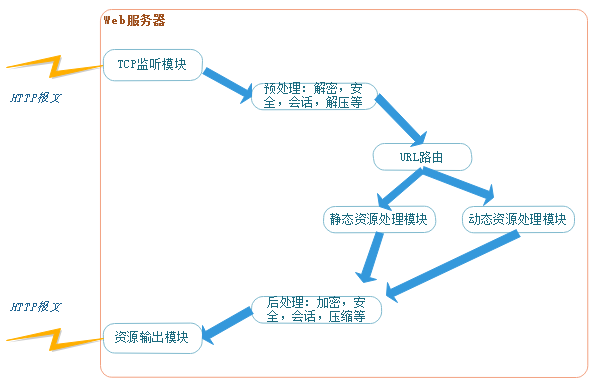
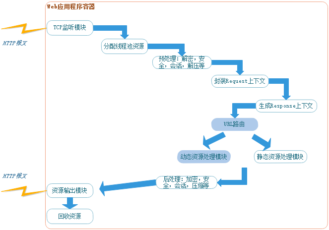
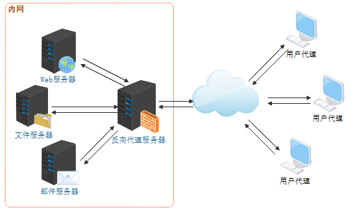
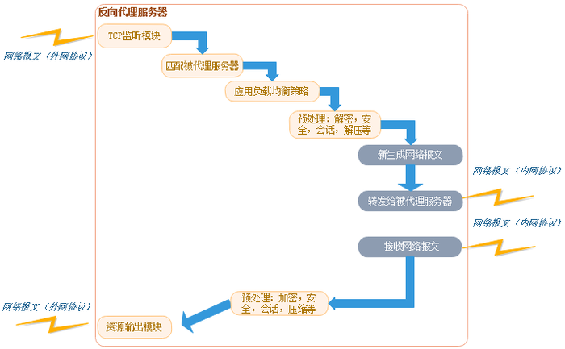

>[《一文看懂web服务器、应用服务器、web容器、反向代理服务器区别与联系》](http://www.cnblogs.com/vipyoumay/p/7455431.html)

>现在还只是转载别人的文章，赶紧自己大量编码、架构、实践，深刻感受Web开发的全流程，然后输出自己的文章！

---

我们知道，不同肤色的人外貌差别很大，而双胞胎的辨识很难。有意思的是Web服务器、Web容器、Web应用程序服务器、反向代理有点像四胞胎，在网络上经常一起出现。本文将对着四个相似的概念加以介绍和区分

# Web服务器概念与基本原理

### Web服务器的历史

1989年，hulianwang之父Berners-Lee向其雇主CERN提出了一个新项目，目的是通过使用超文本系统来缓存科学家之间的信息交流。该项目导致Berners-Lee在1990年编写了两个方案：

* 一个名为WorldWideWeb的浏览器
* 世界上第一台网络服务器，后来被称为CERN httpd，它运行在NeXTSTEP上。在1991年至1994年期间，用于通过万维网冲浪和交换数据的早期技术的简单性和有效性有助于将其移植到许多不同的操作系统，并将其用于科学组织和大学，然后传播到行业

1994年，Berners-Lee决定组件万维网联盟（W3C），通过标准化过程来管理涉及的许多技术（HTTP、HTML等）的进一步发展

就是这台服务器

Web服务器的主要功能是存储、处理和传递网页给客户。客户端和服务器之间的通信使用超文本传输协议（HTTP）进行。交付的页面最常见的是HTML文档，除了文本内容之外，还可能包含图像、样式和脚本

一个用户代理，通常是Web浏览器或Web爬虫，通过发起一个HTTP请求以获取服务器资源，服务器根据请求返回该资源或由于某种原因响应错误消息。该资源通常是服务器辅助存储上的真实文件，但不一定是这种情况，取决于Web服务器的实现方式

虽然主要功能是提供内容，但HTTP的完整实现还包括从客户端接收内容的方式。此功能用于提交Web表单，包括上传文件。许多通用的Web服务器还支持使用Active Server Page（ASP）、PHP或其他脚本语言的服务器端脚本。这意味着Web服务器的行为可以在单独的文件中校本化，而实际的服务器软件保持不变。通常，此函数用于动态生成HTML文档（“即时”），而不是返回静态文档，前者主要用于从数据库检索或修改信息。后者通常快得多，并且更容易被缓存，但不能提供动态内容

Web服务器不仅可用于万维网服务。它们也可以被嵌入到诸如打印机、路由器、网络摄像机等设备中，并且仅服务于本地网络。然后，Web服务器可以用作监控或管理所讨论的设备的系统的一部分。这通常意味着客户端计算机上不需要安装其他软件，因此只需要一个网络浏览器

### Web服务器工作原理

HTTP协议基于TCP协议上，是一个应用层协议，用于用户代理和Web服务器进行通信。Web服务器通常采用一问一答的方式进行工作：

1. 在用户代理上用户发起资源请求，请求内容包括但不限于：指定资源的唯一标识URI，指明动作类型（GET、POST、DELETE、PUT……）
2. 用户代理解析用户输入URI并从中获取目标域名，交由DNS服务器解析。如果URI中指定某IP地址，则无需这步
3. 如果与服务器的会话还未建立，此时先建立TCP连接，并完成HTTP协商（确定双方均可接受的处理方式，包括协议版本、是否加密、内容格式等等）
4. 用户代理把请求内容封装成HTTP数据包向服务器发送
5. 服务器接收到资源请求并以之前协商好的方式解包并处理
6. 服务器请求的资源封装成HTTP数据包并返回给用户代理

重点说一下服务器端的工作原理

* **TCP监听模块**：服务器监听某个端口（一般默认是8080端口，用户可以设置其他端口），以建立和用户代理之间的连接。一旦建立连接，用户代理的后续HTTP请求将不用再进入监听模块
* **预处理**：主要做三件事情
	* 从TCP报文中获取HTTP请求报文
	* 根据用户代理的协商进行解密、解压、安全处理等
	* 根据服务器自身的配置进行安全处理，建立安全会话状态等
* **URL路由**：解析URL字符串和动作以确定用户代理请求的资源，根据匹配规则（通常根据正则表达式+后缀）路由到静态资源处理模块或动态资源处理模块
* **静态资源处理模块**：负责找到静态资源，比如HTML/JS/CSS/图片，确定内容是字符流或字节流，并确定对应MIME，比如HTML生成MIME为text/html的字节流，mpeg视频文件生成MIME为video/mpeg的字节流
* **动态资源处理模块**：运行业务逻辑处理，动态决定返回的资源内容和类型，内容和类型的处理原则同上
* **后处理**：根据和用户协商的协议进行加密、压缩、安全处理等
* **资源输出模块**：把处理好的内容和类型封装成HTTP报文，往TCP连接另一头的用户代理发送TCP报文（内容是HTTP报文）

### 主流Web服务器

包括Apache、IIS、Nginx，市场占有率如下

还有比较多使用Tomcat、Jetty、WebSphere、WebLogic、Kerstrel等

# Web应用程序容器概念与基本原理

### Web应用程序容器的由来

Web服务器的出现标志着WWW时代的到来，世界变得更加平面化。当初尝到甜头的开创者们开始不满足与在互联网上获取静态资源，于是出现了CGI焦恩来动态获取资源。再后来网络发展方向也是朝着增强Web服务器动态获取资源的能力前进。以下是代表性的动态技术

 技术名词                          | 特点
-----------------------------------|---------------------------
 CGI（Common Gateway Interface）   | 以独立进程运行，可以用多种语言开发，比如C,C++,VB,Perl，灵活但效率低，维护复杂
 PHP	                           | 服务器端嵌入HTML脚本，开源，功能强大，扩展性较差	
 JSP	                           | 服务器端嵌入HTML脚本，跨平台，部署前需编译，主要缺点是编写JSP比较复杂，需熟悉JAVA及相关技术	
 ASP	                           | 服务器端嵌入HTML脚本，开发简单，功能强大，只能在Windows下运行

随着Web服务器朝着企业级应用方向发展，快速的业务变化，迫使Web开发人员面对新的挑战：如何快速写出鲁棒、可靠、符合业务需求的程序并顺利部署？解决这个挑战的一个有效的办法是，创造一个Web程序开发框架（含运行环境，比如解释执行JSP、Web API），这个框架解决鲁棒性、可靠性问题，提供快速开发接口。换言之，开发人员只需要专注于实现业务本身，如有更高的需求还可以对框架进行定制和扩展。这个框架的另外一个名字是Web应用程序容器

### Web应用程序容器的基本工作原理

一般情况下Web应用程序容器是以下构成体系

注：浅蓝色的模块是实现业务程序的主要使用模块

相对于Web服务器，该容器新增或强化了以下模块

* **分配线程池资源**：容器为每个请求分配一个线程进行处理，通常采取线程池的方式高效利用CPU资源
* **封装Request上下文**：一个请求对应一个Request上下文，它主要封装了用户请求的主要构成：URL、HTTP请求头，以及基于请求头构建的Session、Cookie等对象，方便编程使用
* **封装Response上下文**：一个请求对应一个Response上下文，主要用于向用户代理返回资源。可以在其中写入输出流，或者重定向，或者返回错误码等
* **URL路由**：在容器中，运行开发人员设置不同的路由匹配规则，比如让.HTM返回.HTML，也可以自定义.xyz返回.HTML资源。更加灵活的配置可以参考Java MVC或ASP.NET MVC的配置方案
* **动态资源处理模块**：通常在这里具体的容器和开发语言都有自己的高效开发模型，比如Java的Servlet、ASP.NET的Web Form、MVC
* **回收资源**：这里会回收刚才的线程资源，为了线程复用，除非服务器空闲一般会将线程返回线程池

可以看到，Web容器本身具备了做为一个Web服务器的功能，事实上通常实现Web容器功能的服务器就是一个Web服务器，比如Tomcat、IIS、Jetty

### 主流Web容器

包括Tomcat , IIS ,Jetty 。

还有比较多使用WebSphere，WebLogic等等。

# Web应用程序服务器概念及基本原理

在Web服务器发展的同一时期，应用服务器已经存在并发展很长一段时间了。一些公司为Unix开发了Tuxedo（面向事务的中间件）、TopEnd、Encina等产品，这些产品都是类似IMS和CICS的主机应用管理和监控环境衍生而来的。大部分的这些产品都指定了“封闭的”产品专用通信协议来互联胖客户机（“fat” client）和服务器。在90年代，这些传统的应用服务器产品开始嵌入HTTP通信功能，刚开始要利用网关来实现，不久后它们之间的界线开始变得模糊了

同时，Web服务器越来越成熟，可以处理更高的负载、更多的并发和拥有更好的特性；应用服务器开始添加越来越多的基于HTTP的通信功能。所有的这些导致了Web服务器与应用服务器的界线变得更窄了

目前，“应用服务器”和“Web服务器”之间的界线已经变得模糊不清了。但人们还把这两个术语区分开，作为强调使用

当有人说到“Web服务器”时，你通常要把它认为是HTTP核心、Web UI为向导的应用。当有人说到“应用服务器”时，你可能想到“高负载、企业级特性、实物和队列、多通道通信（HTTP和更多的协议）”。但现在提供这些需求的基本上都是同一个产品

下面描述一个典型的Web应用服务器的结构图

从上图中可以看到Web应用服务器包括了Web容器，同时内置了支撑企业应用的事务、安全、集成、通信、高可用等等功能，极大地减少了重复开发量，保障了业务系统快速开发和部署，而它本身也是一个Web服务器。Web应用服务器可以选择使用大厂的WebLogic和WebSphere这种重量级产品，也可以使用类似Tomcat、Jetty这样的Web Containner再加上第三方的框架（spring、hibernate等）来构建自己的Application Server；.NET Core平台下可以选择IIS、Apache、Nginx与ASP.NET Core构建

# 反向代理概念与基本原理

### 反向代理基本概念

反向代理是代理服务器的一种。它根据客户端的请求，从后端的服务器（如Web服务器）上获取资源，然后再将这些资源返回给客户端。与前向代理不同，前向代理作为一个媒介将互联网上获取的资源返回给相关联的客户端，而反向代理是在服务器端（如Web服务器）作为代理使用，而不是客户端。客户端通过前向代理可以访问很多不同的资源，而反向代理是很多客户端都通过它访问不同后端服务器上的资源，而不需要知道这些后端服务器的存在，而以为所有资源都来自于这个反向代理服务器

互联网中的请求发送给反向代理，反向代理吧请求转发到内网中的服务器

反向代理的主要作用为：

* 加密和SSL加速
* 负载均衡
* 缓存静态内容
* 压缩
* 减速上传
* 安全防火墙
* 外网发布
* 突破互联网封锁
* 解决跨域问题

### 反向代理基本工作原理

一个反向代理服务器的构成和处理过程如下图

左边淡黄色功能模块对外网报文进行处理，右边灰色功能模块针对内网报文进行处理

* **TCP监听模块**：监听TCP请求，这里的请求是指报文内容是某应用层协议（比如HTTP、FTP、EMAIL等应用层协议）的请求。值域这里是否会单独产生一个线程来处理，由服务器自己决定，目前最流行的是先入消息队列然后异步处理，这样能极大提高代理的吞吐量和稳定性
* **匹配被代理服务器**：代理服务器根据一个表（存放外网URL和内网服务器的对应关系，通常需要人工进行设置），如果匹配到则继续处理，否则根据外网协议返回错误信息，比如HTTP协议则返回404
* **应用负载均衡策略**：如果比较大型的互联网应用，为了整体系统稳定性，解决单点问题，需要根据自定义策略合理的转发报文给被代理服务器。简单的策略是哈希分发或随机分发，一般可以由用户进行配置和选择
* **预处理**：这里依据协商好的外网应用协议进行解密、安全、会话、解压等处理
* **新生成网络报文**：这里依据协商好的内网应用协议生成网络报文，这里可能会进行加密、安全、会话、压缩等处理
* **转发给被代理服务器**：把新生成的网络报文发送给内网服务器（可能是否Web服务器、FTP服务器、邮件服务器）
* **接受网络报文**：接受内网服务器反馈的网络报文
* **预处理**：这里依据协商好的外网应用协议进行加密、安全、会话、压缩等处理
* **资源输出模块**：这里生成满足外网应用协议要求的报文，并发送到外网连接的另一端（用户代理）

### 常见的反响代理服务器

Nginx、IIS、Apache

# 总结

从概念上讲：

* Web服务器是提供WWW服务的程序
* Web容器是提供给开发者的框架
* Web应用程序内容丰富得多，既可用各厂商通常遵循一定的工业标准并自定义扩展功能而成，也可以利用开源组件轻量级拼装打造
* 反向代理服务器在企业级应用中表现突出，具有解决集中式安全、负载均衡等有点。入金这四个概念的边界越来越模糊，看看这个表就知道了：

软件名词  | 是否Web服务器  | 是否Web容器  | 是否Web应用服务器  | 是否能反向代理
----------|----------------|--------------|--------------------|-----------------
IIS       | 是             | 是           |                    | 是
Nginx     | 是             |              |                    | 是
Apache    | 是             |              |                    | 是
Tomcat    | 是             | 是           |                    |
Jetty     | 是             | 是           |                    |
WebSphere | 是             | 是           | 是                 |	
WebLogic  | 是             | 是           | 是                 |
Kerstrel  | 是             | 是？         |                    |		
Http.sys  | 是             |              |                    | 是

关于Kerstrel是否web容器，有两种观点：

1. 由于Kerstrel不提供编写应用的框架，所以它不是容器；asp.net core才是容器，因为它提供了开发应用的框架并提供web应用（MVC,Web API)运行环境
2. Kerstrel提供了运行环境
