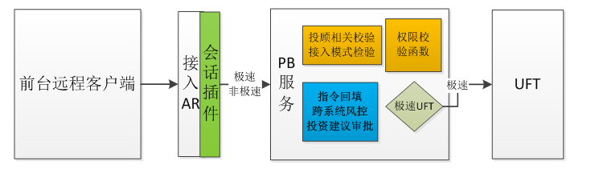
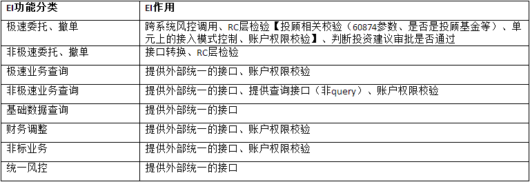
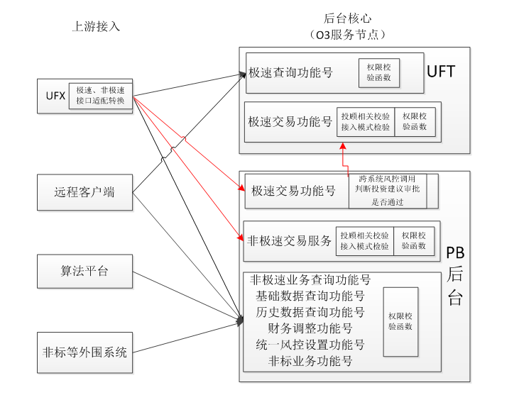

接手了柜台查询服务之后，依然只是停留在了解代码逻辑上，对于整个后台服务的架构逻辑完全不了解。其实后台服务的多进程机制、网络通信机制对于学习如何构建一个大型的系统是很有必要的

这里借助最新的一个EI改造的任务做一个简单梳理，第一次研究，当然不会很深入！

需要对于架构、性能、运维等方面都好好的进行思考！

# 改造背景

目前的服务架构图是这样的

存在如下问题：

* 多个交易入口，调用不统一且较混乱
* 服务间、进程间的相互调用，造成性能损耗
* 后台进程增多，无端占用主机资源
* 引入EI节点，造成部署和运维的不便

希望达成如下的改造目标：

* 尽可能减少服务间、进程间的调用，实现**服务调用扁平化**，缩短程序调用链路，避免性能损耗
* 避免不必要的部署节点引入，实现**配置运维集约化**，减低部署和客户运维的难度
* **整合系统服务接口**，减少应用服务器启动的进程个数，简化服务层次

# 废除RC服务相关改造

### 现状及问题

RC服务有和系统功能相同的地方，也封装了投资系统没有的功能

* 和投资系统功能相同的地方：
	* 调用服务
		* 多启动一份进程，增加应用服务器资源开销
		* 多一次进程间调用，影响性能
	* 调用函数
		* 多启动一份进程，增加应用服务器资源开销
* 封装投资系统没有的功能
	* 自行编写

需要解决的问题：

* 解决RC引起的后台进程增多问题
* 避免进程间服务调用，对性能产生影响

### RC服务分析

针对和投资系统业务核心功能相同的RC服务进行分析

废除RC层可以解决上述问题。但需要将RC功能拆分到其他节点上，RC总结四点功能：

1. 会话校验
2. 业务校验【投顾、接入模式】
3. 权限校验
4. 更改审批标志【认为外部不可靠】

### 改造方案

废除与投资系统业务核心功能相同的RC服务，远程客户端直接调用PB核心服务

1. 会话校验由会话插件完成
2. 业务、权限校验由PB核心服务的业务校验公共函数完成
3. PB服务分极速和非极速，前台区分调用
4. 审批标志强制改为正常，前台不传入由后台根据业务要素自行获取

# 废除EI节点相关改造

### 现状和问题

要解决的问题：

* EI层的出现，导致多出一个节点，对部署和运维造成不便
* 对于非极速交易和极速查询而言，多增加一个中间的功能号调用，对性能产生影响

>废除EI节点，不是废除EI功能

### EI服务分析

针对和投资系统业务核心功能相同的RC服务进行分析

### 改造方案

# 改造后关键节点的调度关系图（委托）

# UFX需要支持授信极致性能模式（委托）

对于授信极致性能模式，极速交易时系统不做业务和权限校验，直接调用UFT

# 改造后逻辑视图

