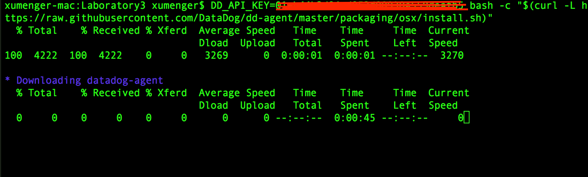
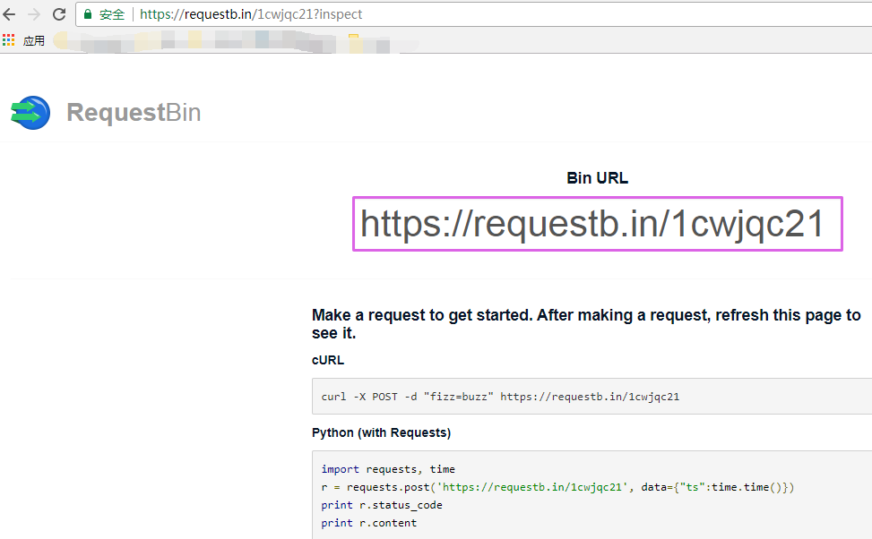

>系统并不安全，需要一只“看家护院”的【数据狗】。但这只狗只会叫，不会咬人

# 最近收到的任务需求

* 熟悉Datadog平台的埋点代码
* 熟悉Datadog平台的监控配置，四种配置，熟悉触发机制
* 熟悉Datadog的webhook，做一个小的http agent，用于接收webhook，并终止进程

看到这些技术需求是为了满足如下的功能需求，通过在代码中埋单，对我们的系统进行监控。假如某个监控值出现超标导致收到对应的webhook，就可以进行对应的应急处理，比如重启进程！

>本文先对Datadog进行一个简单的梳理，后续会详细参考Datadog的官方文档、进行更多的实践来总结Datadog的架构、使用，并且在后续自己开发的项目中使用Datadog进行项目监控

>说到自己的项目，现在确实拖拖拉拉延迟了好久了！！！

# Datadog简介

Datadog agent是运行在你主机上的一款轻量级软件。它的作用就是忠心耿耿地为你收集事件和性能指标，传到Datadog（需要用户在Datadog网站平台上注册账户）中，以便你利用这些监控和运行数据来做点什么


它的工作方式是在每一台需要监控的服务器上运行它的agent。agent不但会收集这台机器的各种基础性能数据。如CPU使用率、剩余内存空间、剩余磁盘空间、网络流量等，也可以收集用户自定义的性能数据，灵活性很好

Datadog也可以对各种监控的性能指标设定阀值，当指标超出阀值范围时，发出警报！

Datadog另一个好用的地方在于它与众多的云服务和开源项目有整合，比如：Redis、Nginx、Slack（用来报警）……

### Datadog agent组件

Datadog agent主要由四个用Python编写的组件构成，每个组件都是单独运行的进程

* Collector(agent.py)：检查当前运行机器的集成环境，抓取系统性能指标，如内存和CPU数据
* Dogstatsd(dostatsd.py)：这是StatsD的后台服务器，它致力于**收集你从代码中发送出去的本地性能指标**
* Forwarder(ddagent.py)：Forwarder负责把Dogstatsd和Collector收集到的数据推到一个队列中，这些数据将会发往Datadog
* Supervisor：由一个单独的管理进程控制。我们把它与其它组件分隔开来，因此如果你担心资源消耗而不想运行所有组件的话（虽然我们建议你这么做），可以单独运行它

**Supervisors**作为一个主控根进程运行，可以fork所有的子进程为`user dd-agent`，其配置文件为`/opt/Datadog-agent/etc/Datadog.conf`和`/opt/Datadog-agent/etc/conf.d/`。配置文件中包含了API key，以及其它访问性能指标（如mysql、postgresql metrics）所需的证书。以下端口对一般操作开放：

* 为一般操作提供的forwarder tcp/17123端口和启用了graphite服务的tcp/17124端口
* dogstatsd udp/8125

在3.4.1或以上版本中，所有监听进程都默认绑定127.0.0.1或::1。而早期版本中，他们则绑定至0.0.0.0 （例如所有的接口）

**Collector**每15s收集一次性能指标，也支持运行基于Python的用户定义的检查内容。这些内容存储于`/etc/dd-agent/checks.d`下。用户定义的检查内容必须从抽象类AgentCheck继承，这个类定义在[checks/__init__.py](https://github.com/Datadog/dd-agent/blob/master/checks/__init__.py?spm=5176.100239.blogcont6636.13.iO6xH9&file=__init__.py)中

Forwarder监听并缓存传入的HTTP请求，接着通过HTTPS转发到Datadog中心。缓存请求使得网络可以一分为二，不影响性能指标的上报。性能指标将被缓存在内存中，直到达到必须发送的大小或数目才会发送。接着，最老的性能数据包就被丢弃，以确保forwarder有足够的存储空间

DogStatsD是用Python实现的[easy statsD](https://github.com/etsy/statsd?spm=5176.100239.blogcont6636.14.iO6xH9)性能指标整合进程，用于通过UDP协议接收和积累任意的性能指标，这样我们就可以度量自定义代码，而不会增加延迟

# Datadog使用

### 注册Datadog，配置Datadog agent

首先你需要在[Datadog平台](https://app.Datadoghq.com/account/login?next=%2Faccount%2Fsettings#agent)注册一个账户

首先需要[在你的主机上安装Datadog agent](https://app.Datadoghq.com/account/settings#agent)，它能收集和报告你主机的指标，这样就可以使用Datadog查看和监控它们。安装这个代理通常仅需要一个命令（下面是[Mac平台的命令](https://app.Datadoghq.com/account/settings#agent/mac)），其中的DD_API_KEY用于绑定到对应的账户上

```
DD_API_KEY=???????????????????? bash -c "$(curl -L https://raw.githubusercontent.com/Datadog/dd-agent/master/packaging/osx/install.sh)"
```

运行情况大致如下



安装完成后，可以看到输出内容如下

```
* Installing Datadog-agent, you might be asked for your sudo password...
Password:

    - Mounting the DMG installer...

    - Unpacking and copying files (this usually takes about a minute) ...

    - Unmounting the DMG installer ...

* Adding your API key to the Agent configuration: Datadog.conf

* Restarting the Agent...


Your Agent has started up for the first time. We're currently verifying that
data is being submitted. You should see your Agent show up in Datadog shortly
at:

    https://app.Datadoghq.com/infrastructure

Waiting for metrics.................................

Your Agent is running and functioning properly. It will continue to run in the
background and submit metrics to Datadog.

If you ever want to stop the Agent, please use the Datadog Agent App or
Datadog-agent command.

It will start automatically at login, if you want to enable it at startup,
run these commands: (the agent will still run as your user)

    sudo cp '/opt/Datadog-agent/etc/com.Datadoghq.agent.plist' /Library/LaunchDaemons
    sudo launchctl load -w /Library/LaunchDaemons/com.Datadoghq.agent.plist
```

只要你的代理启动并运行着，你会看到你主机的指标报告在你Datadog账号下


比如上图中，可以点击xumenger这台主机的链接，看到更详细的信息，展示的是当前主机的CPU、内存、磁盘、网络等信息

### Datadog agent使用说明（Mac OS）

参考其官方文档[Basic Agent Usage for OS X](https://docs.Datadoghq.com/guides/basic_agent_usage/osx/)

>The Datadog Agent is apiece of software that runs on your hosts. Its job is to faithfully collect events and metrics and bring them to Datadog on your behalf so that you can do something useful with your monitoorng and performance data

**agent的开关命令**

```
# 启动
/usr/local/bin/Datadog-agent start

# 关闭
/usr/local/bin/Datadog-agent stop

# 重启
/usr/local/bin/Datadog-agent restart
```

**获取代理状态、信息**

```
# 检查代理是否正在运行
/usr/local/bin/Datadog-agent status

# 获取代理的状态信息
/usr/local/bin/Datadog-agent info

# 添加-v选项，会输出错误的回溯信息
/usr/local/bin/Datadog-agent info -v

# 获取一个integration的更多的metrics, events and service checks信息
/usr/local/bin/Datadog-agent check [integration]

# 添加check_rate可以获取最近更多的rate值
/usr/local/bin/Datadog-agent check [integration] check_rate
```

**配置文件**

agent的配置文件位于`/opt/Datadog-agent/etc/Datadog.conf`，当前用户的配置位于`~/.Datadog-agent/Datadog.conf`

该文件包含比如下面有API Key等信息。除了API Key，还有一个叫做APP Key，可以在[https://app.Datadoghq.com/account/settings#api](https://app.Datadoghq.com/account/settings#api)创建一个新的APP Key

integrations的配置文件位于`/opt/Datadog-agent/etc/conf.d/`，当前用户的配置位于`~/.Datadog-agent/conf.d/`

**日志文件**

`/usr/local/bin/Datadog-agent info`可以获取代理的信息。子系统的日志文件位于

* /var/log/Datadog/supervisord.log (since 3.8.0)
* /var/log/Datadog/collector.log
* /var/log/Datadog/dogstatsd.log
* /var/log/Datadog/forwarder.log

### Datadog agent开发

>[《生产环境下的性能监控 - Datadog》](http://tech.glowing.com/cn/performance-monitoring-with-Datadog/)

Datadog内置系统监控以及第三方整合（redis、nginx等）都很好用，但它真正强大之处在于可以方便地自定义指标。这些自定义的指标可以是Web Server对每个请求的响应时间，或是数据库中每张表的读写请求数，也可以是job queue里pending的job数量……

datadong的自定义指标有两种：Count和Histogram

* Count用于计数，统计某事件在一个时间区间内发送多少次
	* 比如可以定义一个page_view来记录应用中每个页面的访问次数
* Histogram在性能监控中更为有用
	* 它的每个数据点是一个时间戳加上一个浮点值
	* 可以统计某个事件在一个时间区间内发生的次数
	* 也可以统计这些事件所对应的浮点数的平均值、中位数、最大值、最小值等
	* 比如记录每个请求的响应时间
	* 用Histogram来记录，就可以方便地得到某个时间段的平均响应时间和最长响应时间，这两个数据对于性能监控至关重要

对发送到datadong的每个数据点，可以添加多个tag，这对于之后数据的查询和分类非常有帮助，比如我们可以根据数据来自哪个microservice给它们打上不同的tag。在实际使用中，我们会以更细的粒度在数据点上添加tag

首先安装Datadog：`pip3 install Datadog`

比如下面是向Datadog发送自定义指标的python代码示例

```
from datadog import statsd

# send count data
statsd.increment('event.page_view', tag = ['app:glow', 'page:home'])

# send histogram data
statsd.histogram('service.response_time', 0.2
				  tags = ['app:nurture', 'service:user', 'api:get_user_by_id'])
```

执行`python example.py`即可运行代码

其中send count data的例子我们用statsd.increment来发送Count类型的数据，通过两个tag，告诉Datadog，这次访问发生在Glow app的Home page上。之后就可以在多个粒度上统计某段时间内页面访问的次数：

* Glow的Home有多少次页面访问
* Glow app有多少次页面访问
* 所有的app总共有多少次页面访问

send histogram data的例子，假设在我们的Nurture应用下，有一个专门用于读写用户数据的User service，某次访问该服务下get_user_by_id这个API的响应时间为0.2秒。通过三个tag，我们之后可以在下面几个粒度对某段时间内的响应时间进行统计

* Nurture app的响应时间
* User service的响应时间
* User service下get_user_by_id的响应时间

>通过Datadog.statsd模块的接口来实现在系统中埋点，详细参见[DogStatsd的官方接口文档](https://docs.Datadoghq.com/guides/dogstatsd/)

### 在Datadog上建立dashboard

执行上面的代码，即可以把想要监控的数据发送给Datadog，下一步就是将统计数据可视化，这一步可以通过在Datadog上创建dashboard来完成

虽然Datadog提供了多种图表的类型，但最常用的是Time Seriers和Top List。前者用于显示某组指标在一段时间内的变化，比如查看服务响应时间在最近24小时内的变化曲线；后者用于显示在某段时间内某一指标的排名，比如查看最近24小时响应时间最长的10个API

下面是一个简单的Time Series Graph的例子


这里用的自定义域名`www.resp_time`（web响应时间），它是从我们的代码里面通过`statsd.histogram`发送给Datadog的。`from env:prod`限定了我们只关心生产环境下的数据，后面的`avg by app`表示在图中显示每个app响应时间的平均值。这里`app`、`env`都是在发送数据时附加在`www.response_time`上的tag

下图是某段时间内响应时间的变化曲线，那段时间服务器有些不稳定，虽然平均响应时间在0.2-0.4之间，但一些时间点上的峰值超过了2秒。其中`bryo`、`emma`、`kaylee`、`lexie`等等都是我们app的code name


下面再看一个Top List的例子


上面这个例子列出了在生产环境中（env:prod）、Forum service下10个响应时间最长的API的URL。并且当响应时间超过0.5时，用红色背景显示

>关于如何在代码中埋点、如何有效的规划监控方案、如何在代码中设计tag的分布、如何有效查看在Datadog上生成的统计图这个还需要后续在实际工作中进行大量的尝试和总结

>[《生产环境下的性能监控 - Datadog》](http://tech.glowing.com/cn/performance-monitoring-with-Datadog/)是一篇很不错的文章！

# Datadog webhooks

>参考文档是[Datadog-Webhooks Integration](https://docs.Datadoghq.com/integrations/webhooks/)

With Webhooks you'll be able to:

* Connect to your services
* Alert your services when a metric alert is triggered

看这个介绍，最直接想到的就是使用Datadog对当前系统进行监控，当出现异常的时候，会触发某个webhook，在这里面进行相关的处理

按照上面提到的任务需求：熟悉Datadog的webhook，做一个小的http agent，用于接收webhook，并终止进程。下面就是实现这个任务

首先是进入[webhook integration title](https://app.Datadoghq.com/account/settings#integrations/webhooks)，会看到这个界面


将该页面往下拖动，为了创建一个webhook，需要在下面输入一个webhook的名称和对应的URL值


当这个webhook被触发的时候，会POST（注意是POST请求）类似下面格式的数据给到你指定的URL

```
{
    "id": "1344050132567490561",
    "title": "Title of the event",
    "date": "1400246223000", // ms timestamp when the event happened
    "last_updated": "1400248125000", // ms timestamp of the last update of the event
    "event_type": "The event type", // "metric_alert" for a metric alert
    "body": "@webhook-url1 Hi this is my event!",
    "org": {
        "id": "2",
        "name": "The name of your organization"
    }
}
```

### RequestBin

>RequestBin gives you a URL that will collect requests made to it and let you inspect them in a human-friendly way

>Use RequestBin to see what your HTTP client is sending or to inspect and debug webhook requests

所以可以在[RequestBin](https://requestb.in/)平台创建一个RequestBin，获取一个URL，然后将这个URL添加到Datadog的webhook配置上，来对webhook进行简单的测试

[RequestBin](https://requestb.in/)打开后，界面是这样的


点击【Create a RequestBin】即可创建一个RequestBin，获取一个可以测试用的URL（同时界面上展示了分别使用curl、python、等不同语言和工具来进行测试的方法）



测试RequestBin的方法很简单：先向这个URL发起一个请求，然后刷新这个URL的界面即可看到效果！

### 使用RequestBin测试

上面创建了一个RequestBin，获取了一个可用的URL：https://requestb.in/1cwjqc21

接下来就是在Datadog的webhook配置界面新增一个关联到该URL的webhook配置了！


* Name and URL：新增一个webhook，以及该webhook发生时对应的URL
* Custom Payload：当webhook发生时，发送给URL的数据内容
* Headers：应该是在HTTP请求头中新增的一个键值对

然后【Update Configuration】即可完成webhook的新增

接下来为了使用webhook，就需要将该webhook以`@webhook-name_of_the_webhook`的格式，比如我上面设置webhook对应的是`@webhook-testwebhook`，然后进行测试

点击[这个链接](https://app.Datadoghq.com/event/stream?tags_execution=and&show_private=true&per_page=30&aggregate_up=true&use_date_happened=false&display_timeline=true&from_ts=1512961200000&priority=normal&live=true&is_zoomed=false&status=all&to_ts=1513047600000&is_auto=false&incident=true&only_discussed=false&no_user=false&page=0&bucket_size=1800000)

在下面这个输入框中`@webhook-testwebhook`，然后点击Post提交即可


当有事件发生的时候会按照配置的webhook发送到配置的RequestBin的URL

但是有时候会发生错误，比如这次当提醒webhook的时候发生错误！


错误信息是：Error: [Errno 1] _ssl.c:510: error:14077410:SSL routines:SSL23_GET_SERVER_HELLO:sslv3 alert handshake failure

>目前还不清楚该怎么解决！不过请教了一下别人，应该是因为目前RequestBin使用的URL是https的而不是http的，加上报错里面有SSL的内容，所以初步怀疑是因为https的ssl导致的，但是目前RequestBin已经不支持http了，所以暂时没有办法在RequestBin平台再对webhook进行测试

### 做一个小的http agent，用于接收webhook，并终止进程

经过上面对webhook的整个梳理，现在这个任务看起来就很简单了！

* 使用Python开发一个小的HTTP服务器，比如绑定在http://192.168.11.10:8008这个URL上
* 在Datadog上针对这个URL新增一个webhook
* 当Datadog上的这个webhook发生的时候，Datadog会将其发送Request给这个URL
* Python开发的HTTP服务器收到Datadog发来的Request
* 服务器解析发过来的内容进行处理即可！

当HTTP的请求方法为POST的时候，请求字符串会放在HTTP的body中，可以使用环境变量中的wsgi.input进行读取。下面是一个Python wsgi实现HTTP服务器处理Post请求的代码例子

```
#!/usr/bin/env python
  
from wsgiref.simple_server import make_server
from cgi import parse_qs, escape

html = """
<html>
<body>
   <form method="post" action="">
      <p>
         Age: <input type="text" name="age">
         </p>
      <p>
         Hobbies:
         <input name="hobbies" type="checkbox" value="software"> Software
         <input name="hobbies" type="checkbox" value="tunning"> Auto Tunning
         </p>
      <p>
         <input type="submit" value="Submit">
         </p>
      </form>
   <p>
      Age: %s<br>
      Hobbies: %s
      </p>
   </body>
</html>
"""  

def application(environ, start_response):
   # the environment variable CONTENT_LENGTH may be empty or missing
   try:
      request_body_size = int(environ.get('CONTENT_LENGTH', 0))
   except (ValueError):
      request_body_size = 0

   # When the method is POST the query string will be sent
   # in the HTTP request body which is passed by the WSGI server
   # in the file like wsgi.input environment variable.
   request_body = environ['wsgi.input'].read(request_body_size)
   d = parse_qs(request_body)

   age = d.get('age', [''])[0] # Returns the first age value.
   hobbies = d.get('hobbies', []) # Returns a list of hobbies.

   # Always escape user input to avoid script injection
   age = escape(age)
   hobbies = [escape(hobby) for hobby in hobbies]

   response_body = html % (age or 'Empty', ', '.join(hobbies or ['No Hobbies']))
   status = '200 OK'
   response_headers = [('Content-Type', 'text/html'), ('Content-Length', str(len(response_body)))]
   start_response(status, response_headers)
   return [response_body]

httpd = make_server('localhost', 10001, application)
httpd.serve_forever()
```

参考上面的代码，下面给出实现一个python agent，用于处理Datadog的webhook（特别注意，下面这段代码在Python2.7下可以正常运行，在Python3.5下运行报错）

```
#!/usr/bin/env python

from wsgiref.simple_server import make_server
from cgi import parse_qs, escape

def application(environ, start_response):
   # the environment variable CONTENT_LENGTH may be empty or missing
   try:
      request_body_size = int(environ.get('CONTENT_LENGTH', 0))
   except (ValueError):
      request_body_size = 0

   # When the method is POST the query string will be sent
   # in the HTTP request body which is passed by the WSGI server
   # in the file like wsgi.input environment variable.
   request_body = environ['wsgi.input'].read(request_body_size)
   d = parse_qs(request_body)

   # 输出POST内容
   print(d)
   print(request_body)
   # 可以实现为杀死进程
   # quit()

   response_body = 'Datadog Webhook Response'
   status = '200 OK'
   response_headers = [('Content-Type', 'text/html'), ('Content-Length', str(len(response_body)))]
   start_response(status, response_headers)
   return [response_body]

httpd = make_server('localhost', 10001, application)
print('Server HTTP on port 10001')
httpd.serve_forever()
```

### 部署到公网并进行测试

上面说到使用RequestBin可能是因为https导致Datadog向URL进行notify的时候报错，所以现在将其部署为http，看一下运行情况

现在的情况是这样的

* 因为Datadog是在公网上，所以为了测试，也需要在一个公网IP上进行测试，否则Datadong无法与其进行通信
* 现在我有一个公网地址是`118.31.8.178`，先SSH登录上去
* 该平台开放的对外端口是12000，可以作为测试webhook的端口，
  * 另外运行`netstat -lpnut`命令可以查看机器的端口信息，比如被哪个进程占用
  * 然后`top -p pid`可以查看这个进程的信息
  * `ps -aux | grep pid`可以查看到具体是哪个python文件
  * `kill -s 9 pid`可以将指定的进程强杀
* 上面的那份示例代码中的端口是10001，需要对应修改为12000
* IP地址从`localhost`修改为`0.0.0.0`，用于监听所有的地址！这一点特别注意

另外注意在[webhook](https://app.datadoghq.com/account/settings#integrations/webhooks)中将testwebhook和118.31.8.178进行绑定

将代码上传到`118.31.8.178`这台机器的某个目录下！

执行`python webhook.py`运行程序，然后下面这个页面输入`@webhook-testwebhook`点击post


可以看到在`118.31.8.178`这台机器上的输出如下


### webhook在Datadog的配置

上面是直接通过在[这个链接](https://app.Datadoghq.com/event/stream?tags_execution=and&show_private=true&per_page=30&aggregate_up=true&use_date_happened=false&display_timeline=true&from_ts=1512961200000&priority=normal&live=true&is_zoomed=false&status=all&to_ts=1513047600000&is_auto=false&incident=true&only_discussed=false&no_user=false&page=0&bucket_size=1800000)手动发送webhook的方式来进行测试的

实际的系统监控中显然不可能是这样的，需要将一个webhook绑定到一个metric alert上

怎么绑定到metric alert上呢？


# 简单总结

>很多东西在最开始没有接触的时候确实看起来很没有头绪，但经过一系列的查阅资料、结合自己现有的知识经验进行同理化等，一定会拨云见日！

### Datadog相关网址

* [Datadog官网](https://www.Datadoghq.com/)
* [Datadog官方接口文档](https://docs.Datadoghq.com)，这里可以查看API文档、Datadog用法等资料
* [Datadog应用](https://app.Datadoghq.com)，这里是对自己的Datadog账户、监控数据、metric、webhook等进行管理的地方
	* [API Key和APP Key相关的设置](https://app.Datadoghq.com/account/settings#api)
	* [安装了的Integrations，比如webhook等](https://app.Datadoghq.com/account/settings)
	* [被当前Datadog账户监控的主机信息](https://app.Datadoghq.com/infrastructure)

### 本文内容和资源总结

* 这次收到的任务本身好好理解，能看到里面有很多值得学习的技术点
  * 熟悉Datadog平台的埋点代码
  * 熟悉Datadog平台的监控配置，四种配置，熟悉触发机制
  * 熟悉Datadog的webhook，做一个小的http agent，用于接收webhook，并终止进程
* Datadog是一个很好的云监控平台，后续可以在我自己的项目中大量应用
* Datadog的官方英文文档有大量的资料，是很好的学习资源，也是自己开始专注英文资源的第一步
* 学习到了webhook这个概念
* [RequestBin平台](https://requestb.in)可以很好的作为我测试webhook、HTTP request的平台

### 参考资料

* [Datadog的github地址](https://github.com/Datadog)
* [Datadog官网](https://www.Datadoghq.com/)
* [RequestBin](https://requestb.in/)
* [官网API接口说明](https://docs.Datadoghq.com/api/)
* [《Datadog Agent是啥？它消耗什么资源？》](https://yq.aliyun.com/articles/6636)
* [《生产环境下的性能监控 - Datadog》](http://tech.glowing.com/cn/performance-monitoring-with-Datadog/)
* [《如何使用 Datadog 监控 NGINX（第三篇）》](https://linux.cn/article-6088-rss.html)
* [《Getting Started with the Agent》](https://docs.Datadoghq.com/guides/basic_agent_usage/)
* [Getting started with DogStatsD](https://link.juejin.im/?target=http%3A%2F%2Fdocs.Datadoghq.com%2Fguides%2Fdogstatsd%2F)
* [Datadog Graphing Primer](https://link.juejin.im/?target=http%3A%2F%2Fdocs.Datadoghq.com%2Fgraphing%2F)
* [Datadog Monitoring Reference](https://link.juejin.im/?target=http%3A%2F%2Fdocs.Datadoghq.com%2Fmonitoring%2F)
* [Datadog API Reference](https://link.juejin.im/?target=http%3A%2F%2Fdocs.Datadoghq.com%2Fapi%2F)
* [Datadog-Webhooks Integration](https://docs.Datadoghq.com/integrations/webhooks/)
* [Why should I install the agent on my AWS instances?](https://help.Datadoghq.com/hc/en-us/articles/203657309-Why-do-I-need-to-install-the-agent-on-my-AWS-hosts-)
* [I'd like to write my own/extend one of your checks/integrations to include additional metrics. Is this possible? Does Datadog offer an SDK?](https://help.Datadoghq.com/hc/en-us/articles/204679545-I-d-like-to-write-my-own-extend-one-of-your-integrations-to-include-additional-metrics-Is-this-possible-?spm=5176.100239.blogcont6636.10.KK3e53)
* [《Java 开发者最有用的监控工具有哪些呢?》](http://developer.51cto.com/art/201507/483006.htm)
* [《使用Datadog在docker环境下监控Java, Tomcat, Nginx, Kfaka, ZooKeeper》](http://www.coin163.com/it/3958864713191520387/nginx-tomcat-javaubuntulinux)
