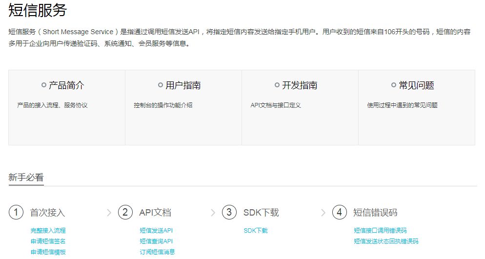

# 任务需求说明

目前大致有一个这样的任务需求

* 通过datadog.statds的接口实时监控比特币的数量
* 比特币的数量会实时同步到datadog平台（确定tag值……）
* 当比特币的少于5个时，datadog会发送webhook给自己的主机上的接收webhook的服务器
    * 在[20171210-datadog-monitor](https://github.com/HackerLaboratory/_Hack/tree/master/07-build-my-system/20171210-datadog-monitor)一文有讲解datadog、webhook的配置、使用、开发
* 服务器判断如果webhook触发是因为比特币数量少于5个，那么就处理
* 目前的处理是调用阿里云的API发送短信到某个手机号

目前我的情况是这样的：

* 如何调用datadog.statsd在代码中埋点
    * 但是目前应该如何在量化系统的代码中埋点，改在什么地方埋点还不清楚
* 如何在datadog平台上设置webhook，并且发送
    * 但目前是自己手动发送的，没有找到如何配置当某个事件触发时自动发送webhook
    * 这个点需要研究一下
* 如何使用Python调用阿里云的接口，然后发送短信到指定手机号上
    * 是不是需要有阿里云的账户？
    * 阿里云API的开发文档在哪里参考？

# 搭建开发环境

### 阿里云短信服务简介

短信服务（Short Message Service，SMS）是指通过调用短信发送API，将指定短信内容发送给指定手机用户。用户收到的短信来自105开头的号码，短信的内容多用于企业向用户传递验证码、系统通知、会员服务等信息

打开[阿里云短信服务帮助文档](https://help.aliyun.com/product/44282.html)链接可以看到关于阿里云SMS帮助文档的网页



另外还有[短信发送API的Python接口文档](https://help.aliyun.com/document_detail/55491.html?spm=5176.doc55284.6.565.9JSLAJ)

### 注册

现在[阿里云官网](https://www.aliyun.com/?spm=5176.doc55491.2.3.eDUdVY)免费注册

### 获取阿里云访问密钥

为了使用短信发送API-Python SDK，必须申请阿里云的访问秘钥。阿里云访问秘钥是阿里云用户为用户使用API（非控制台）来访问其云资源设计的“安全口令”，可以用它来签名API请求内容以通过服务端的安全验证

该访问秘钥成对（AccessKeyId 与 AccessKeySecret）生成和使用。每个阿里云用户可以创建多对访问秘钥，且可随时启用（Active）、禁用（Inactive）或者删除已经生成的访问秘钥对

在[阿里云控制台的秘钥管理页面](https://ak-console.aliyun.com/?spm=5176.doc55491.2.5.eDUdVY#/accesskey)创建、管理所有的访问秘钥对，且保证它处于“启用”状态。由于访问秘钥是阿里云对API请求进行安全验证的关键因子，请妥善保管你的访问秘钥。如果某些秘钥对出现泄漏风险，建议及时删除该秘钥对并生成新的替代秘钥对

### 在控制台完成模板与签名的申请，获取调用接口必须的参数

点击[这个地址](https://dysms.console.aliyun.com/dysms.htm?spm=5176.8911205.101.190.3b317f17Nwli0I#/)进入到SMS的控制台


先开通短信服务，这个是付费的，不过我这里仅仅是用来做简单的测试，一共也不会发送几条！所以费用很少！

首先根据用户属性来创建符合自身属性的签名，短信签名需要审核通过后才可以使用


审核通过后，可以在“短信签名”中查看签名内容，该字符串是短信发送接口的必填入参（入参填写请参照[https://help.aliyun.com/document_detail/55284.html?spm=5176.doc55327.6.551.ASST2P](https://help.aliyun.com/document_detail/55284.html?spm=5176.doc55327.6.551.ASST2P)）


然后就是创建模板。短信模板，即具体发送的短信内容。短信模板可以支持验证码、短信通知、推广短信三种模式。验证码和短信通知，通过变量替换实现个性短信定制。推广短信不支持在模板中添加变量


短信模板需要审核通过后才可以使用

审核通过后，可以在“短信模板”中查看模板ID，该ID是短信发送接口的必填入参（入参填写请点击[参照](https://help.aliyun.com/document_detail/55284.html?spm=5176.doc55330.2.4.J7qVun)）


### 安装SDK

SDK工具包中一共包含了2个目录

* aliyun-python-sdk-core：阿里云API调用的核心代码库
* alicom-python-sdk-dysmsapi：流量直冲相关接口调用的客户端以及示例代码

确定本机已经安装了python，版本要求2.6.5或以上版本。另外阿里云Python API好像并不支持Python3

进入aliyun-python-sdk-core执行`python setup.py install`

进入alicom-python-sdk-dysmsapi执行`python setup.py install`

[这里是SDK下载地址](https://help.aliyun.com/document_detail/55359.html?spm=5176.doc55491.2.8.eDUdVY)

### 开发测试程序

下面给出一个样例程序。详细的建议参考

```
# -*- coding: utf-8 -*-
from aliyunsdkdysmsapi.request.v20170525 import SendSmsRequest
from aliyunsdkdysmsapi.request.v20170525 import QuerySendDetailsRequest
from aliyunsdkcore.client import AcsClient
import uuid

"""
短信产品牌-发送短信接口
"""

# 暂不支持多region
REGION = 'cn-hangzhou'
# 根据实际申请的账户信息进行替换
ACCESS_KEY_ID = "yourAccessKeyId"
ACCESS_KEY_SECRET = "yourAccessKeySecret"

acs_client = AcsClient(ACCESS_KEY_ID, ACCESS_KEY_SECRET, REGION)

def send_sms(business_id, phone_number, sign_name, template_code, template_param=None):
    smsRequest = SendSmsRequest.SendSmsRequest()
    # 申请的短信模板编码，必填
    smsRequest.set_TemplateCode(template_code)

    # 短信模板变量参数
    # 友情提醒：如果JSON中需要带换行符，请参照标准的JSON协议对换行符的要求
    # 比如短信内容中包括\r\n的情况在JSON中需要表示成\\r\\n，否则会导致JSON在服务端解析失败
    if template_param is not None:
        smsRequest.set_TemplateParam(template_param)

    # 设置业务请求流水号，必填
    smsRequest.set_OutId(business_id)

    # 短信签名
    smsRequest.set_SignName(sign_name)

    # 短信发送的号码，必填    
    # 支持以逗号分隔的形式进行批量调用，批量上限为1000个手机号
    # 批量调用相对于单条调用及时性稍有延迟，验证码类型的短信推荐使用单条调用的方式
    smsRequest.set_PhoneNumbers(phone_number)

    # 发送请求
    smsResponse = acs_client.do_action_with_exception(smsRequest)

    return smsResponse

if __name__ == '__main__':
    __business_id = uuid.uuid1()
    print __business_id
    params = "{\"name\": \"徐猛\", \"metric\": \"btc\", \"range\": \"5\"}"
    print send_sms(__business_id, "1500000000", "云通信产品", "SMS_000000", params)
```

查询所有错误码及解决办法请点击[短信接口调用错误码](https://help.aliyun.com/knowledge_detail/57717.html?spm=5176.doc55491.2.9.eDUdVY)

>为了方便程序代码的维护，建议将手机号、ACCESS_KEY_ID等信息维护在一个配置文件中

>为了保证程序出问题的时候方便排查，建议将运行过程中遇到的所有异常信息输出到Log，方便后续有据可循！

比如上面代码中的手机号、ACCESS_KEY_ID等信息都是正确的话，将其保存为sms.py，执行`sms.py`运行程序。可能会出现下面的报错（因为发送短信需要收费！）


然后去阿里云平台，继续运行上面的例子，运行成功


# HTTP接口

上面使用的Python SDK开发，但是目前阿里云只支持Python2，如果想要用Python3进行开发怎么办？

世上没有解决不了的问题，阿里云不光针对不同的编程语言提供了SDK，同时还提供了HTTP模式的接口，方便那些没有SDK支持的语言也能进行开发

详细的可以参考[HTTP协议及签名](https://help.aliyun.com/document_detail/56189.html?spm=5176.doc55284.6.576.ty0836)

下面给出一个Python3使用HTTP接口开发的例子

```
# -*- coding: utf-8 -*-
import requests

def send_sms(business_id, phone_number, sign_name, template_code, template_param=None):
    
```

# 参考资料

* [《阿里云SMS发短信python3代码》](http://blog.csdn.net/speedge/article/details/70480992)
* [阿里云短信服务帮助文档](https://help.aliyun.com/product/44282.html)