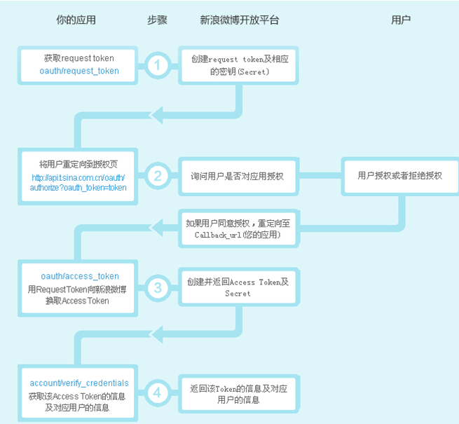

在[《Flask用户登录》](http://www.pythondoc.com/flask-mega-tutorial/userlogin.html)这一部分的实践中，遇到OpenID这个概念，不是很懂它的工作原理，所以在网络上搜索一些资料学习一下

## OpenID及其原理介绍

OpenID是一套不别于微软的Passport（或者其他厂商的一些所谓的通行证技术）的开源的解决方案，支持自己架设验证服务器。我想对于企业内部大部分应用系统实现统一登录是会有些帮助的，它的主要原理是：

* 首先你得拥有一个合法的OpenID账号，也就是说需要在一个验证服务器申请一个账号
* 你有了这个账号之后，就可以在任何一个支持OpenID验证的网站用你上面申请的OpenID登录
* 因为这个网站并不知道你的身份是否正确，所以它会请求你的验证服务器对你的身份进行验证
* 验证服务器告诉网站说，你是合法用户
* 网站接受你的身份，让你进入

在生活中的例子大致可以是这样的：

* 你在本国申请了一个护照
* 你周游列国时出示护照
* 该国的出入境管理单位，根据你的护照信息，请求你所在国的出入境管理单位的验证
* 所在国的出入境管理单位确认你的身份
* 你可以在任何国家游览了

从技术上说，这个OpenID与Passport并没有本质区别。与Cardspace的道理也是一样的。甚至可以说，它的原理并不深奥

网上也有人讨论说，这与网站的根本利益是冲突的，因为网站都想拥有自己的用户群体。这没错，但对于企业内部应用来说，可能情况就不是这样的了。我个人认为这种技术很好，因为往往一个网站最难的就是让用户来注册，如果可以不用注册，直接通过OpenID进行登录，那么用户就可以无脑直接上手了，对于网站岂不是一件好事

## OAuth

OAuth（开放授权）是一个开放标准，允许用户让第三方应用访问该用户在某一网站上存储的私密的资源（如图片、视频、联系人列表等），而无需将用户名和密码提供给第三方应用

OAuth协议**为用户资源的授权提供了一个安全的、开放而又简易的标准**。与以往的授权方式不同之处是OAuth的授权不会使第三方触及到用户账户信息（如用户名与密码），即第三方无需使用用户的用户名和密码就可以申请到该用户资源的授权，因此OAuth是安全的。同时，任何第三方都可以使用OAuth认证服务，任何服务提供商都可以实现自身的OAuth认证服务，因而OAuth是开放的

OAuth有以下角色：

* Consumer：消费方
* Service Provider：服务提供者
* User：用户

OAuth的流程如下：

* 用户访问客户端的网站，想操作有用户存放在服务提供方的资源
* 客户端向服务提供方请求一个临时令牌
* 服务提供方验证客户端的身份后，授予一个临时令牌
* 客户端获得临时令牌后，将用户引导至服务提供方的授权页面请求用户授权。在这个过程中将临时令牌和客户端的回调连接发送给服务提供方
* 用户在服务提供方的网页上输入用户名和密码，然后授权该客户端访问所请求的资源
* 授权成功后，服务提供方印到用户返回客户端的网页
* 客户端**根据临时令牌从服务提供方那里获取访问**令牌
* 服务提供方根据临时令牌和用户的授权情况授予客户端访问令牌
* 客户端使用获取的访问令牌访问存放在服务提供方上的受保护的资源

## 有腿的OAuth

前面描述的OAuth，被称为三条腿的OAuth（3-Legged OAuth），这也是OAuth的标准版本。这里所谓的“三条腿”，指的是授权过程中涉及前面提到的三种角色，也就是：消费方、服务提供者、用户。不过有些情况下，不需要用户的参与，此时就产生了一个变体，被称为两条腿的OAuth（2-Legged OAuth），一般来说，**访问私有数据的应用需要三条腿的OAuth，访问公共数据的应用需要两条腿的OAuth**

两条腿的OAuth和三条腿的OAuth相比，因为没有用户的参与，所以在流程中就不会涉及用户授权的环节，也就不需要使用Token，而主要是通过Consumer Key和Consumer Secret来完成签名的，此时的Consumer Key和Consumer Secret基本等价于账号和密码的作用

## OAuth和OpenID的区别

OAuth关注的是authorization授权，即“用户能做什么”；而OpenID侧重的是authentication认证，即“用户是谁”

OpenID和OAuth联合使用的例子：

* OpenID用户希望访问其在example.com的账户
* example.com（在OpenID的黑话中被称为Relying Party）提示用户输入他/她/它的OpenID
* 用户给了他的OpenID，比如说“http://user/myopenid.com”
* example.com跳转到了有用户的OpenID提供商“myopenid.com”
* 用户在“myopenid.com”（OpenID provider）提示的界面上输入用户名密码登录
* “myopenid.com”（OpenID provider）跳转回example.com
* example.com允许用户访问其账户
* 用户在使用example.com时希望从mycontacns.com导入他的联系人
* example.com（在OAuth的黑话里面叫“Consumer”）把用户送往mycontacts.com（黑话是“Service Provider”）
* 用户在mycontacts.com登录（可能也可能不用了他的OpenID）
* mycontacts.com问用户是不是希望授权example.com访问他在mycontact.com的联系人
* 用户确定
* mycontacts.com把用户送回example.com
* example.com从mycontacts.com拿到联系人
* example.com告诉用户导入成功

上面的例子告诉我们，**OpenID是认证协议，OAuth是授权协议，二者是互补的**。OAuth来自Twitter，可以让A网站的用户共享B网站上他自己的资源，而不需泄漏用户名和密码给另一个网站，OAuth可以把提供的Token，限制在一个网站特定时间段的特定资源

## 我的思考和问题

之前说过，学一个东西，总要在后面去进一步的思考、提出一些有建设性的问题：

* OAuth也是有一个固定流程的，其中的哪些步骤存在安全风险？
* OpenID也是有一个固定流程的，其中的哪些步骤存在安全风险？
* 在国内开发网站，使用OpenID是不是靠谱？
* 很多网站上的支持微信账号登录是怎么实现的，背后是什么原理？

----------------

参考[《OAuth、OAuth与OpenID区别和联系》](http://desert3.iteye.com/blog/1701626)
