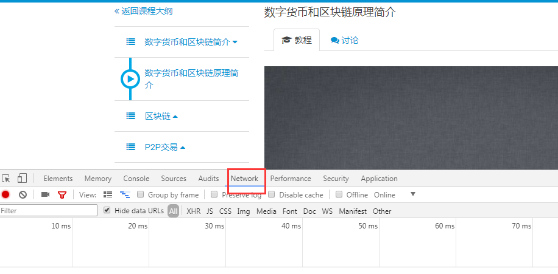
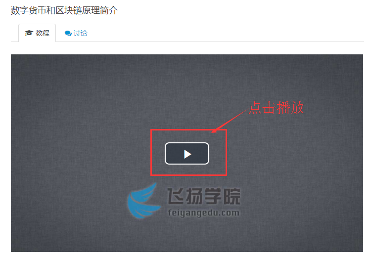
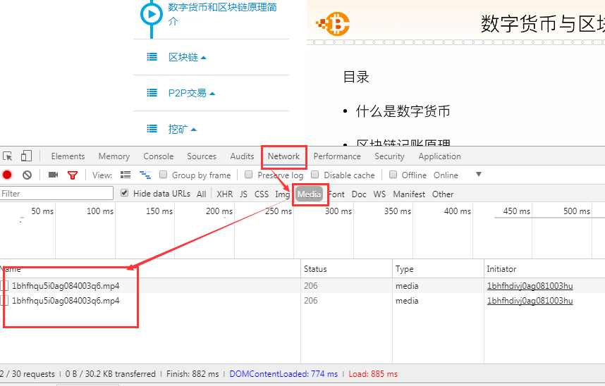
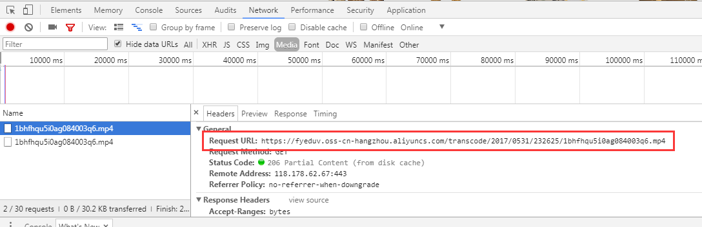
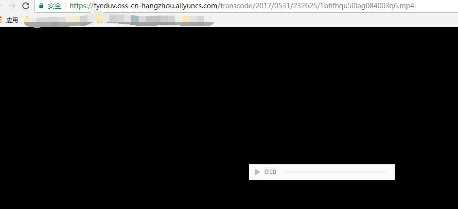
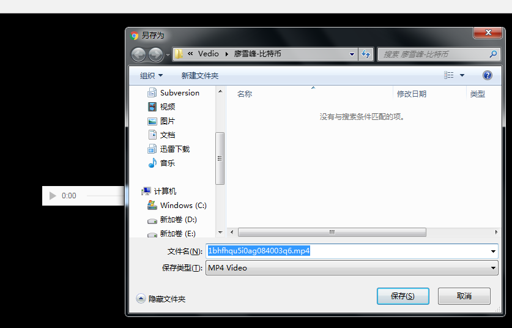

自己最近在网络平台上购买了很多的视频教程，但都是网页版的视频，没有办法下载，他们是为了保护版权吧。但是想想这些视频都有有效期，很不爽，所以就想到能不能想办法将这些视频下载下来，然后自己永久存储，可以一直看

下面是自己常用的教育平台（本文以其中一个展示如何下载，后续抽空全部下载下来保存）

* [飞扬学院](https://www.feiyangedu.com/)
* [Boolan: 博览网](http://boolan.com)
* [小象学院](http://www.chinahadoop.cn)

## 使用Chrome下载网页视频

这里用[飞扬学院廖雪峰的比特币课程](https://www.feiyangedu.com/category/CryptoCurrency)进行演示

比如打开第一个视频所在的网页[《数字货币与区块链原理》](https://www.feiyangedu.com/section/1bhmv6m560ag081003lh)！

按【F12】打开开发者工具，选择【Network】

接着刷新这个页面，然后点击播放

然后在开发者工具-->【Network】上，选择【Media】进行过滤，看到如此内容

选择其中的一个mp4文件，点击，可以看到对应的HTTP请求信息，可以看到URL

Chrome打开一个新的Tab页，输入这个URL，回车！有时候可以看到播放的视频，也有时候可能看到这样的页面

就算是在网页上没有看到视频也没有影响，在这个网页上【Ctrl-S】即可下载这个视频，然后选择保存到本地的某个目录即可完成下载

## 总结

OK，这里展示了如何下载一个网页上播放的视频！后续其他的基本都可以采用这种方式下载

这个过程不光完成了下载网页视频的任务，更重要的是对浏览器、服务器、HTTP协议、Web原理的深刻理解

技术真的是很有意思，太他妈爽了！
