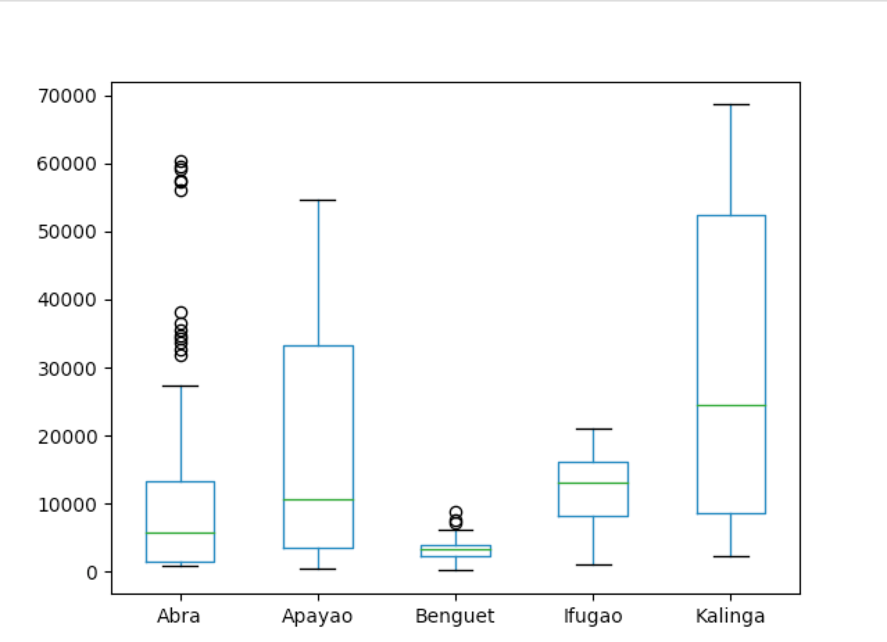
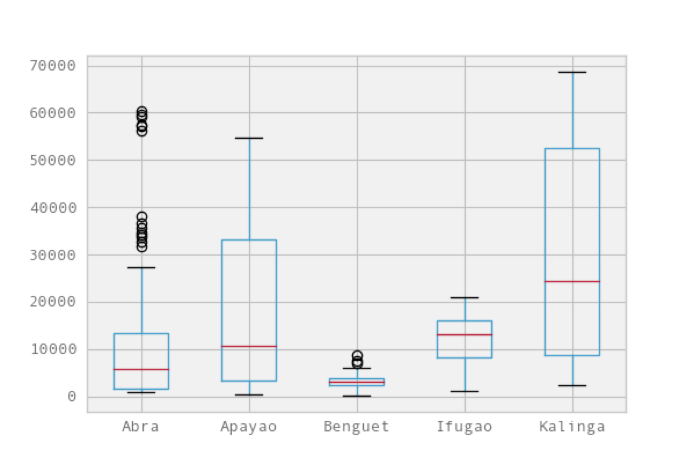

>转载[《Python数据分析》](http://python.jobbole.com/81333/)

具体内容如下：

* 数据导入：导入本地或Web端的CSV文件
* 数据变换
* 数据统计描述
* 假设检验：单样本t检验
* 可视化
* 创建自定义函数

## 数据导入

这是很关键的一步，为了后续的分析我们首先需要导入数据。通常来说，数据是CSV格式，就算不是，至少也可以转换成CSV格式。在Python中，我们的操作如下：

```
>>> import pandas as pd

#Reading data loaclly
>>> df = pd.read_csv('./data.csv')

#Reading data from web
>>> data_url = "https://raw.githubusercontent.com/alstat/Analysis-with-Programming/master/2014/Python/Numerical-Descriptions-of-the-Data/data.csv"
>>> df = pd.read_csv(data_url)
```

为了读取本地CSV文件，我们需要pandas这个数据分析库中的相应模块。其中的read_csv函数能够读取本地和web数据

## 数据变换

既然在数据空间有了数据，接下来就是数据转换。统计学家和科学家们通常会在这一步移除分析中的非必要数据，我们先看看数据：

```
>>> print df.head()
    Abra  Apayao  Benguet  Ifugao  Kalinga
0   1243    2934      148    3300    10553
1   4158    9235     4287    8063    35257
2   1787    1922     1955    1074     4544
3  17152   14501     3536   19607    31687
4   1266    2385     2530    3315     8520
>>> print df.tail()
     Abra  Apayao  Benguet  Ifugao  Kalinga
74   2505   20878     3519   19737    16513
75  60303   40065     7062   19422    61808
76   6311    6756     3561   15910    23349
77  13345   38902     2583   11096    68663
78   2623   18264     3745   16787    16900
>>> 
```

对R语言程序员来说，上面操作等价于通过print(head(df))来打印数据的前6行，以及通过print(tail(df))来打印数据的后6行.当然Python中，默认打印是5行，而R是6行。因此R代码中的head(df, n=10)，在Python中就是df.head(n=10)，打印数据尾部也是同样道理

在R语言中，数据列和行的名称通过colnames和rownames来分别进行提取。在Python中，我们则使用columns和index属性来提取，如下

```
>>> print df.columns
Index([u'Abra', u'Apayao', u'Benguet', u'Ifugao', u'Kalinga'], dtype='object')
>>> print df.index
RangeIndex(start=0, stop=79, step=1)
>>> 
```

数据转置使用T方法

```
>>> print df.T
            0      1     2      3     4      5     6      7     8      9   \
Abra      1243   4158  1787  17152  1266   5576   927  21540  1039   5424   
Apayao    2934   9235  1922  14501  2385   7452  1099  17038  1382  10588   
Benguet    148   4287  1955   3536  2530    771  2796   2463  2592   1064   
Ifugao    3300   8063  1074  19607  3315  13134  5134  14226  6842  13828   
Kalinga  10553  35257  4544  31687  8520  28252  3106  36238  4973  40140   

         ...       69     70     71     72     73     74     75     76     77  \
Abra     ...    12763   2470  59094   6209  13316   2505  60303   6311  13345   
Apayao   ...    37625  19532  35126   6335  38613  20878  40065   6756  38902   
Benguet  ...     2354   4045   5987   3530   2585   3519   7062   3561   2583   
Ifugao   ...     9838  17125  18940  15560   7746  19737  19422  15910  11096   
Kalinga  ...    65782  15279  52437  24385  66148  16513  61808  23349  68663   

            78  
Abra      2623  
Apayao   18264  
Benguet   3745  
Ifugao   16787  
Kalinga  16900  

[5 rows x 79 columns]
```

其他变换，例如排序就是用sort属性。现在我们提取特定的某列数据。Python中，可以使用iloc或ix属性。但我更喜欢用ix，因为它更稳定些，假设我们需数据第一列的前5行，我们有

```
>>> print df.ix[0:5, 0].head()
0     1243
1     4158
2     1787
3    17152
4     1266
Name: Abra, dtype: int64
```

顺便提一下，Python的索引是从0而非1开始的，为了提取从11到20行的前3列数据，可以：

```
>>> print df.ix[10:20, 0:3]
     Abra  Apayao  Benguet
10    981    1311     2560
11  27366   15093     3039
12   1100    1701     2382
13   7212   11001     1088
14   1048    1427     2847
15  25679   15661     2942
16   1055    2191     2119
17   5437    6461      734
18   1029    1183     2302
19  23710   12222     2598
20   1091    2343     2654
>>> 
```

上述命令相当于df.ix[10:20, ['Abra', 'Apayao', 'Benguet']]

为了舍弃数据中的列，这里是列1(Apayao)和列2(Benguet)，我们使用drop属性，如下：

```
>>> print df.drop(df.columns[[1,2]], axis=1).head()
    Abra  Ifugao  Kalinga
0   1243    3300    10553
1   4158    8063    35257
2   1787    1074     4544
3  17152   19607    31687
4   1266    3315     8520
```

axis参数告诉函数到底舍弃列还是行，如果axis等于0，那么就舍弃行

## 统计描述

下一步就是通过describe属性，对数据的统计特性进行描述

```
>>> print df.describe()
               Abra        Apayao      Benguet        Ifugao       Kalinga
count     79.000000     79.000000    79.000000     79.000000     79.000000
mean   12874.379747  16860.645570  3237.392405  12414.620253  30446.417722
std    16746.466945  15448.153794  1588.536429   5034.282019  22245.707692
min      927.000000    401.000000   148.000000   1074.000000   2346.000000
25%     1524.000000   3435.500000  2328.000000   8205.000000   8601.500000
50%     5790.000000  10588.000000  3202.000000  13044.000000  24494.000000
75%    13330.500000  33289.000000  3918.500000  16099.500000  52510.500000
max    60303.000000  54625.000000  8813.000000  21031.000000  68663.000000
```

## 假设检验

Python有一个很好的统计推断包。那就是scipy里面的stats。ttest_1samp实现了单样本t检验。因此，如果我们想检验数据Abra列的稻谷产量均值，通过零假设，这里我们假定总体稻谷产量均值为15000，我们有：

```
>>> from scipy import stats as ss
>>> print ss.ttest_1samp(a = df.ix[:, 'Abra'], popmean = 15000)
Ttest_1sampResult(statistic=-1.1281738488299586, pvalue=0.26270472069109496)
>>> 
```

返回下述值组成的元组：

* t：浮点或数组类型；t统计量
* prob：浮点或数组类型；two-tailed p-value双侧概率值

通过上面的输出，看到p值是0.267远大于a等于0.05，因此没有充分的证据说明平均稻谷产量不是15000。将这个检验应用到所有的变量，同样假设均值为15000，我们有：

```
>>> print ss.ttest_1samp(a = df, popmean = 15000)
Ttest_1sampResult(statistic=array([ -1.12817385,   1.07053437, -65.81425599,  -4.564575  ,   6.17156198]), pvalue=array([  2.62704721e-01,   2.87680340e-01,   4.15643528e-70,
         1.83764399e-05,   2.82461897e-08]))
```

第一个数组t是统计量，第二个数组则是相应的p值

## 可视化

Python中有许多可视化模块，最流行的当属matplotlib库。稍加提及，我们可选择bokeh和seaborn模块

```
>>> import matplotlib.pyplot as plt
>>> plt.show(df.plot(kind='box'))
```



现在，我们可以用pandas模块中集成的ggplot主题来美化图表

```
>>> import matplotlib.pyplot as plt
>>> pd.options.display.mpl_style = 'default'
sys:1: FutureWarning: 
mpl_style had been deprecated and will be removed in a future version.
Use `matplotlib.pyplot.style.use` instead.

>>> df.plot(kind='box')
```



----

后续计算自定义函数计算正态分布的部分目前还是不太懂，先通过其他途径学学再说吧
