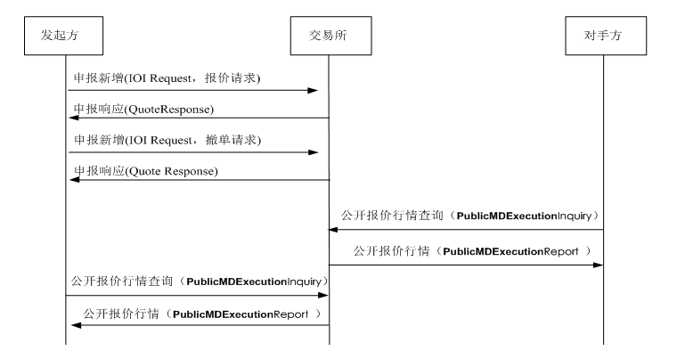
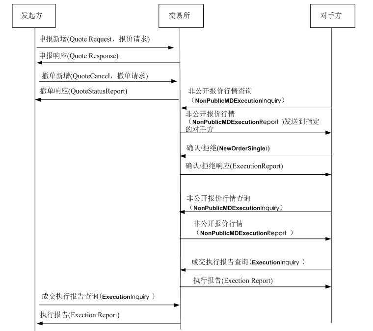
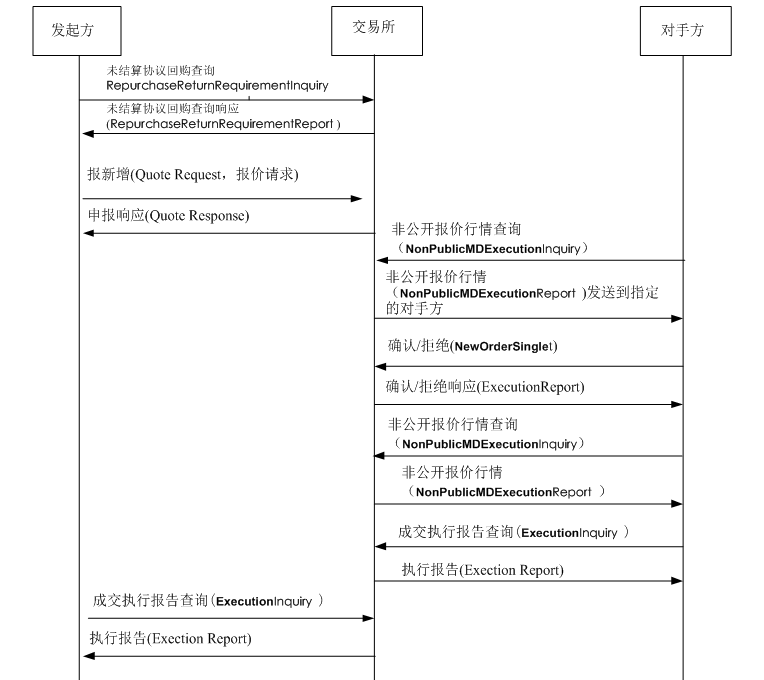
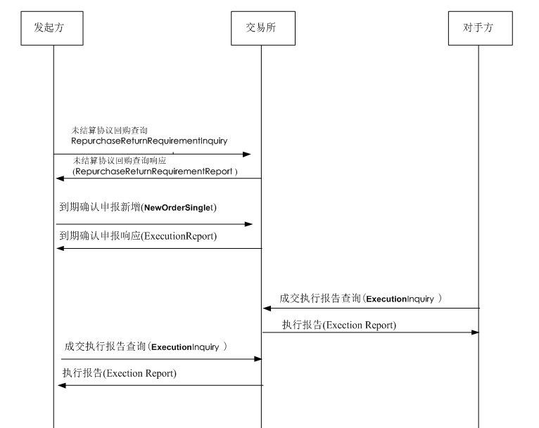
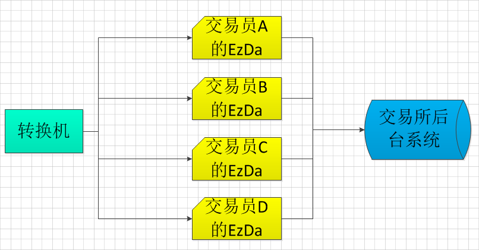

>本文整理上交所债券协议回购的业务规则

一直以来，对于证券金融业务总是在懂与不懂之间，比如对股票、债券、基金、ETF等这些概念大致了解，自己根据交易所的接口文档开发公司行为、债券协议回购、黄金等业务也是可以完成的，但是总是觉得差点什么东西（最大的问题就是不知道如何描述这个问题），所以总是对于业务的理解不深刻

上交所债券协议回购业务我的理解还算是比较深入一些，因为当时我在上交所待了大概一个半月，反复阅读交易所接口文档、向交易所的老师问了好多相关的问题，所以对这个业务梳理的比较清楚，现在在这里对这个业务进行一个系统化的梳理

我最近也在思考，要怎么学习金融业务，下面是自己的一些思考：

* 交易所的接口文档很重要，弄明白接口中每个字段、每个值域的作用，对于理解业务有极大的帮助
* 现货股票、协议回购、黄金、期货、银行间等很多业务都有自己独立的金融账户结构的，把这个梳理清楚也很重要
* 我现在是做金融系统的报盘部分，其他环节比如清算、风控、等都有必要了解
* 另外要弄明白一些重要的名词：轧差、久期、持仓、可用、头寸、期货、期权等都要弄清楚
* 股票业务在上交所和深交所可能差别不大，但是还有一些业务比如债券协议回购，在上交所和深交所有极大的差异

>本文当然主要是针对上交所债券协议回购进行梳理，另外就也会谈及和深交所债券协议回购的差异

>当然以下的整理都是依赖于目前（2017年）的接口规范，后续交易所可能对其中的一部分或全部交易规则做了变更，就会导致下面总结的内容无效了！所以这个实时性的问题需要注意

# 背景知识

固定收益平台现有电子化报盘接口基于DBF数据库表实现。为适应市场发展、满足交易商用户的数据直通需求，上交所根据近年来STEP协议的应用经验，制定了适应于固定收益平台业务的、基于STEP协议的数据交换协议

# 交易规则

>这部分内容主要是参考交易所的接口文档进行整理的

债券质押式协议回购（简称“协议回购”）是指交易双方自主谈判和协商议定，以债券为权利质押的融资业务。资金融入方（正回购方）在将债券出质给资金融出方（逆回购方）融入资金的同时，双方约定在未来某一日期，由正回购方向逆回购方返还本金，并按约定利率支付利息，同时解除债券质押登记解除

协议回购业务功能包括：意向申报、成交申报、到期确认申报、到期续做申报、解除质押申报、换券申报、提前终止申报

* 只能正回购方做的业务
	* 首次申报（成交申报）
	* 到期续做、到期确认
	* 换券申报
* 正回购方和逆回购方都可以做的业务
	* 提前终止申报
	* 解除质押申报

### 意向申报

意向申报用于报单者向市场上发布信息：“我要做协议回购的交易，有人也想做的话可以来找我”，但只停留在这个层面，不涉及到任何钱、券的问题。要想进行交易，需要用下面的其他申报方式

### 成交申报

* A想做协议回购业务，发起首次报价（交易所称之为“成交申报”，可撤单），那A称为正回购方
	* 首次报价申报支持一笔委托中包括最多10只代码
	* 交易所考虑如此场景：正回购方需融入1000万，但手中的某一只券达不到要求，所以一次申报多只券达到1000万的效果
	* 逆回购方针对这笔首次报价申报的所有券，如果同意则全部同意，如果拒绝则全部拒绝
	* 逆回购方通过非公开报价行情收到首次申报请求，所以非公开报价行情记录中也会包含多只券
* 交易所收到首次报价申报后，如果未废单，那么在交易所生成一个非公开报价行情
	* 不像竞价平台，协议回购在首次报价时，指定了逆回购方，所以这个行情仅在这两人之间可见
* 逆回购方发起非公开报价行情查询，向交易所查到所有和自己相关的非公开行情
* 逆回购方根据行情决定是否和正回购方做交易，选择确认或拒绝
* 如果选择确认，那么对应的这笔非公开报价行情会失效
* 如果选择确认，正逆回购方可以通过成交执行报告查询来查询成交的信息

### 续做/解除质押/换券/提前终止

>到期续做申报、解除质押申报、换券申报、提前终止申报

到期续做、解除质押、换券、提前终止都是依赖于之前成交了的首次报价申报，首次报价申报中指定了到期日

* 协议回购到期，正回购方（只能是正回购方）发起到期续做
	* 在交易所生成了一笔非公开报价行情
	* 逆回购方进行确认或拒绝，之后的流程和首次报价类似
* 协议回购过期之后，只能做解除质押申报（逾期违约）
	* 可以是正回购方，也可以是逆回购方
	* 解除质押交易双方依约定在线下自行划付资金
* 换券申报只能由正回购方发起
* 如果协议回购未到期，想提前终止，可以发起提前终止申报
	* 对于正常存续期（不含首次结算日和到期结算日）的回购交易
	* 交易双方达成一致，提前结束协议回购合约
	* 按照合约实际存续的期限和双方协商的利率进行结算

### 到期确认申报

到期确认也是依赖于之前成交了的首次报价申报，首次报价申报的要素中指定了到期日，当协议回购到期的时候，可以选择上面说到的

* 查询未结算协议回购
* 正回购方（只能是正回购方）发起到期确认申报
* 交易所收到到期确认申报后，会产生成交（无需逆回购方确认）
* 正回购方查询成交
* 逆回购方查询成交

# 电子化关键节点拓扑图

* 转换机将多个交易员加载上来
	* 在资产管理系统中维护多个交易员
	* 每个交易员有自己的EzDataAccess
* 每个交易员在转换机内部通过Socket连接到自己的EzDataAccess
* 交易员A报单报到自己的EzDataAccess
	* 不允许多个交易员连接到一个EzDataAccess
* 然后这个EzDataAccess再报单到交易所后台

>这部分开发涉及到TCP网络编程，在我做报盘开发的过程中，在做网络编程部分遇到了各种问题

# 账户结构

>这部分我们会拿交易所债券协议回购业务的账户结构和普通交易所市场的现货股票账户结构进行比较

首先我们要弄清楚这么一个概念。比如上交所，它分为这样几个平台：

* 竞价平台，主要进行现货股票、债券等的买卖
* 固定收益平台，包括本文讲解的债券协议回购业务等
* 大宗交易平台，为了防止有些人一次买卖大量的股票等证券会引发市场大波动，所以专门在这个平台来进行大宗证券的交易

就我在交易所出差期间了解的情况，这三个不同的平台在交易内部是不同的后台系统、由不同的团队开发和维护、账户结构和交易规则也是有比较大的差别的

### 先说竞价平台账户结构

竞价平台在直连模式下的概念有：席位、股东账号

* 席位：表示可以直接在交易所进行交易的资格
	* 一般大型机构，比如券商、基金公司可以向交易所申请席位
	* 而个人买卖证券，没有席位资格，必须通过券商分仓
* 股东账号：股东账号是指上海股东卡上的账号和深圳股东卡上的账号
	* 它的区别在于股东账户卡是代表你具备了买卖股票的资格

竞价平台在分仓模式下的概念有：资金账号、股东账号、营业部

* 股东账号：和直连模式的股东是一样的
* 资金账号：资金账号是代表你有没有现钱来买进股票
	* 一般8位或8位以下数字组成
	* 每家券商的开户的股民资金账号位数不尽相同
* 营业部：可以参见[01-securities-company-introduce.md](https://github.com/HackerLaboratory/_Crack/blob/master/20170901~2017mmdd-finance-detail/01-securities-company-introduce.md)中相关描述

### 再说债券协议回购账户结构

通过交易所的接口文档，可以看到其账户中的一些关键概念有：交易商、交易员、交易单元（席位）、投资者账户（股东）

交易商和交易员是一对多的关系

席位和股东是一对多的关系

比如，可以用交易商004/交易员Z00401的席位24739/股东B004247390做正回购方；对应用交易商004/交易员Z00401的席位24739，另一个股东D004247390做逆回购方

# 业务细节

>这部分内容主要是梳理我在交易所期间向交易所的老师询问的诸多问题，主要是交易流程上的一些逻辑细节的总结

### 电子化 vs 录单

如果不是通过电子化接口报单，而是直接在交易所录单（首次报价），也会生成非公开行情，通过电子化接口可以查询到

### 首次报价申报质押券

首次报价申报中，每只券有字段：质押券数量，假如值是i手；字段：成交金额，假如值是j元

其含义是，用i手的这只券，去换j元

### 逆回购方拒绝首次报价

假如正回购方发起首次报价，逆回购方通过成交申报做拒绝

那么逆回购方通过成交申报的响应可以收到拒绝被交易所处理成功还是处理失败的消息

但是正回购方无法通过电子化接口收到被拒绝的消息，正回购方的首次报价申报委托就会一直挂单在交易所

这个只能是正逆回购方线下通过电话等方式进行沟通

### 换券申报目前只支持全额替换

换券申报目前只支持全额替换，什么是全额替换？

金额不变，一个券换成另一个券

不能换一半，结束一半

### 查询非公开报价行情

非公开报价行情，逆回购方可以查询，正回购方可以查询吗？

只能逆回购方查行情，正回购方无法查。填写自己的交易商和交易员，即可查询到作为逆回购方对应的行情

### 确认报价时填首次申报成交编号

但假如T日成交，T+N把T日的成交编号给交易所，那么T日的会不会和T+N的成交编号重复，之前的协议回购是通过合同序号来匹配到的

未结算查询中可以查到成交编号、成交日期，然后确认报价报单时使用这个查询回来的成交编号、成交日期信息

### 正回购方续做确认后产生4笔成交

正回购方发起到期续做被确认后，会产生4笔成交

正逆回购方各收到2笔成交。2笔中分别是一笔协议到期终结成交，一笔是协议新开成交

但是逆回购方没有做任何主动处理，完全是被动收到的成交，需要根据其中的**原成交日期**、**原成交编号**去找之前做的首次申报确认的委托记录才行

### 协议回购最多支持10只券

假如正回购方首次申报中有10只券，对方也进行了确认，那么最终交易所系统中拆成10笔成交，每只券对应10笔成交，查询到的成交执行报告记录也是10笔

>因为支持10只券，所以在系统表结构设计、报盘开发的时候就会很恶心；而深交所债券质押式协议回购就没有这个问题，所以深交所相对好开发很多

后面做到期续做的时候也需要分别做10笔续做

### 到期续做申报的质押券不得变更

续做申报须经续做逆回购方确认后生成新的回购合约，原到期回购合约终结

续做逆回购方可以是原回购的逆回购方也可以是新的第三方

交易系统后台将该续做申报拆分成两笔交易：一笔到期续做前期合约了结，和一笔到期续做合约新开

### 折算比例

折算比例，不能大于100%！

这个不是交易所规定的，这是双方协商的结果，但是不能超过100%

### 到期结算金额

到期结算金额 = 成交金额 + 回购利息

### 质押式回购的到期和过期

如果到期先申报了续做，又撤单撤成了，那么要在下一笔到期确认？如果没有下到期确认，到了下一个交易日是不是正回购方要解除质押？

过期之后只能做解除质押

协议回购到期之前可以做：换券、提前终止

到期日当天可以做：到期续做、到期确认

过期之后，只能解除质押，不通过交易所系统进行资金结算，其他业务都要经过交易所进行资金结算

解除质押交易是交易双方依约定在线下自动划付资金

# 重要概念

做报盘就是有这方面天生的优势，总是第一手拿到交易所的接口文档，然后就可以通过分析接口文档来理解业务，最重要的就是针对接口文档中的每个字段进行研究，弄清楚每个字段在交易中启到的作用，清楚每个值域的意义和作用！

这对于理解金融业务也是极其重要的。所以下面就是针对接口文档中的一些关键术语（关键字段）进行总结

* 质押券代码
* 回购利率
* 回购期限
* 实际占款天数
* 回购到期日
* 到期结算日
* 质押券面总额合计
* 回购利息
* 到期结算金额
* 交易商
* 交易员
