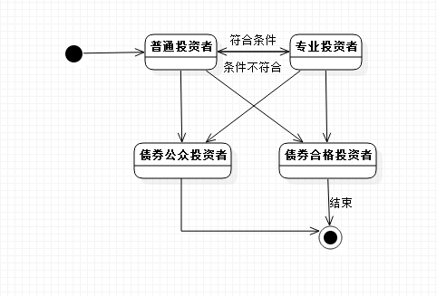
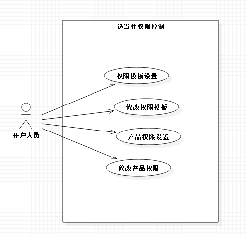
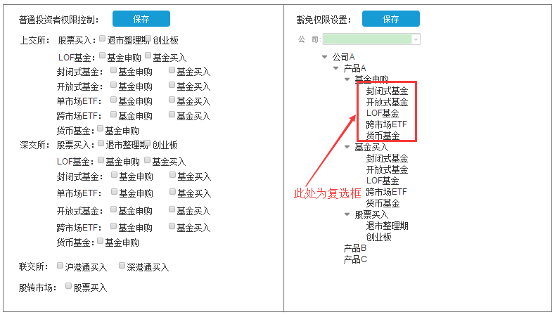
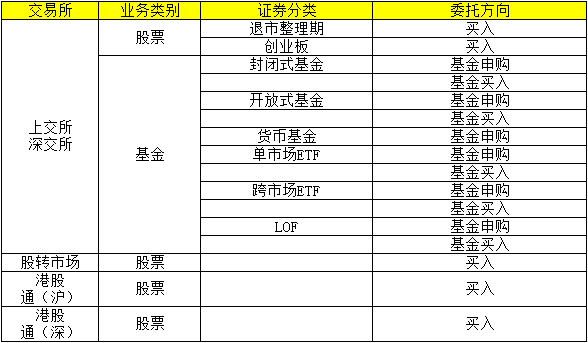

# 业务背景

### 背景介绍

随着券商PB业务的持续发展，投资者对交易速度的要求也越来越高，券商给投资者提供PB系统直连交易所进行委托的服务，直连交易所很大程度上提升了委托下达到报单至交易所的速度，直连报盘对委托速度要求很高的客户来说是非常有效的办法

但是针对交易所发布投资者适当性管理办法和投资者债券适当性管理办法后，对投资者的要求也做出了规定，如果交易链路走分仓的模式时，交易权限可以通过集中交易柜台来做控制，PB系统不需要很严格的控制业务交易权限；但直连的情况下只能通过交易系统来控制投资者的交易权限，以达到适当性管理要求的目的，当前系统只能通过风控来进行控制直连情况下的交易权限

针对同一类型的投资者，具体到业务权限也会有所区别，比如针对同为专业投资者，有一些投资者是没有ETF的申赎权限，有一些投资者是有申购权限的，故需要根据不同合同的签署情况来进行设置

当前PB系统针对适当性管理中的业务权限管理还不是特别充分，故需要恒生PB系统结合交易所投资者适当性管理办法和债券适当性管理办法来做出相应的业务权限控制

### 投资者适当性

为规范上海证券交易所（以下简称本所）市场投资者适当性管理工作，保护投资者合法权益，根据《中华人民共和国证券法》《证券公司监督管理条例》《证券期货投资者适当性管理办法》（以下简称《办法》）以及其他相关业务规则，制定出投资者适当性管理办法

市场的投资者分为专业投资者和普通投资者。专业投资者和普通投资者在一定条件下可以互相转化

投资者适当性管理主要包括以下内容：

* 了解投资者的相关情况并评估其风险承受能力
* 了解拟提供的产品或服务的相关信息
* 向投资者提供与其风险承受能力相匹配的产品或服务，并进行持续跟踪和管理
* 提供产品或服务前，向投资者介绍产品或服务的内容、性质、特点、业务规则等，进行有针对性的投资者教育
* 揭示产品或服务的风险，与投资者签署《风险揭示书》

### 债券适当性

为保护投资者合法权益，引导投资者理性参与债券市场，促进债券市场健康稳定发展，根据国家相关法律、行政行规、规章及交易所相关业务规则，制定出交易所债券市场投资者管理办法

债券市场投资者适当性管理，是指对不同特征和风险水平的公司债券、企业债券、资产支持证券等（以下统称债券）的发行认购、上市交易及挂牌转让做出分类，并区别不同产品风险和风险承受能力的投资者，引导其参与相应类型债券认购、交易及转让的制度安排

债券市场投资者按照产品风险识别能力和风险承受能力，分为合格投资者和公众投资者

合格投资者可以认购及交易在本所上市交易或挂牌转让的全部债券，但下列债券仅限合格投资者中的机构投资者认购及交易

* 债券信用评级在AAA以下（不含AAA）的公司债券、企业债券（不包括公开发行的可转换公司债券）
* 非公开发行的公司债券、企业债券
* 资产支持证券
* 认可的其他仅限合格投资者中的机构投资者认购及交易的债券

公众投资者可以认购及交易在交易所上市的下列债券：

* 国债
* 地方政府债券
* 政策性银行金融债券
* 公开发行的可转换公司债券
* 符合《公司债券发行与交易管理办法》和本所《公司债券上市规则》规定条件，面向公众投资者公开发行的公司债券

合格投资者可以参与国债预发行交易，合格投资者中的机构投资者可以参与债券质押式回购的融资交易、债券质押式协议回购的融资交易和融券交易。合格投资者及公众投资者可以参与债券质押式回购的融券交易

各会员应该能够解析处理新的投资者适当性管理分类信息，并据此信息按照即将正式发布的《深圳证券交易所债券市场投资者适当性管理办法》的要求对投资者认购或买入债券的行为做好前端管控

发行人、承销机构、证券经营机构违反投资者适当性管理要求的，本所可以根据相关规定实施监管措施和纪律处分

# 需求概述

### 需求目标

为了落实交易所提出的投资者适当性管理办法和债券市场投资者适当性管理办法，方便券商对直连产品的业务权限控制，恒生PB系统计划进一步完善业务权限控制相关功能。具体需要达成如下目标：

* 新增“业务权限管理”功能，包括“普通投资者”、“豁免权限”的分类模板。包括“允许投资的业务分类”、“委托方向权限”、“证券类别权限”设置
* 支持豁免权限模板根据产品来进行设置
* 支持资金账户层投资者适当性属性类型的权限控制
* 支持业务权限根据模板和资金账号层的设置取交集处理
* 支持资金账户层设置“债券投资者适当性管理”
* 支持转换机同步柜台资金账户投资者适当性状态（以实现）以及债券投资者适当性状态

### 投资者状态说明

投资者说明

变迁条件      |条件说明                       |备注
--------------|-------------------------------|-------------
普通投资者    |投资者初始为普通投资者         |状态相互转化
专业投资者    |符合交易所条件的投资者         |状态相互转化
债券合格投资者|符合交易所规定的债券合格投资者 |
债券公众投资者|除债券合格投资者以外的投资者   |

# 用户需求详述

### 权限模板设置

项目      |内容
----------|-------------------------------------------------------
用例名称  |权限模板设置
用例简述  |开户人员根据业务部门和风控部门要求来设置投资者权限模板
前置条件  |券商开通“直连模式适当性管理”功能模块
主要流程  |运营人员设置“普通投资者权限控制”和“豁免权限设置”；运营人员根据业务部的要求来设置资金账户的权限
替代流程  | 
业务规则  |支持根据不同的类别进行设置（权限主要分为：交易所权限、证券类别权限、委托方向权限；交易市场权限为：上交所、深交所、股转市场、联交所；证券类别权限为：股票、基金；委托方向权限为：买入）；模板修改后，点击“保存”后生效，点击需要二次确认，二次确认提示信息“确定修改普通投资者权限控制？”
后置条件  |权限模控制板设置后，同资金账户层权限设置取交集处理；权限按照权限模板设置为准
说明      |N/A

### 普通投资者

项目      |内容
----------|-------------------------------------------------------
用例名称  |普通投资者权限控制
用例简述  |投资者不满足专业投资者的相关要求，只能投资普通投资者的投资品种
前置条件  |投资者在券商开户成功，并评估为“普通投资者”，由转换机同步至PB系统
主要流程  |运营人员把该资金账户适当性分类调整为“普通投资者”（当前系统已支持同步柜台）；运营人员根据业务部提供的普通投资者的权限清单来进行权限模板设置
替代流程  |
业务规则  |普通投资者权限只针对投资者属性为“普通投资者”生效；如果设置资金账户层委托方向权限和证券类别权限的情况下，同权限控制模板取交集生效
后置条件  |
说明      |N/A

### 专业投资者

项目      |内容
----------|-------------------------------------------------------
用例名称  |专业投资者权限控制
用例简述  |投资者满足合格投资者的相关要求，可以投资专业投资者的投资品种
前置条件  |投资者在券商开户成功，并评估为“专业投资者”，且通过转换机同步柜台为“专业投资者”
主要流程  |运营人员把该资金账户适当性分类调整为“专业投资者”（当前系统已支持同步柜台）
替代流程  |
业务规则  |普通投资者权限值针对投资者属性为“专业投资者”生效；根据资金账户层设置的权限进行控制
后置条件  |
说明      |N/A

### 债券适当性

项目      |内容
----------|-------------------------------------------------------
用例名称  |债券适当性
用例简述  |针对债券投资者适当性管理，来针对投资者针对债券的投资范围
前置条件  |券商开通“直连模式适当性管理”功能模块
主要流程  |券商开户人员选择资金账户层的投资者债券适当性分类（分类为：公众投资者、合格投资者、合格投资者中机构投资者，缺省为公众投资者。该类型需要增加转换机任务进行柜台同步）；根据证券基础信息来区分债券投资者适当性来进行权限控制（证券资料表中已存在该字段）
替代流程  |
业务规则  |根据资金账户层“投资者债券适当性分类”来做控制（当分类为“公众投资者”时，只允许对证券资料债券适当性管理分类为“仅公众投资者”的债券仅限认购和交易；当分类为“合格投资者”时，只允许对证券资料债券适当性分类为“仅合格投资者”的债券包括“公众投资者”的债券进行认购和交易；当分类为“合格投资者中机构投资者”时，允许对证券资料债券适当性分类为“仅合格投资者中机构投资者”的债券包括“合格投资者”和“公众投资者”的债券进行认购和交易）；当公众投资者认购或交易：仅“合格投资者”或“仅合格投资者中机构投资者”的债券时，给出提示时：该证券仅XXXXX投资者可以认购或交易
后置条件  |当在日间修改债券适当性分类时，修改后生效
说明      |N/A

# 附件

### 投资者权限模板

### 权限控制字段

