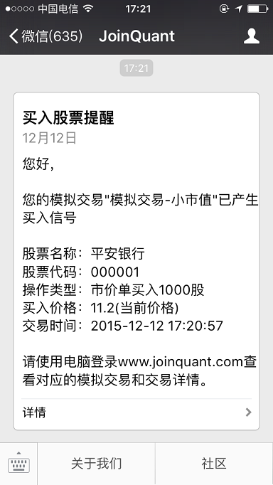

>[【新手入门教程】十行代码带你量化交易入门 - JoinQuant-TWist](https://link.zhihu.com/?target=https%3A//www.joinquant.com/post/3616)

## 前言

说起量化交易入门，很多时候得到的答案要么是谈理论、要么列书单、要么就过程繁琐难以实践，结果往往是让对量化交易感兴趣的人迈不出那最初的一步

这篇文章，力求以简单的例子，手把手教你如何用十行代码，写一个根据实际行情发送交易信号到微信的量化交易策略！

学习内容：

* 学会写一个简单的量化交易策略
* 理解策略的基本框架
* 学会建立连接实盘的模拟交易，并使其自动发送交易的信号到微信

首先，进入JoinQuant，新建策略并清空原本模板代码，如下图。注意，未登录用户无法保存编写的策略以及查看回测详情，最好先登录，免得编的策略保存不了白做了


左侧是编写策略代码，右侧是策略运行结果。我们就在左侧写策略代码。（图片是老版示例，跟上图不相连，只看大体界面就好）


下面教你用10行代码写个量化交易策略：单股票均线策略

## 确定策略内容与框架

我们明确下策略内容：

* 若昨日收盘价高出过去20日平均价，今天开盘买入股票
* 若昨日收盘价低于过去20日平均价，今天开盘卖出股票

只操作一只股票，很简单对吧，但怎么用代码说给计算机听呢？

想想人是怎么操作的，应该包括这样两个部分：

* 既然是单股票策略，事先决定好交易哪一只股票
* 每天看看昨日收盘价是否高于过去20日平均价，是的话开盘就买入，不是开盘就卖出。每天这么做，循环下去

对应代码也是这两个部分

```
def initialize(context):
    # 用来写最开始要做什么的地方

def handle_data(context, data):
    # 用来写每天循环要做什么的地方
    # handle_data按天循环时，其中的操作都是在9:30执行
```

>几乎所有策略都基于这个基本的策略框架：先初始化，然后循环操作

* 初始化，即最开始要做的事情，如选定股票；设置变量、参数等等
* 周期循环：即每个周期要做的事情，如计算指标、买入卖出等，周期可能是分钟、天等，本文策略的周期是一天。当你要做一些盘中断线操作的时候，周期就要调成分钟。先别急！会遇到的

## 初始化

我们要先设置要交易的股票的代码，比如：兔宝宝（002043），真的有这个股票噢

```
def initialize(context):
    g.security = '002043.XSHE' # 存入“兔宝宝”的股票代码
```

答题和延伸：

* **g是什么？**全局变量前都要写`g.`。全局变量就是全局能用的变量，一般变量只能在该函数下使用。如security不加`g.`，只能在第一部分即initialize里使用，不能在第二部分handle\_data里使用
* **什么是变量？**可以当变量是各种存放数据的容器，每个都要有个名字，比如`g.security = '002043.XSHE`，就是把数据'002043.XSHE'放到变量`g.security`中，如果变量中里面有别的数据会替换掉
* **XSHE是什么？**股票代码使用时要加后缀，深交所股票代码后缀为`.XSHE`，上交所股票代码后缀为`.XSHG`

## 获取收盘价与均价

首先，获取昨日股票的收盘价

```
# 用法：变量 = data[股票代码].close
# 取得最近日收盘价，命名为last_price
last_price = data[g.security].close
```

然后，获取近20日股票收盘价的均价

```
# 用法：变量 = data[股票代码].mavg(天数, 'close')
# 获取近20日股票收盘价的平均价，命名为average_price
average_price = data[g.security].mavg(20, 'close')
```

## 判断是否买卖

数据都获取完，该做买卖判断了

```
# 如果昨日收盘价高于20日平均价，则买入，否则卖出
if last_price > average_price:
    买入
elif last_price < average_price:
    卖出
```

问题来了，现在该写买卖下单了，但那多少钱去买我们还没有告诉计算机，所以还要获取账户里现金量

```
# 用法：变量 = context.portfolio.cash
# 获取当前的现金量
cash = context.portfolio.cash
```

>问：context.portfolio是什么？

## 买入卖出

```
# 用法：order_value(要买入股票的股票代码, 要多少钱去买)
order_value(g.security, cash)    # 用当前所有资金买入股票

# 用法，order_target(要买卖股票的股票代码, 目标持仓金额)
order_target(g.security, 0)      # 将股票仓位调整到0，即全卖出
```

* **为什么没有指定交易价格？**此策略是按天回测进行的且使用的较为简单的市价单下单方法，交易价格为开盘价（加上滑点）
* **无法交易的情况？**涨跌停，停牌，T+1制度等无法交易的情况，系统会自动使下单不成交并在日志中发出警告
* **滑点是什么？**简言之是为成交误差留出余地
* **下单方法有哪些？**

## 策略代码写完，进行回测

把买入卖出的代码写好，策略就写完了，如下

```
def initialize(context):
    g.security = '002043.XSHE'

def handle_data(context, data):
    last_price = data[g.security].close
    average_price = data[g.security].mavg(20, 'close')
    cash = context.portfolio.cash

    if last_price > average_price:
        order_value(g.security, cash)
    elif last_price < average_price:
        order_target(g.security, 0)
```

现在，在策略回测界面右上部，设置回测时间从20140101到20160601，设置初始资金为100000，设置回测频率，然后点击运行回测


>**什么是回测？**回测是量化交易策略研究中的关键，是指给定一段时间的历史数据（如此处是20140101到20160601的每日数据），计算机按照所编写的策略进行模拟仿真交易，以测试策略效果好坏

如果你代码没有问题，就会顺利的进行回测，回测结果如下


至此，你就完成了一个简单策略的回测了

如何根据回测结果评价策略好坏？很初级地讲，有三：

* 盈利能力：策略收益与年化收益高，则说明盈利能力强。盈利能力不行说啥都没有用
* 盈利稳定性：最大回撤要低。最大回撤是指最大亏损幅度，50%则意味着历史上看最大亏损率为50%
* 回测可靠性：交易次数要多。交易次数越多意味着经历了越多次的检验，回测的结果也越可靠
* 更多说明见[风险指标说明](https://www.joinquant.com/api#风险指标)

当前这个策略回撤大、交易次数少，只交易一只股票，并不靠谱。但是结构简单适合新手入门理解整个流程

## 建立模拟交易，使策略和行情实时连接自动运行

策略写好，回测完成，点击回测结果界面（如上图）右上部模拟交易按钮，新建模拟交易如下图


写好交易名称，设置初始资金，数据频率，此处是每天，设置好后点提交

>模拟交易创建成功后，需要等待A股至少开盘一次，才能查看模拟交易结果

## 开启微信通知，接收交易信号

点击聚宽导航栏-->我的交易，可以看到创建的模拟交易，如下图


点击右边的微信通知开关，将OFF调到ON，按照指示扫描二维码，绑定微信，就能微信接收交易信号了

当策略买卖操作，微信会收到信号提醒类似下图



问题：**能不能自动下单？**目前不能，国家管制，你可以根据信号手动下单买卖，施行策略

## 自测与自学

* 能否理解整个策略框架？
* 能否成功编写单股票均线策略，成功回测，建立模拟，开启微信通知
* 能够理解年化收益，最大回撤
* 浏览[聚宽新手指南](https://www.joinquant.com/post/4589)，干货、答疑、指路，一应俱全
