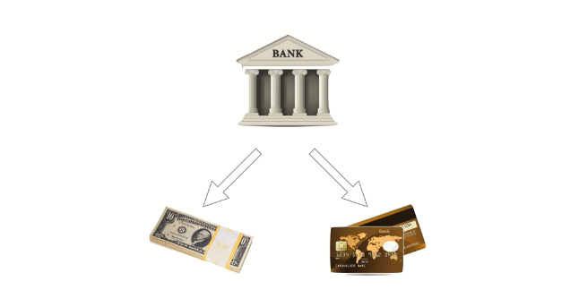
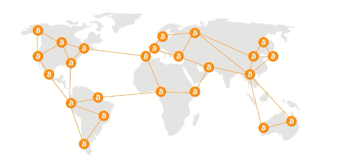
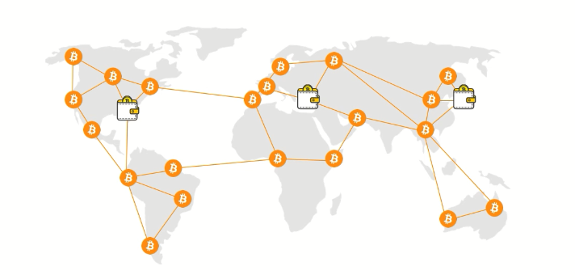
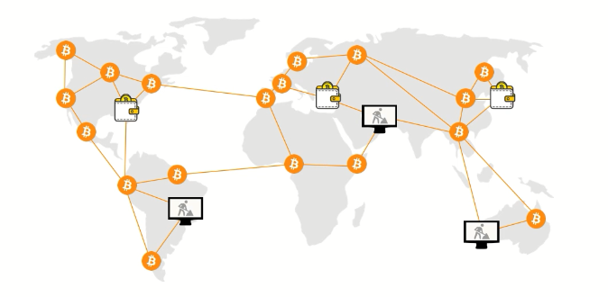
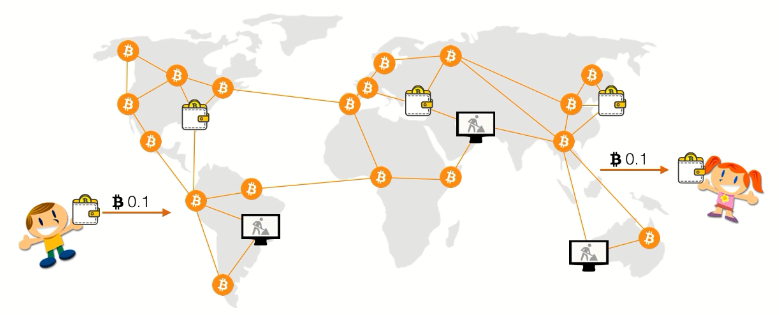
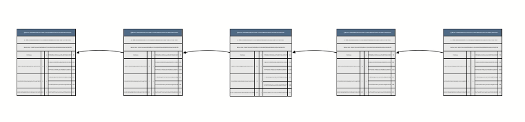
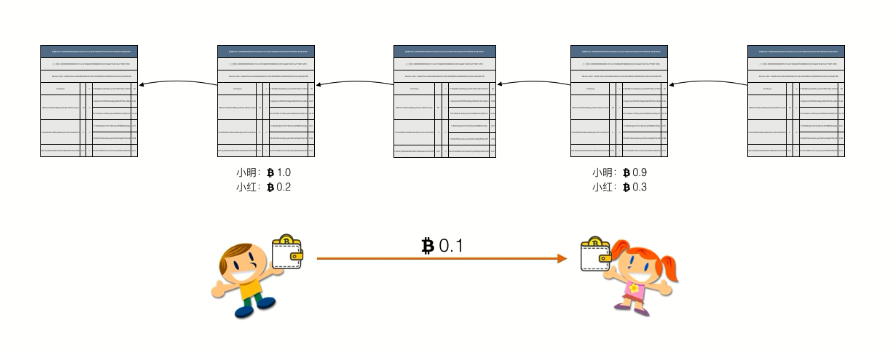
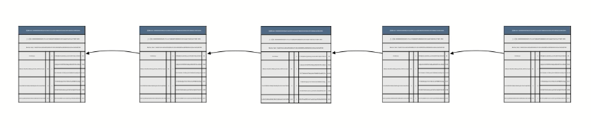
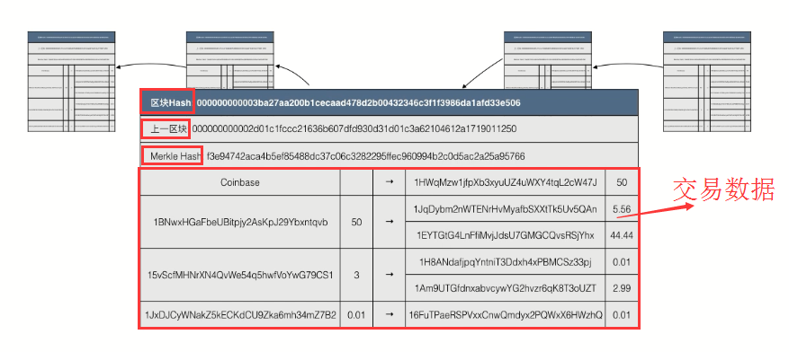

## 前言

最近因为一些偶然原因接触到比特币这个东西：主要是要开发一个比特币量化交易平台。并且了解到当前的一些数字货币交易平台

* [okex市场|提供比特币、莱特币、以太币等数字资产的现货和合约交易](https://www.okex.com)
	* [https://www.okcoin.com/](https://www.okcoin.com/)
	* [https://www.okcoin.cn/](https://www.okcoin.cn/)
* [BitMEX|比特币商品交易所 (Bitcoin Mercantile Exchange): 期货,..](https://www.bitmex.com)

虽然开发这个系统不要求我理解比特币本身的原理，但是自己还是很有兴趣去了解一下。之前也阅读过一篇文章[《教你如何轻松学习区块链和比特币基础技术原理》](https://github.com/HackerLaboratory/_Hack/tree/master/10-finance-detail/20171206-btc-blockchain)。最近又找到一份[关于比特币的课程](https://www.feiyangedu.com/course/1bhmuur980ag081003l8)，这里我参考这套教程对比特币的相关知识进行梳理，希望自己能够对比特币的运行原理有一个深刻的理解

将会涉及到以下知识点：

* 什么是数字货币
* 区块链记账原理
* 零信任交易原理
* 比特币挖矿原理
* 比特币支付原理

## 数字货币和区块链原理简介

数字货币是基于数学加密原理构建的不可伪造的货币系统。比特币是第一个基于数学加密原理构建的分布式数字货币

比特币有以下特点：

* 分布式系统
* 不可伪造
* 涉及到P2P网络、区块链、挖矿等技术

下面是比特币的大致历史：

* 08年10月，中本聪发布比特币白皮书
* 08年11月，比特币代码发布
* 09年1月，中本聪挖出比特币第一个区块：创始区块，比特币网络正式开始运行

>关于货币、黄金、纸币、法币、等的概念就不再这里再多废话了。随着经济的发展，金属货币因为重量不易携带，所以人类发明了纸币。纸币的机制决定了必须由政府发行，并且强制使用，因此纸币又称为法币。随着计算机系统的发展，现在基本上完全实现了用计算机替代人工记账，纸币也实现了电子化，现在可以自由的使用网银、支付宝等工具实现随时随地的转账付款，就得益于纸币的电子化（又称为电子货币）

电子货币本质上也是法币，只是没有了纸这个型，它还是由中央银行发行的

而比特币作为一种数字货币，它和电子货币最大的差别就是比特币是没有一个像中央银行这样的中央信任机构

比特币是通过全球的P2P网络进行发行和流通（听起来有点不可思议，但比特币就是这样利用密码学理论建立的不可伪造的货币系统），比特币网络是P2P网络，不同于我们常见的BS、CS架构，没有中央节点，随时都可以有新的节点进来，也随时都可以有新的节点离开

比特币的P2P网络中有些节点是钱包，它们可以把比特币交易发送到网络中

有一些节点是矿工，这些节点负责把网络中的交易打包到区块链中，并且赚取挖矿费用和交易手续费

举个例子来理解比特币的工作原理：假如一个比特币用户要发送比特币给另一个用户：其实就是通过一个钱包软件将这个比特币发送到P2P网络中，过一段时间，矿工将这个比特币打包，然后收款用户就可以接收到这个比特币

但比特币是如何从一个用户的钱包转移到另一个用户的钱包的呢？

钱包软件是运行在用户自己的电脑或手机上的软件，如果用户自己修改了账户余额（比如从1个比特币修改为100个比特币），那岂不是可以随意修改自己的资产？使用网银的我们都知道，我们的账户余额信息是存储在银行的服务器上的，你无法在客户端随意修改。类似的，一个用户拥有的比特币数量并不记录在用户的比特币钱包中，而是记录在全网总账本中

这个全网总账本类似将一页一页的账本串起来，每一页新的账本都指向上一页，所以这个全网总账本被称为**区块链**

如果小明给小红转账0.1比特币，那么任何人都可以在区块链上查看到小明的钱包从原始金额比如10变成了9.9，而小红的比特币从原始金额比如0.2变成了0.3，这样就保证了用户不可以自己修改钱包余额！

由于**区块链作为全网总账本，记录了所有用户的所有比特币余额和所有交易记录**，所以为了防止有人篡改区块链，比特币的区块链在P2P的每个节点都进行了复制，也就是每个节点都有一块完整的区块链数据，任何一个节点私自修改账户记录，是不会被其他节点认可的

随着用户不断产生交易，每隔大约10min，比特币网络上的矿工就会把新的交易打包成一页新的账本，并且追加到区块链的末尾，所以随着时间的推移，区块链就会越来越长。新增到末尾的区块也会被广播到整个P2P网络，确保每个节点都有完整的区块链数据

简单总结比特币的特点：

* 创建了无需信任中心的货币发行机制
* 发行数量由程序决定，无法随意修改
* 交易账本完全公开可追溯，不可篡改（这是由比特币依赖的区块链技术决定的）
* 密码学理论保证货币防伪造，防双花
* 数字签名机制保证交易完整可信，不可抵赖和撤销

简单总结比特币网络的运行机制：

* 用户创建交易并签名发送给P2P网络
* 矿工验证交易后将一批交易打包成新区块并获取挖矿奖励
* 其他节点验证并接受或拒绝该区块
* 每个新区块都指向前一个区块并形成区块链
* 全网所有账户余额与全部历史交易记录都保存在区块链中

## 区块链记账原理

>区块链就是一个不断增长的全网总账本；每个完全节点都拥有完整的区块链；节点总是信任最长的区块链；伪造区块链需要拥有超过51%的全网算力

这个想起来了一个和版本控制工具的类比：

* SVN是一个集中式的版本控制工具
	* 所有的修改记录都存储在服务器上
	* 每个客户端只保存最新版本的文件
	* 类似于传统的依赖于中央银行的货币系统
	* 完全依赖于中心节点，当中心节点崩溃了，所有节点都会受到影响
* git是一个分布式版本控制工具
	* 所有客户端、服务器上都保存修改记录
	* 类似于比特币系统的分布式模式
	* 任意一个节点崩溃，其他节点都还有完整的数据，完全不受影响
	* 这就是**去中心化**吧

为什么区块链是不可篡改的？

区块链是由一个一个的区块构成的有序链表，每一个区块都记录了一系列交易，并且每一个区块都指向前一个区块，从而形成一个链条

下面我们来放大看一个区块

每个区块上都有

* 一个唯一的Hash标识（区块Hash）
* 同时区块存储上一个区块的Hash来指向上一个区块
* Merkle Hash，确保这个区块的所有交易记录无法被篡改
* 区块的主要数据就是一系列交易
	* 第一条通常是Conbase交易，也就是矿工的挖矿奖励
	* 后续交易都是用户的交易

区块链的不可篡改特性是因为它应用了哈希算法，哈希算法（散列算法、Hash）是这样一种算法：

* 它是单向算法：h = H(x)
	* 通过输入可以很容易地计算输出
	* 通过输出无法反推输入，只能暴力穷举
* 它把任意长度的输入数据转化为固定长度的输出
* 安全哈希算法还要求碰撞率低
	* 如果`x <> y`，而`H(x) == H(y)`，则发生了碰撞
	* 因为输入数据的长度是不固定的，所以输入数据是一个无限大的集合
	* 而输出数据的长度固定，所以是一个有限集合
	* 把一个无限集合中的每个元素映射到一个有限集合中，必然会有碰撞
	* 而安全的哈希算法只能做到碰撞率尽可能低
* 安全哈希算法还要求输出无规律
	* 输入数据任意一个bit的改动，会导致输出完全不同

接下来看一下哈希算法在比特币系统中的作用！假设我们相信一个安全的哈希算法，如果H(x)=H(y)

## 去中心化交易原理

## Pow机制和挖矿原理

## 可编程支付原理

