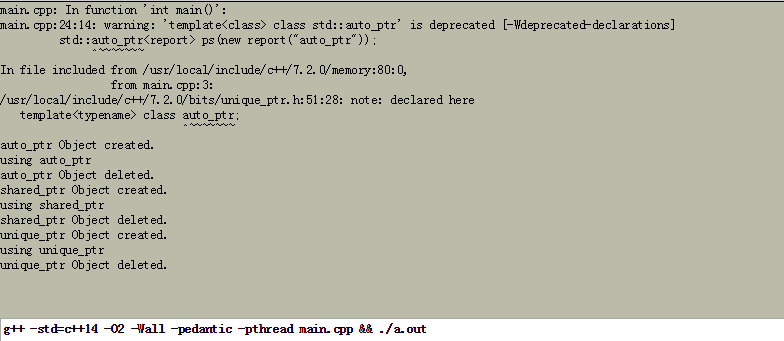
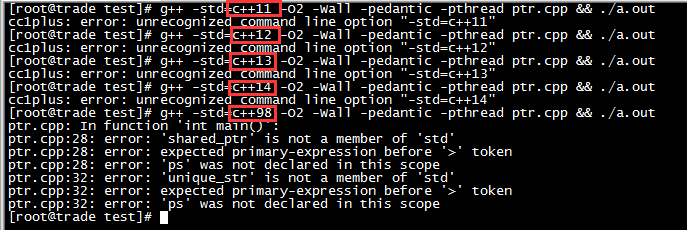
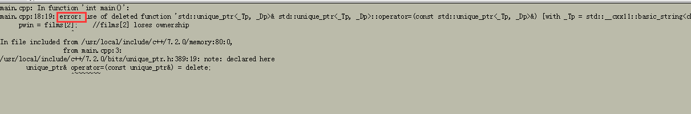

libevent这个网络库是用C语言实现的，对于C语言我比较熟悉了，而muduo却是用C++实现的。虽然C++是兼容C的、虽然我在平时工作中使用Delphi和C++是相互兼容的，虽然我在[www.xumenger.com](http://www.xumenger.com/)针对C++的对象内存模型进行了充分的研究，但是对于C++的更多知识点，比如智能指针、STL、boost等的用法和基本原理还都不是很清楚。这里查阅相关资料对C++的智能指针进行初步整理

C++面试过程中，很多面试官都喜欢问智能指针相关的问题，比如你知道哪些智能指针、share\_ptr的设计原理是什么？如果让你设计一个智能指针，你如何完成？等等

而且在muduo项目中对于智能指针、STL的用法也比比皆是。本文对于智能指针进行整理，后续对于C++的STL、boost等也逐步进行梳理

这里的整理主要是转抄别人的博客、参阅别人的资料，后续我希望自己在查阅了足够多的资料之后，在[自己的博客](http://www.xumenger.com/)中整理出原创的关于C++深度学习的好文

**本文目录**

1. 智能指针本后的设计思想
2. C++智能指针的简单介绍
3. 为什么摒弃auto\_ptr？
4. unique_ptr为何优于auto_ptr？
5. 如何选择智能指针？

## 1.智能指针背后的设计思想

我们先来看一个简单的例子：

```
void remodel(std::string & str)
{
    std::string * ps = new std::string(str);
    ...
    if(werid_thing())
        throw exception();
    str = *ps;
    delete ps;
    return;
}
```

当出现异常时（werid_thing()返回True），delete将不会被执行，因此将导致内存泄漏

如何避免这种问题呢？有人会说，这还不简单，直接在`throw exception();`之前加上`delete ps;`不就行了。是的，你本应该如此，问题是很多人都会忘记在适当的地方加上delete语句（连上述代码中最后的那句delete也会有很多人忘记吧），如果你要对一个庞大的项目进行review，看是否有这种潜在的内存泄漏问题，那就是异常灾难！

这时我们会想：当remodel这样的函数终止（不管是正常终止，还是由于出现了异常而终止），本地变量都会从栈内存中删除——因为指针ps占据的内存将被释放，**如果ps指向的内存也被自动释放，那该有多好啊**

我们知道析构函数有这个功能。如果ps有一个析构函数，该析构函数将在ps过期时自动释放它指向的内存。但ps的问题在于，它只是一个常规指针，不是有析构函数的类对象指针。如果它指向的是对象，则可以在对象过期时，让它的析构函数删除指向的内存

这是auto\_ptr、unique\_ptr和shared\_ptr这几个智能指针背后的设计思想。我简单的总结下就是：

>将基本类型指针封装为类对象指针（这个类肯定是个模板，以适应不同基本类型的需求），并在析构函数里编写delete语句删除指针指向的内存空间

因此，要转换remodel()函数，应该按下面3个步骤进行：

* 包含头文件memory（智能指针所在的头文件）
* 将指向string的指针替换为指向string的智能指针对象
* 删除delete语句

下面是使用auto\_ptr修改该函数的结果

```
#include <memory>

void remodel(std::string & str)
{
    std::auto_ptr<std::string> ps (new std::string(str));
    ...
    if(werid_thing())
        throw exception();
    str = *ps;
    //delete ps;
    return;
}
```

## 2.C++智能指针简单介绍

STL一共提供了四种智能指针：auto\_ptr、unique\_ptr、shared\_ptr、weak\_ptr（本文暂不讨论）

>模板auto\_ptr是C++98提供的解决方案，C++11已经将其摒弃，并提供了另外两种解决方案。然而，虽然auto\_ptr被摒弃，但它已使用了好多年：同时，如果您的编译器不支持其他两种解决方案，auto\_ptr将是唯一的选择

>需要注意C++的版本！

**使用注意点**

所有的智能指针类都有一个explicit构造函数，以指针作为参数。比如auto\_ptr的类模板原型为：

```
template<class T>
class auto_ptr{
    explicit auto_ptr(X *p = 0);
    ...
};
```

因此不能自动将指针转换为智能指针对象，必须显式调用

```
shared_ptr<double> pd;
double *p_reg = new double;
pd = p_reg;                         //not allowed (implicit conversion)
pd = shared_ptr<double>(p_reg);     //allowed (explicit conversion)
shared_ptr<double> pshared = p_reg; //not allowed (implicit conversion)
shared_ptr<double> pshared(p_reg);  //allowed (explicit conversion)
```

对全部三种智能指针都应避免的一点：

```
string vacation("I wandered lonely as a cloud.");
shared_ptr<string> pvac(&vacation);     //no
```

pvac过期时，程序将把delete运算符用于非堆内存，这是错误的

**使用举例**

```
#include <iostream>
#include <string>
#include <memory>

class report
{
private:
    std::string str;
public:
    report(const std::string s) : str(s) {
        std::cout << str << " Object created.\n";
    }
    ~report(){
        std::cout << str << " Object deleted.\n";
    }
    void comment() const {
        std::cout << "using " << str << "\n";
    }
};

int main()
{
    {
        std::auto_ptr<report> ps(new report("auto_ptr"));
        ps->comment();
    }
    {
        std::shared_ptr<report> ps(new report("shared_ptr"));
        ps->comment();
    }
    {
        std::unique_ptr<report> ps(new report("unique_ptr"));
        ps->comment();
    }
    return 0;
}
```

使用[C++在线编译器](http://coliru.stacked-crooked.com/)编译运行结果如下



使用工作的Linux环境编译，编译器不支持C++11,（即不支持shared\_ptr、unique\_ptr），只能以C++98编译，编译时可能报错



## 3.为什么摒弃auto_ptr？

先来看下面的赋值语句

```
auto_ptr<string> ps (new string ("I reigned lonely as cloud."));
auto_ptr<string> vocation;
vocation = ps;
```

上面赋值语句完成了什么工作呢？如果ps和vocation是常规指针，则这两个指针将指向同一个string对象。这是不能接受的，因为程序将试图删除同一个对象两次——一次是ps过期时，另一次是vocation过期时。要避免这种情况，方法有多种：

1. **定义赋值运算符，使之执行深复制**。这样两个指针将指向不同的对象，其中一个对象是另一个对象的副本，缺点是浪费空间，所以智能指针都未采用此方案
2. **建立所有权（ownership）概念**。对于特定的对象，只能有一个智能指针可拥有，这样只有拥有对象的智能指针的构造函数会删除该对象。然后让赋值操作转让所有权。这就是用于auto\_ptr和unique\_ptr的策略，但unique\_ptr的策略更严格
3. **创建智能更高的指针**。跟踪引用特定对象的智能指针数。这称为引用计数。例如，赋值时，计数将加1，而指针过期时，计数将减1。当减为0时才调用delete。这是shared\_ptr采用的策略

当然，同样的策略也适用于复制构造函数

每种方法都有其用途，但为何说要摒弃auto\_pre呢？下面举个例子来说明：

```
#include <iostream>
#include <string>
#include <memory>

using namespace std;

int main()
{
    auto_ptr<string> films[5] = {
        auto_ptr<string> (new string("Fowl Balls")),
        auto_ptr<string> (new string("Duck Walks")),
        auto_ptr<string> (new string("Chicken Runs")),
        auto_ptr<string> (new string("Turkey Errors")),
        auto_ptr<string> (new string("Goose Eggs"))
    };

    auto_ptr<string> pwin;
    pwin = films[2];    //films[2] loses ownership
                        //将所有权从films[2]转让给pwin
                        //此时films[2]不再引用该字符串，变成空指针

    cout << "The nominees for best avian baseballl films are\n";
    for(int i=0; i<5; i++)
        cout << *films[i] << endl;
    cout << "The winner is " << *pwin << endl;
    cin.get();

    return 0;
}
```

运行下发现程序崩溃了


原因在上面注释已经说明清楚了，films[2]已经是空指针了，下面输出访问空指针当然会崩溃了

但这里如果把auto\_ptr全都改成unique\_ptr直接无法编译通过



和auto\_ptr一样，unique\_ptr也采用所有权模型，但是在使用unique\_ptr时，程序不会等到运行阶段崩溃，而是在编译阶段就直接报错告诉你潜在的内存错误

>这应该也是为什么unique\_ptr叫做unique\_ptr的原因了吧？！它只允许有一个指针指向一个对象！

如果修改为shared\_ptr可以正确编译、运行


原因是shared\_ptr使用了引用计数，pwin和films[2]都指向同一块内存，在释放空间时因为事先要判断引用计数值的大小因此不会出现多次删除一个对象的错误

>这应该也就是为什么shared\_pre叫做shared\_ptr的原因了吧？！它通过引用计数允许多个指针共享一个对象！

综上，无论是unique\_ptr还是shared\_ptr都明显比auto\_ptr优越，所以摒弃auto\_ptr的原因很明显：**避免潜在的内存崩溃问题**

## 4.unique_ptr为何优于auto_ptr？

可能大家认为前面的例子已经说明了unique\_ptr为何优于auto\_ptr，也就是内存安全问题，下面再叙述的清楚一点，请看下面的语句：

```
auto\_pre<string> p1 (new string ("auto"));     //#1
auto\_ptr<string> p2;                           //#2
ps = p1;                                        //#3
```

在语句#3中，p2接管string对象的所有权之后，p1的所有权将被剥夺。前面说过，这是好事，防止p1和p2的析构函数试图删除同一个对象

但如果程序 随后试图使用p1，这将是一件坏事，因为p1不再指向有效的数据

下面来看unique\_ptr的情况

```
unique_ptr<string> p2 (new string ("unique"));  //#4
unique_ptr<string> p4;                          //#5
p4 = p3;                                        //#6
```

编译器认为语句#6非法，避免了p3不再指向有效数据的问题，因此unique\_ptr比auto\_ptr更安全

**但unique\_ptr还有更聪明的地方**

有时候，会将一个智能指针赋给另一个并不会留下危险的悬挂指针。假设有如下函数定义

```
unique_ptr<string> demo(const char *s)
{
    unique_ptr<string> temp (new string (s));
    return temp;
}
```

并假设编写了如下代码：

```
unique_ptr<string> ps;
ps = demo("Uniquely spacial");
```

demo()返回一个临时的unique\_ptr，然后ps接管了原本归返回unique\_ptr的所有对象，而返回时临时的unique\_ptr被销毁，这就是说没有机会使用unique\_ptr来访问无效的数据。换句话说，这种赋值不会出现任何问题，即没有理由禁止这种赋值。实际上，编译器确实允许这种赋值，这正是unique\_ptr更聪明的地方

>总之，当编译器试图将一个unique\_ptr赋值给另一个时，如果源unique\_ptr是个临时右值，编译器允许这么做；如果源unique\_ptr将存在一段时间，编译器将禁止这么做，比如

```
unique_ptr<string> pu1 (new string ("hello world"));
unique_ptr<string> pu2;
pu2 = pu1;                                          // #1 not allowed

unique_ptr<string> pu3;
pu3 = unique_ptr<string> (new string ("You"));      // #2 allowed
```

其中#1留下悬挂的unique\_ptr(pu1)，这可能导致危害，而#2不会留下悬挂的unique\_ptr，因为它调用unique\_ptr的构造函数，该构造函数创建的临时对象在其所有权让给pu3后就会被销毁。这种随情况的行为表明，unique\_ptr优于允许两种赋值的auto\_ptr

当然，你可能确实想执行类似于#1的操作，仅当以非智能的方式使用摒弃的智能指针时（如解除引用时），这种赋值才不安全。要安全的重用这种指针，可给它赋新值。C++有一个标准库函数`std::move()`，让你能够将一个unique\_ptr赋给另一个。下面是一个使用前面demo()函数的例子，该函数返回一个`unique_ptr<string>`对象：使用move后，原来的指针仍转让所有变成空指针，可以对其重新赋值

```
unique_ptr<string> ps1, ps2;
ps1 = demo("hello");
ps2 = move(ps1);
ps1 = demo("xumenger");
cout << *ps2 << " " << *ps1 << endl;
```

## 5.如何选择智能指针？

在掌握了几种智能指针后，大家可能会想到另一个问题：在实际应用中，应该使用哪种智能指针呢？

下面给出几个使用指南！

**如果程序要使用多个指针指向同一个对象，应选择shared_ptr。这样的情况包括**

* 有一个指针数组，并使用一些辅助指针来标示特定的元素，如最大的元素和最小的元素
* 两个对象包含都指向第三个对象的指针
* STL容器包含指针。很多STL算法都支持复制和赋值操作。这些操作可用于shared\_ptr，但不能用于unique\_ptr（编译器发出warning）和auto\_ptr（行为不确定）。如果你的编译器没有提供shared\_ptr，可使用Boost提供的shared\_pre

**如果程序不需要多个指针指向同一个对象的指针，则可使用unique_ptr**

如果函数使用new分配内存，并返回指向该内存的指针，将其返回类型声明为unique\_ptr是不错的选择。这样，所有权转让接受返回值的unique\_ptr，而该智能指针将负责调用delete。可将unique\_ptr存储到STL在那个，只要不调用将一个unique\_ptr复制或赋给另一个算法（如sort()）

例如，可在程序中使用类似下面的代码段

```
unique_ptr<int> make_int(int n)
{
    return unique_ptr<int> (new int (n));
}

void show(unique_ptr<int> &p1)
{
    cout << *a << ' ';
}

int main()
{
    ...
    vector<unique_ptr<int> > vp(size);
    for(int i=0; i<vp.size(); i++)
        vp[i] = make_int(rand() % 1000);      //copy temporary unique_ptr
    vp.push_back(make_int(rand() % 1000));    //ok because arg is temporary
    for_each(vp.begin(), vp.end(), show);     //use for_each()
}
```

其中push\_back()调用没有问题，因为它返回一个临时unique\_ptr，该unique\_ptr被赋给vp中的一个unique\_ptr。另外，如果按值而不是按引用给show()传递对象，for\_each()将非法，因为这将导致使用一个来自vp的非临时unique\_ptr初始化pi，而这时不允许的。前面说过，编译器将发现错误使用unique\_ptr的企图

在unique\_ptr为右值时，可将其赋给shared\_ptr，这与将一个unique\_ptr赋给一个需要满足的条件相同。与前面一样，在下面的代码中，make\_int()的返回类型为unique\_ptr<int>

```
unique_ptr<int> pup(make_int(rand() % 1000));      //ok
shared_ptr<int> spp(pup);                          //not allowed, pup as lvalue
shared_ptr<int> spr(make_int(rand() % 1000));      //ok
```

模板shared\_ptr包含一个显示构造函数，可用于将右值unique\_ptr转换为shared\_ptr。shared\_ptr将接管原来归unique\_ptr的所有对象

在满足unique\_ptr要求的条件时，也可使用auto\_ptr，但unique\_ptr是更好的选择。如果你的编译器没有unique\_ptr，可以考虑使用Boost库提供的scoped\_ptr，它与unique\_ptr类似

## 更多思考

Delphi中的string是引用计数机制

Delphi中的interface也是引用计数机制，详细参见[《Delphi引用模型：接口的引用计数特性》](http://www.xumenger.com/delphi-interface-refcount-20170621/)

那么在多线程的情况下，多线程读写有引用计数特性的类会不会有并发安全问题？如果有并发安全问题，那么在什么场景下会出现？如果有并发安全问题，怎么在编程中避免？

智能指针除了这里讲到的这些，还有没有其他更多的属性、知识点？

以前学习C++的时候，知道string是有引用计数、写时复制的机制的，后续查资料说在C++后续版本去掉了这个逻辑，这个需要确认一下！

>C++中的string是否使用引用计数值机制，和具体的STL实现有关，其接口是一套标准，而实现并不需要遵循某个标准

## 参考资料

首先是来自我自己博客的资料

* [《Delphi引用模型：接口的引用计数特性》](http://www.xumenger.com/delphi-interface-refcount-20170621/)
* [《Delphi引用模型：Delphi和VC++通过接口进行对接》](http://www.xumenger.com/cpp-delphi-interface-20170620/)
* [《Delphi对象内存模型：Delphi的虚方法表和动态方法表》](http://www.xumenger.com/class-delphi-cpp-02-20161128/)
* [《Delphi对象内存模型：Delphi和VC++使用类进行对接》](http://www.xumenger.com/class-delphi-cpp-01-20161128/)
* [《C++对象内存模型：C++的string和Delphi的string》](http://www.xumenger.com/cpp-delphi-string-20161116/)
* [《C++对象内存模型：模板、异常与RTTI》](http://www.xumenger.com/cpp-object-memory-02-20161113/)
* [《C++对象内存模型：构造、析构与拷贝》](http://www.xumenger.com/cpp-object-memory-01-20161113/)
* [《C++对象内存模型：通过重载与覆盖理解虚函数表指针》](http://www.xumenger.com/cpp-override-overload-20161106/)
* [《C++对象内存模型：对象内存对齐机制》](http://www.xumenger.com/cpp-object-memory-03-20161105/)
* [《C++对象内存模型：编译器对C++的影响》](http://www.xumenger.com/cpp-object-memory-02-20161105/)
* [《C++对象内存模型：简单继承与多态下的内存模型》](http://www.xumenger.com/cpp-object-memory-01-20161105/)
* [《C++对象内存模型：先简单展示几种典型C++类》](http://www.xumenger.com/cpp-object-memory-20161104/)
* [《Delphi配合VC++开发：跨语言传字符串》](http://www.xumenger.com/delphi-vc-dll-5-20160903/)
* [《Delphi配合VC++开发：使用DLL进行对接》](http://www.xumenger.com/delphi-vc-dll-4-20160903/)
* [《Delphi配合VC++开发：Visual C++使用说明》](http://www.xumenger.com/delphi-vc-dll-3-20160903/)
* [《Delphi配合VC++开发：结构体对齐机制》](http://www.xumenger.com/delphi-vc-dll-2-20160903/)
* [《Delphi配合VC++开发：基础数据类型对应关系》](http://www.xumenger.com/delphi-vc-dll-1-20160903/)
* [《C++拷贝构造函数：深拷贝、浅拷贝》](http://www.xumenger.com/cpp-class-copy-20151112/)
* [《比较C++、Java、Delphi声明类对象时候的相关语法和原理》](http://www.xumenger.com/java-cpp-delphi-oop/)
* [《C++和Delphi在构造和析构上的语法比较》](http://www.xumenger.com/cpp-delphi-oop/)

其次是其他的资料

* [如何理解智能指针？](https://www.zhihu.com/question/20368881)
* [C++在线编译器](http://coliru.stacked-crooked.com/)
* [《C++智能指针简单剖析》](http://www.cnblogs.com/lanxuezaipiao/p/4132096.html)
* [《从auto_ptr说起》](http://www.jellythink.com/archives/673)
* [《到C++11中的智能指针》](http://www.jellythink.com/archives/684)
* [《智能指针-引用计数实现》](http://www.jellythink.com/archives/301)
* [《COM编程——引用计数（1）》](http://www.jellythink.com/archives/232)
* [《COM中的引用计数2》](http://www.jellythink.com/archives/242)
* [《C++中的RAII机制》](http://www.jellythink.com/archives/101)
* [《C++中的Lambda表达式》](http://www.jellythink.com/archives/668)
