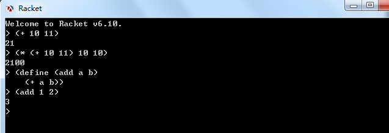

>使用栈将中缀表达式转化为前/后缀表达式

>利用栈计算前/后缀表达式的值

## 背景和简介

最近做的[服务配置化改造项目](https://github.com/HackerLaboratory/_Laboratory/tree/master/_Idea/_Config)中的配置化部分就有涉及到解析表达式的部分，比如下面的配置

```
; 前置机应答和服务应答对应关系
[AnswerFields_6700-0_701]
enable_balance        = $enable_balance$
enable_amount         = !$enable_amount$*&getamountperhand|I-<c_market_no>|I-<vc_report_code>|I-<branch_reportunit>&
acc_assure_ratio      = $acc_assure_ratio$
exchange_type         = [c_market_no]
```


其中的`!$enable_amount$*&getamountperhand|I-<c_market_no>|I-<vc_report_code>|I-<branch_reportunit>&`就是一个运算表达式，需要进行解析和计算

结合自己之前做过的计算器项目，知道对于中缀表达式转换成前缀表达式后对于计算机会更方便进行运算！下面做详细介绍

## 中缀表达式和前缀表达式

我们从小学的数学中，加减乘除这四种基础运算都是用中缀表达式表示的，比如

```
31 * (10 + 20) + 51 - 10 / (2 + 3)
```

这个表达式是我们都很熟悉的，毕竟是我们从小就一直学习和使用的表达方式

其实这并不是什么绝对的真理，只是大家约定好的一种表达方式，这种方式称为`中缀表达式`，其实还有其他的表达方式，分别是`前缀表达式`、`后缀表达式`

比如`10 + 3`是一种简单的中缀表达式形式，其对应的前缀表达式是`+ 10 3`，其对应的后缀表达式是`10 3 +`

>下面会有专门的一节讲解如何将中缀表达式转换为前缀表达式

## Scheme(Lisp)

我在工作中使用的主力编程语言是C、Delphi、C++、Python，这些都是中缀表达式方式的语言，所以对于这种表达方式比较熟悉

其实在编程的世界中有使用前缀表达式方式的语言，它们是Lisp系编程语言，我之前有在[《初识Lisp语法》](http://www.xumenger.com/lisp-20170215/)对其语法做过简单的整理

比如我们在Racket中输入一些前缀表达式的命令



>编译原理、算法、数据结构无论在什么语言里面都是最核心的部分。希望后续在阅读《SICP》的时候能够对这些知识真正的深刻化，现在自己在这方面实在是有太多的知识漏洞！

>这些基础知识不扎实，在进行网络编程、系统架构、项目开发的时候真的是有深深的无力感

## 中缀表达式转为前缀表达式

上面对中缀表达式和前缀表达式进行了简单的介绍，下面将会讲一下如何使用栈这个数据结构做转换

**首先介绍如何将中缀表达式转换为前缀表达式**

1. 初始化两个栈：运算符栈S1和存储中间结果的栈S2
2. `从右至左`扫描中缀表达式
3. 遇到操作数时，将其压入S2
4. 遇到运算符时，比较其与S1栈顶运算符的优先级
	4.1. 若S1为空，或栈顶运算符为右括号')'，将运算符入栈
	4.2. 若优先级比栈顶运算符高或相等，也将运算符入栈
	4.3. 否则，将S1栈顶的运算符弹出并压入S1，再次转到(4.1)与S1中新的栈顶运算符比较
5. 如果遇到括号时
	5.1. 如果是右括号')'，则直接压入S1
	5.2. 如果是左括号'('，则依次弹出S1栈顶的运算符，并压入S1，知道遇到右括号')'为止
6. 重复步骤(2)~(5)，直到表达式的最左边
7. 将S1中剩余的运算符依次弹出并压入S2
8. 依次弹出S2中的元素并输出，结果即为中缀表达式对应的前缀表达式

比如，将中缀表达式`1+((2+3)*4)-5`转换为前缀表达式的过程如下

扫描到的元素   | S2(栈底->栈顶)   | S1(栈底->栈顶)   | 说明
---------------| -----------------| -----------------| ---------
 5             | 5                | 空               | 数字直接入栈
 \-            | 5                | -                | S1为空，运算符直接入栈
 )             | 5                | - )              | 右括号直接入栈
 4             | 5 4              | - )              | 数字直接入栈
 \*            | 5 4              | - ) *            | S1栈顶是右括号，直接入栈
 )             | 5 4              | - ) * )          | 右括号直接入栈
 3             | 5 4 3            | - ) * )          | 数字
 \+            | 5 4 3            | - ) * ) +        | S1栈顶是右括号，直接入栈
 2             | 5 4 3 2          | - ) * ) +        | 数字
 (             | 5 4 3 2 +        | - ) *            | 左括号，弹出运算符直至遇到右括号
 (             | 5 4 3 2 + *      | -                | 同上
 \+           | 5 4 3 2 + *      | - +              | 优先级与-相同，入栈
 1             | 5 4 3 2 + * 1    | - +              | 数字
 到达最左端    | 5 4 3 2 + * 1 + -| 空               | S1中剩余的运算符

结果是`- + 1 * + 2 3 4 5`

**下面讲如何计算前缀表达式的值**

从右至左扫描表达式，遇到数字时，将数字压入堆栈，遇到运算符时，弹出栈顶的两个数，用运算符对它们做相应的计算（栈顶元素 op 次顶元素），并将结果入栈；重入上述过程直至表达式最左端，最后 运算得出的值即为表达式的结果

例如`- * + 3 4 5 6`

1. 从右至左扫描，将6、5、4、3压入栈
2. 遇到`+`，弹出3和4，计算`3+4`得到7，将7入栈
3. 遇到`*`，弹出7和5，计算`7*5`得到35，将35入栈
4. 遇到`-`，弹出35和6，计算`35-6`得到29。结束

所以，用计算机计算前缀表达式是很容易的！

## 中缀表达式转为后缀表达式

将中缀表达式转换为后缀表达式和将中缀表达式转为前缀表达式类似，只是将扫描的顺序改为`从左至右`

计算后缀表达式的值和计算前缀表达式类似，只是将扫描的顺序改为`从左至右`

>当然在判断是否入栈的时候，还是有一些不同的点，比如优先级比较的规则等还是有比较大的不同，详细还请参考[《前缀、中缀、后缀表达式》](http://blog.csdn.net/antineutrino/article/details/6763722)

在[服务配置化改造项目](https://github.com/HackerLaboratory/_Laboratory/tree/master/_Idea/_Config)中选择使用后缀表达式是一个不错的选择！

## 反思

栈、前缀表达式、中缀表达式、词法分析、语法分析等是我在平时一直知道的概念，但是需要自己具体使用来进行编程实现的时候就困难多多！

包括之前通过《Effective  STL》重新学习STL的时候，其中提到了关联容器set、map是基于红黑树实现的，我也是大致知道红黑树这个概念，具体的原理不清楚，更别提自己如何熟练的编程实现了！

上面提到的这些概念，核心无非就是算法与数据结构，说实话自己现在在这方面的扎实程度实在是太差、太差！

还有很多具体的点可以说明问题：

* 现在写个表达式解析的过程还要查资料，什么时候能够完全独立的思考出来？
* 让我手写一个快速排序能立马实现吗？
* 让我手写一个堆排序能快速实现吗？
* 让我手写一个图遍历能快速实现吗？
* 等等！

>接下来该如何进行针对性的练习来提升算法与数据结构基础呢？！
