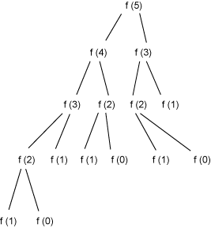
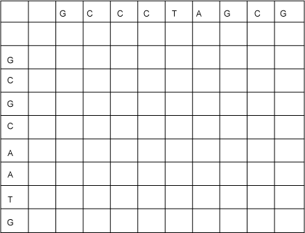
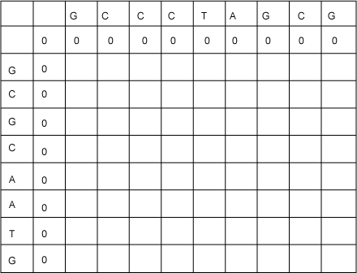
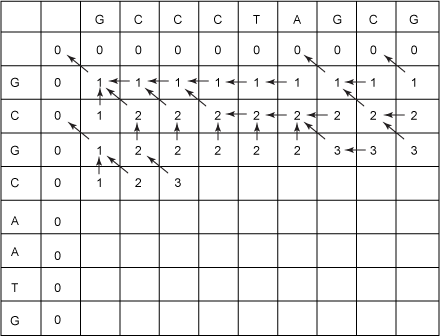
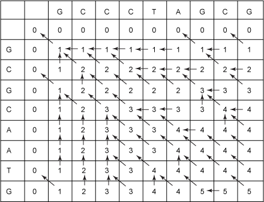
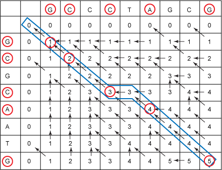

>[《动态编程和基因序列比对——计算机科学助力分子生物学》](https://www.ibm.com/developerworks/cn/java/j-seqalign/)

基因组数据库保存了海量的原始数据。人类基因本身就有接近30亿个DNA碱基对。为了查遍所有数据并找到其中有意义的关系，分子生物学家们越来越依赖于高效的计算机科学字符串算法。本文将介绍三个这方面的算法，它们都利用**动态编程**技术，这是解决最优化问题的一种高级的算法技术，它从下向上寻找子问题的最优解。本文将使用这些算法的Java实现，还将学习一个用于处理生物学数据的开源的Java框架

# 基因和字符串算法

基因资料—DNA和RNA—链是称为**核苷酸**的小单元组成的序列。为了回答某些重要的研究问题，研究人员把基因串看作计算机科学的字符串—也就是说，可以忽略基因串的物理和化学性质，而将其想象成字符的序列（虽然严格地讲，它们的化学性质通常被编码为字符串算法的参数，您将在本文看到）

本文的示例使用DNA，DNA由腺嘌呤（A)、胞嘧啶（C）、胸腺嘧啶（T）和鸟嘌呤（G）组成的核苷酸双螺旋组成。DNA的双螺旋彼此反向互补。A和T是互补的碱基对，C和G也是互补的碱基对。这意味着一个链中的A与另一个链中的T组成一对（反之亦然），一个链中的C与另一个链中的G组成一对（反之亦然）。所以，如果知道一个链中的A、C、T和G的顺序，那么就能推导出另一个链中的顺序。所以，可以将一条DNA链想象成由字母A、C、T和G组成的字符串

# 动态编程

**动态编程**是在序列分析中经常使用的一种算法技术。在可以使用递归，但因为递归重复解决相同的子问题造成效率低下的时候，则可以采用动态编程。例如，请看斐波那契（Fibonacci）序列：0、1、1、2、3、5、8、13……第一个和第二个斐波那契数字分别定义为0和1。第n个斐波那契数字是前两个斐波那契数字的和。所以，可以用清单1中的递归函数计算第n个斐波那契数：

>清单1.计算第n个斐波那契的递归函数

```
public int fibonacci1(int n){
  if (0 == n) {
    return 0;
  } else if (1 == n){
    return 1;
  } else {
    return fibonacci1(n-1) + fibonacci1(n-2);
  }
}
```

但是清单1的代码效率并不高，因为它重复地解决相同的递归子问题。例如，考虑一下fibonacci1(5)的计算，如图1所示

>图1.斐波那契数的递归计算



从图1可以看到，fibonacci1(2)被计算了3次。如果从下往上计算斐波那契数，而不是从上往下计算，效率会更高，如清单2所示：

>清单2.从下往上计算斐波那契数

```
public int fibonacci2(int n){
  int[] table = new int[n + 1];
  for (int i = 0; i < table.length; i++) {
    if(0 == i) {
      table[i] = 0;
    } else if (1 == i) {
      table[i] = 1;
    } else {
      table[i] = table[i-2] + table[i-1];
    }
  }
  return table[n];
}
```

另外一种循环的解法参见我的文章[《递归和循环》](http://www.xumenger.com/recursion-vs-loop-20170830/)

清单2将中间结果保存在表格中，这样就能重复使用它们，而不是在抛弃之后再重复计算多次。确实，存储表格的内存使用效率较低，因为一次只使用表格的两个条目，但是现在暂且将这件事放在一边。我们将在本文中使用相似的表格（不过是二维表格）处理比清单1复杂得多的示例。清单2中的实现所需的时间比清单1短很多，清单2的运行时间为O(n)，而清单1的递归实现的运行时间是n的指数

这就是动态编程的工作原理。遇到一个能用递归算法从上向下解决的问题，然后用从下向上的迭代的方式解决。将中间结果保存在表格中供后续步骤使用；否则，需要重复计算它们：这显然是一种效率很低的算法。但是动态编程通常被用于最优化问题（比如本文后面的示例），而不是像斐波那契数这样的问题。下面的示例是一个字符串算法，与计算生物学中经常使用的算法相似

# 最长公共子序列问题

首先将要看到如何运用动态编程查找两个DNA序列的**最长公共子序列（longest common subsequence， LCS）**。发现了新的基因序列的生物学家通常想知道该基因序列与哪些序列最相似。查找LCS是计算两个序列相似程度的一种方法：LCS越长，两个序列越相似

子序列中的字符与子字符串中的字符不同，它们不需要是连续的。例如，ACE是ABCDE的子序列，但不是它的子字符串。请看下面两个DNA序列：

* S1 = GCCCTAGGG
* S2 = GCGCAATG

这两个序列的LCS是GCCAG。（请注意，这仅是一个LCS，而不是唯一的LCS，因为可能存在其他长度相同的公共子序列。这种最优化问题和其他最优化问题的解可能不止一个）

### LCS算法

首先，考虑如何递归地计算LCS。令：

* C1是S1最右侧的字符
* C2是S2最右侧的字符
* S1'是S1中“切掉”C1的部分
* S2'是S2中“切掉”C2的部分

有三个递归子问题：

* L1 = LCS(S1', S2)
* L2 = LCS(S1, S2')
* L3 = LCS(S1', S2')

结果表明（而且很容易使人相信）原始问题的解就是下面三个子序列中最长的一个：

* L1
* L2
* 如果C1等于C2，则L3后端加上C1，如果C1不等于C2，则L3

基线条件（base case）是S1或S2为长度等于零的字符串的情况。在这种情况下，S1和S2的LCS显然是长度为零的字符串

但是，就像计算斐波那契数的递归过程一样，这个递归解需要多次计算相同的子问题。可以证明，这种递归解法需要耗费指数级的时间。相比之下，这个问题的动态编程解法的运行时间是O(mn)，其中m和n分别是两个序列的长度

为了用动态编程有效地计算LCS，首先需要构建一个表格，用它来保存部分结果，沿着顶部列出一个序列，再沿着左侧从上到下列出另一个序列，如图2所示：

>图2.初始LCS表格



这种方法的思路是：将从上向下、从左到右填充表格，每个单元格包含一个数字，代表该行和该列之前的两个字符串的LCS的长度。也就是说，每个单元格包含原始问题的一个子问题的解。例如，请看第6行第7列的单元格：它在GCGCAATG序列的第二个C的右侧，在GCCCTAGCG的T的下面。这个单元格最终包含的数字就是GCGC和GCCCT的LCS的长度

首先看一下表格的第二行中应该是什么条目。这一行的单元格保存的LCS长度对应的是序列GCGCAATA的零长前端和序列GCCCTAGCG的LCS。显然，这些LCS的值都是0。类似的，沿着第二列向下的值也都是0，这与递归解的基线条件对应。现在表格如图3所示：

>图3.填充了基线条件的LCS表格



接下来，要实现与递归算法中递归子问题对应的情景，但这时使用的是表格中已经填充的值。在图4中，我已经填充了一半左右的单元格：

>图4.填充了一半的LCS表格



在填充单元格时，需要考虑以下条件：

* 它左侧的单元格
* 它上面的单元格
* 它左上侧的单元格

下面三个值分别对应我在前面列出的三个递归子问题返回的值

* V1 = 左侧单元格的值
* V2 = 上面单元格的值
* V3 = 左上侧单元格的值

在空单元格中填充下面3个数字中的最大值：

* V1
* V2
* 如果C1等于C2则为V3+1，如果C1不等于C2，则为V3，其中C1是当前单元格上面的字符，C2是当前单元格左侧的字符

请注意，我在图中还添加了箭头，指向当前单元格值的来源。后面的“回溯”一节将用这些箭头建立实际的LCS（与仅仅发现LCS长度相反）

现在填充图4中接下来的空单元格——在GCCCTAGCG中第三个C下面和GCGCAATG第二个C的右侧的单元格。它上面的值是2，左侧的值是3，左上侧的值是2。这个单元格上面的字符和左侧的字符相等（都是C），所以必须选择2、3和3（左上侧单元格中的2+1）的最大值。所以这个单元格的值为3。绘制一个箭头，从该单元格指向其中的值的源单元格。在这个示例中，新的数值可能来自不止一个单元格，所以可以任选一个：例如左上侧单元格

作为练习，您可以尝试填充表格的余下部分。如果在关联过程中，一直按照左上侧—上侧—左侧的顺序选择单元格，那么会得到如图5所示的表格。（当然，如果在关联过程中做了不同的选择，那么箭头就会不同，但是数字是相同的）

>图5.填充好的LCS表格



回想一下，任何单元格中的数字都是该单元格所在行之上和列之前的字符串的LCS长度。所以表格右下角的数字就是字符串S1和S2（本例中是GCCCTAGCG和GCGCAATG）的LCS长度。所以，这两个序列的LCS长度是5

这是在所有动态编程算法中都要牢记的关键点。表格中的每个单元格都包含单元格所在行上面和所在列左侧序列前端问题的解

### 使用回溯方法寻找实际的LCS

接下来要做的就是寻找实际的LCS。使用单元格箭头进行回溯可以完成。在构建表格的时候，请记住，如果箭头指向左上侧的单元格，那么当前单元格中的值要比左上侧单元格的值大1，这意味着左侧单元格和上面单元格中的字符相等。构建LCS时，这会将相应的字符添加到LCS中。所以，构建LCS的途径就是从右下角的单元格开始，沿着箭头一路返回。每当沿着对角箭头回到左上角的单元格，而且该单元格的值比当前单元格的值小1时，就要将对应的公共字符添加到正在构建的LCS的前端。请注意，之所以将字符放在LCS前端，是因为我们是从LCS末端开始的。（在图5的示例中，右下角的5与要添加的第5个字符对应）

依此类推，继续构建LCS。从右下侧的单元格开始，看到单元格指针向左上侧的单元格，而且当前单元格的值（5）比其左上侧单元格的值（4）大1，所以将字符G添加到最初的零长度的字符串之前。下一个箭头，从包含4的单元格开始，也指向左上侧，但是值没有变。接着这个箭头也是如此。下一个单元格的箭头还是指向左上侧，但是这次值从3变为4。这意味着需要将这一行和这一列中的公共字符A添加到LCS中，所以现在的LCS是AG。接下来，沿着指针向左（对应着跳过上面的T）到达另一个3。然后有一个对角指针指向2。因此，又添加了在当前行和当前列中的公共字符C，生成LCS为CAG。继续使用这种方式，直到最后到达0，图6显示了整个回溯过程：

>图6.在填满的LCS表格上进行回溯



通过这种回溯方法，得到的LCS为GCCAG
