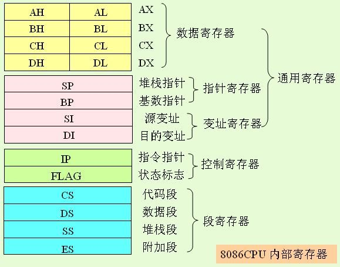
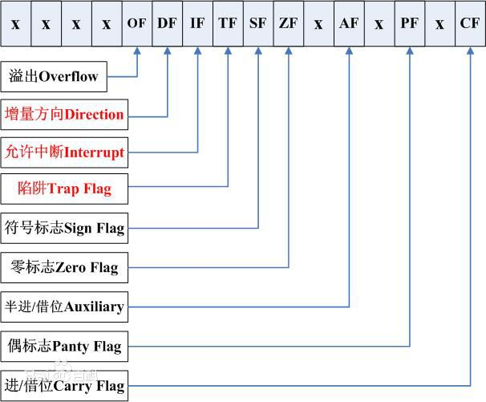

对计算机的学习，越学越发现还是底层的东西有意思，把底层的原理、机制弄清楚，再去开发、调试、排查就事半功倍了

接下来以8086的CPU 为例说明处理器中常用的寻址方式，首先推荐文章：

* [《汇编与逆向基础：使用IDA和OllyDbg分析C函数调用》](http://www.xumenger.com/c-assembly-ollydbg-ida-20161216/)
* [《汇编与逆向基础：Windows 7 64位环境下搭建汇编开发环境》](http://www.xumenger.com/windows-assembly-20161208/)
* [《x86汇编语言语法简介》](http://www.xumenger.com/x86-20160720/)

另外关于常用单位的介绍：

* 比特，bit：一个bit位
* 字节：8个二进制位构成1个"字节(Byte)"
* 字："字"由若干个字节构成，字的位数叫做字长，不同档次的机器有不同的字长
	* 例如一台8位机，它的1个字就等于1个字节，字长为8位
	* 如果是一台16位机，那么，它的1个字就由2个字节构成，字长为16位
	* 字是计算机进行数据处理和运算的单位

## 8086处理器中的内部寄存器

为了说明8086 处理器的寻址方式及指令系统，首先描述处理器中与应用有关的，用户能用指令改变其内容的寄存器



简称方便记：

* 通用寄存器
	* 数据寄存器
		* AX
		* BX
		* CX
		* DX
	* 指针寄存器
		* SP：Stack Pointer，堆栈指针
		* BP：Base Pointer，基数指针
	* 变址寄存器
		* SI：Source，源变址
		* DI：Destination，目的变址
* 控制寄存器
	* IP：Instruction Pointer，指令指针
	* PSW：状态标志
* 段寄存器
	* CS：Code Segment，代码段
	* DS：Data Segment，数据段
	* SS：Stack Segment，堆栈段
	* ES：附加段

**数据寄存器**

8086 有4个16位的数据寄存器，可以存放16位的操作数。上图可以看到，4个16位的寄存器在需要时，可分为8个8位的寄存器来使用，这样就大大增加了使用的灵活性

**指针寄存器**

8086的指针寄存器有2个：SP和BP

SP时堆栈指针寄存器，由它和堆栈段寄存器SS一起来确定堆栈在内存中的位置。BP是基数指针寄存器，通常用于存放基地址，以使8086的寻址更加灵活

**变址寄存器**

SI是源变址寄存器，DI是目的变址寄存器，都用于指令的变址寻址。顾名思义，SI通常指向源操作数，DI通常指向目的操作数

**控制寄存器**

8086的控制寄存器有2个：IP和PSW

IP是指针寄存器，用来控制CPU的指令执行顺序。它和代码寄存器CS一起可以确定当前所要取的指令的内存地址。CPU执行过程的地址总是`CS * 16 + IP`。当顺序执行程序时，CPU每从内存中取一个指令字节，IP自动加一，指向下一个要读取的指令字节

当CS不变，IP单独改变时，会发生段内程序转移。当CS和IP同时改变时，会产生段间的程序转移

PSW时程序状态字，也有人称它为状态寄存器或标志寄存器，用来存放8086 CPU在工作过程中的状态。PSW各位标志如下图



状态标志寄存器是一个16位的寄存器，前面四个X位留着后用，剩下的X位不用。8086中所用的9位对了解8086 CPU的工作和用汇编语言编写程序是很重要的：

* CF——进位标志位。做加法时出现进位或做减法时出现借位时，该标志位置1；否则清0。位移和循环指令也影响进位标志
* PF——奇偶标志位。当结果的低8位中1的个数为偶数时，该标志位置1；否则清0
* AF——半加标识位。在加法时，当位[3]需向位[4]进位，或在减法时位[3]需向位[4]借位时，该标志位置1；否则清0。该标志位通常用于对BCD算术运算结果的调整
* ZF——零标志位。运算结果所有各位均为0时，该标志位置1；否则清0
* SF——符号标志位。当运算结果的最高位为1，该标志位置1；否则清0
* TF——陷阱标志位（单步标志位）。当该位置1时，将使8086进行单步指令工作方式
	* 在每条指令执行结束时，CPU总是去测试TF是否为1
	* 如果为1，那么在本指令执行后将产生缺陷中断，从而执行缺陷中断处理程序
	* 该标志位通常用于程序的调试
	* 例如，在系统调试软件DEBUG中的T命令就是利用它来进行程序的单步跟踪的
* IF——中断允许标志位。如果该位置1，则处理器有可能响应可屏蔽中断请求（还要看其它条件）；否则就一定不能响应可屏蔽中断请求
* DF——方向标志位。该标志只用于串操作指令，当该位置1时，串操作指令为自动减量指令，即从高地址到低地址处理字符串；否则串操作指令为自动增量指令
* OF——溢出标志位。在算术运算中，带符号的数的运算结果超出所规定的带符号数所能表达的范围时，该标志位置1；否则清0

**段寄存器**

8086微处理器具有4个段寄存器：代码段寄存器CS、数据段寄存器DS、堆栈段寄存器SS、附加段寄存器ES

这些段寄存器的内容与有效的地址偏移量一起可确定内存的物理地址。通常CS规定并控制程序区，DS和ES控制数据区，SS控制堆栈区

**存储器寻址**

8086 CPU具有1MB 的内存空间(1MB = 1024 KB = 1024\*1024 B = 2^20 B)，可是内部寄存器都只有16位，很显然，不采用特殊措施，是不能寻址1MB存储空间的。为此引入了段的概念。每个内存段具有64KB的存储空间。该段内的物理地址由16位的段寄存器内容和16位的地址偏移量来确定，20位的物理地址是这样产生的

```
物理地址 = 段寄存器的内容 * 16 + 偏移地址
```

段寄存器的内容 * 16（相当于左移4位）变为20位，再在低端16位上加上偏移地址（也叫做有效地址EA），便可得到20位物理地址

对于CPU读程序的内存地址，总是由下式来决定：

```
程序地址 = CS * 16 + IP
```

也就是说，当8086(88) CPU读程序时，其内存地址永远都是`代码段(CS)寄存器 * 16 与IP(指令指针)的内容`作为偏移地址来决定的

但是，当8086(88)CPU读写内存数据时，各个段寄存器都能使用，经常使用的是CS、SS和DS这三个寄存器，而偏移地址又有多种不同的产生方法

```
程序地址 = CS * 16 + IP 
数据地址 = DS或ES * 16 + EA 
堆栈地址 = SS * 16 + SP 
```

## 8086CPU 的寻址方式

8086处理器的寻址方式包括：

* 决定操作数地址的寻址方式
* 决定转移地址的寻址方式

## 决定操作数地址的寻址方式

**1.立即寻址**

这种寻址方式所提供的操作数直接包含在指令中。它紧跟在操作码的后面，与操作码一起放在代码段区域中。这种寻址方式的操作数叫做立即数，可以是8位的，也可以是16位的，比如

```
MOV AL, 05H
MOV DX, 8000H
```
数字后面加H，表示是16进制的格式

**2.直接寻址**

操作数地址的16位段内偏移地址直接包含在指令中，它与操作码一起存放在代码段区域中。操作数一般在数据区域中，它的地址为数据段寄存器DS加上这16位的段内偏移地址，比如

```
MOV BX, DS:[2000H]
```

在本例中，取数的物理地址就是：`DS的内容 * 16(即左移4位)，变为20位，再在其低端16位上加上偏移地址2000H`。偏移地址2000H是由指令直接给出的

**3.寄存器寻址**

操作数包含在CPU的内部寄存器中，例如：

```
MOV DS, AX
```

**4.寄存器简介寻址**

这种寻址方式中，操作数存放在存储器中，操作数的16位段内偏移地址却放在以下4个寄存器SI、DI、BP、BX中的一个。由于上述4个寄存器所默认的段寄存器不同，又可以分成两种情况

(1)若以BX、SI、DI这3个寄存器进行寄存器间接寻址，则操作数默认放在DS所决定的数据段中。此时数据段寄存器(DS)内容乘以16加上SI、DI、BX中的16位段内偏移地址，即得到操作数的地址，例如

```
MOV AX, 2000H	;AX = 2000H
MOV DS, AX	;DS = AX	即2000H
MOV SI, 1000H	;SI = 1000H
MOV AX, [SI]	;AX = DS * 16 + SI = 2000H * 16 + 1000H = 21000H
```

上面第4条指令执行时，操作数的地址为`DS * 16 + SI = 21000H`。即从21000H单元取一个字节放入AL，从21001H单元取一个字节放入AH

(2)若以寄存器BP间接寻址，则操作数默认存放在堆栈段(SS)区域中。此时堆栈段寄存器SS的内容乘以16加上BP中的16位段内偏移地址，即得到操作数的地址，例如

```
MOV DX, 4000H	;DX = 4000H
MOV SS, DX	;SS = DX 即 4000H
MOV BP, 500H	;BP = 500H
MOV BX, [BP]	;BX = SS * 16 + BP = 4000H * 16 + 500H = 40500H
```

在执行上面的指令时，第4条便是从40500H单元取一个字节放入BL中，从40501H单元取一个字节放入BH

在这里说明段超越的问题。在对存储器操作数寻址时，存储单元的物理地址由段寄存器的内容和偏移地址来决定。在8086(88)指令系统中对段寄存器有基本规定，即默认状态，如上(1)、(2)所述。指令中的操作数也可以不在基本规定的默认段中，这时就必须在指令中明确制定段寄存器，这就是段超越，例如

```
MOV AX, ES:[SI]	;AX = ES * 16 + SI
```

该指令中ES为段超越前缀，功能指令就是从ES * 16 + SI 形成的物理地址及其下一个地址中取一个字放入AX中

在指令中，默认段寄存器时可以缺省的，而段超越的前缀是不能缺省的，必须明确指定。当使用段超越前缀时，指令代码增加一个字节，从而也增加了指令的执行时间。因此，能不用段超越时尽量不用

**5.寄存器相对寻址**

在这种寻址方式中，操作数存放在存储器中。操作数的地址是由段寄存器内容乘以16，加上SI、DX、BX、BP之一的内容，再加上由指令中所给出的8位或16位带符号的位移量而得到的

在一般情况下，若用SI、DI或BX进行相对寻址时，默认数据段寄存器DS作为地址基准；而用BP寻址时，则默认堆栈寄存器为地址基准，例如

```
MOV BX, 3000H	;BX = 3000H
MOV DS, BX	;DS = BX 
MOV SI, 1000H	;SI = 1000H
MOV AL, [SI-2]	;AL = DS * 16 + SI -2
```

执行寄存器相对寻址时，操作数的物理地址为`DS * 16 + SI - 2 = 30000H+1000H-2=30FFEH`。即从地址30FFEH单元取一个字节放入AL中

**6.基地址变址寻址**

在8086(88)中，通常把BX和BP作为基址寄存器，而把SI、DI作为变址寄存器。将这两种寄存器联合起来进行的寻址就称为基址变址

操作数的地址应该时段寄存内容乘以16 加上基址寄存器的内容（BX或BP的内容），再加上变址寄存器的内容（SI或DI的内容）得到的

同理，若用BX作为基地址，则操作数应放在数据段DS区域内；若BP作为基地址，则操作数应放在堆栈段SS区域内，例如

```
MOV DX, 8000H		;DX = 8000H
MOV SS, DX		;SS = DX
MOV BP, 1000H		;BP = 1000H
MOV DI, 0500H		;DI = 500H
MOV AX, [BP][DI]	;AX = SS * 16 + BP + DI = 8000H * 16 + 1000H + 500H
```

在执行基址变址寻址指令时，就是从81500H和81051H单元分别取一个字节放入AL和AH中

**7.基址变址相对寻址**

这种方式实际上是第6种寻址方式的扩充。即操作数的地址是由基址、变址方式得到的地址再加上由指令指明的8位或16位的相对偏移地址而得到的，例如

```
MOV AX, DISP[BX][SI]
```

**8.隐含寻址**

在有些指令的指令码中，不仅包含有操作码信息，而且还隐含了操作数地址的信息。例如，乘法指令MUL的指令码中只需要一个乘数的地址，另一个乘数和积的地址是隐含固定的。再如DAA指令是隐含对AL的操作

这两种将操作数的地址隐含在指令操作码中的寻址方式就称为隐含寻址

## 决定转移地址的寻址方式

由于8086(88)对内存的寻址是利用段寄存器对内存分段来实现的，CPU执行的程序放在代码段寄存器所决定的内存代码段中，这就存在着程序的转移可以在段内进行也可以在段间进行的情况。8086(88)CPU支持这两种情况的转移

**段内转移**

前面已经说过，CPU执行程序的地址永远都是CS * 16 + IP，而且IP具有CPU每从内存取出一个字节，IP就自动加一指向下一个字节的特性

(1)段内的相对寻址

这种寻址方式中，指令应指明一个8位或16位的相对地址偏移量DISP（它有正负符号，用补码表示）。此时，转移地址应该是代码寄存器CS内容乘以16加上指令针IP的内容，再加上相对地址位偏移量DISP，例如

```
JMP SHORT ARTX
```

指令中ARTX表示要转移到的符号地址；而SHORT表示地址偏移量DISP为8位带符号的数，上面的指令为一条两字节指令：

* EB——指令操作码
* DISP——位移量

此时位移指令的偏移地址为`IP+DISP8`。此时的IP就是该转移指令的下一条指令的第一指令字节所在的偏移地址，或称为下一条指令的首地址

这种情况下，转移地址就是以当前IP的内容（就是下一条指令的首地址）为基准加上DISP8（一个8位的正数或负数）。由于DISP8时8位带符号的数，其数值范围在-128～127之间，以此为基准向上偏移（向地址减小的方向）只能跳128个单元；向下转移（向地址增大的方向）只能跳127个单元。也就是说这种类型的指令跳不远

若是用`JMP NEAT PTR PROM`指令，则可以跳得更远一些

在上面的指令中，使用的操作符NEAR PTR就表示地址偏移量用16位带符号的数来表示。由于16位带符号数可表示的数值范围时-32768~32767。因此，该指令可以当前IP（即下一条指令的首地址）为基准向上最大可跳32768个单元，向下最大可跳32767个单元。转移的目的地址就是当前的IP加上DISP16

可以看到，后面的指令转移的范围覆盖了前一条指令的转移范围。但后面的目的码为三个字节（前者为两个字节），执行时间也长一些

(2)段内间接寻址

在这种寻址方式中，转移地址的段内偏移地址要么存放在一个16位的寄存器中，要么存放在存储器的两个相邻单元中。存放偏移地址的寄存器和存储器的地址将按指令码中规定的寻址方式给出。此时，寻址所得到的不是操作数，而是转移地址，例如：

```
JMP CX
JMP WORD PTR[BX]
```

可以看到，在段内转移的情况下，CS的内容保持不变，仅仅是IP的内容发生了变化。在段内相对转移时，相当于IP加上带符号的位移量。上面的指令`JMP CX`，**相当于用CX的内容取代了IP原来的内容**。而`JMP WORD PTR[BX]`指令，是用DS做为段寄存器，DS*16加上BX的内容形成一个地址，并将该地址和它的下一单元的内容（共16位）放入IP中，由于IP的内容改变了，必然产生转移

**段间转移**

在程序执行中从内存的一个代码段转移到内存的另一代码段便是段间转移。当发生段间转移时，必定是CS和IP同时发生改变。段间转移的寻址也分为两种情况

(1)段间直接寻址

在这种寻址方式中，指令码中将直接给出16位的段地址和16位的段内偏移地址，例如

```
JMP FAR PTR ADD1
```

在执行这种段间直接寻址指令时，指令操作码后的第二个字将赋予代码段寄存器CS，第一个字将赋予指针寄存器IP，最后CS * 16 + IP得到转移地址。指令中用FAR PTR操作符指明这是一条远转移指令

当CS和IP的内容同时改变时，便会发生段间转移。当8086(88)CPU执行一条远转移指令时，将从指令码下面的4个顺序单元中取出4个字节，分别放入IP和CS。这样就改变了两个寄存器的内容。这4个字节是由汇编程序事先放好的段间转移的目标地址

(2)段间间接寻址

这种寻址方式和段内间接寻址方式类似。但是，由于确定转移的地址需要32位信息，因此只适用于存储器的寻址方式。用这种寻址方式可计算出存放转移地址的存储器的首地址，与此相邻的4个单元中，前2个单元存放16个的段内偏移地址；而后2个单元存放的时16位的段地址，例如

```
JMP DWORD PTR[BP][DI]
```

上述指令表示，同时改变CS和IP的内容。但是，在上面这个例子中，段间转移的目的地址时如下获得的：堆栈寄存器SS * 16再加上BP的内容和DI的内容形成物理地址。由于该地址开始的顺序4个单元的内容构成一个字放入CS。因此CS和IP形成的地址就是转移的目的地址

显然，上述例子中放在堆栈段的目的地址（也就是放入IP和CS的字）时在程序执行前事先放好的

>经过以上的学习，总结，还只是一个大概的了解，在调试、逆向的时候还是不能够熟练的阅读汇编代码！所以这只是一小步！

## 补充

以上的总结均参考李伯成与顾新老师的《计算机组成与设计》

* 第一章：绪论
	* 1.1 计算机的发展史
		* 1.1.1 发展经历
		* 1.1.2 摩尔定律
	* 1.2 计算机的基本组成
		* 1.2.1 硬件系统
		* 1.2.2 软件系统
	* 1.3 计算机的分类及性能描述
		* 1.3.1 计算机的分类
		* 1.3.2 计算机的性能描述
* 第二章：计算机中的数据表示
	* 2.1 数据编码
		* 2.1.1 数值数据的编码
		* 2.1.2 数据的浮点表示
		* 2.1.3 BCD码
	* 2.2 非数值数据的编码
		* 2.2.1 ASCII码
		* 2.2.2 汉字编码
	* 2.3 检错与纠错编码
		* 2.3.1 奇偶校验码
		* 2.3.2 海明码
		* 2.3.3 循环冗余校验码（CRC码）
* 第三章：运算方法与运算器
	* 3.1 定点数运算
		* 3.1.1 加法运算
		* 3.1.2 乘法运算
		* 3.1.3 除法运算
	* 3.2 算术逻辑单元
		* 3.2.1 单元电路
		* 3.2.2 算术逻辑单元
		* 3.2.3 运算器的结构
	* 3.3 浮点运算
		* 3.3.1 加减运算
		* 3.3.2 浮点乘除运算
		* 3.3.3 浮点数运算的实现
* 第四章：指令系统与汇编语言
	* 4.1 指令格式
		* 4.1.1 概述
		* 4.1.2 指令格式的描述
		* 4.1.3 指令设计
	* 4.2 寻址方式
		* 4.2.1 8086 处理器中的内部寄存器
		* 4.2.2 8086 CPU的寻址方式
	* 4.3 8086(88)的指令系统
		* 4.3.1 传送指令
		* 4.3.2 算术运算指令
		* 4.3.3 逻辑运算和移位循环指令
		* 4.3.4 串操作指令
		* 4.3.5 程序控制指令
		* 4.3.6 处理器控制指令
		* 4.3.7 输入/输出指令
		* 4.3.8 位操作指令
		* 4.3.9 其他指令
	* 4.4 汇编语言及其程序设计
		* 4.4.1 汇编语言的语句格式
		* 4.4.2 常数
		* 4.4.3 伪指令
		* 4.4.4 汇编语言的运算符
		* 4.4.5 汇编语言源程序的结构
		* 4.4.6 汇编语言程序设计
	* 4.5 精减指令集计算机（RISC）
		* 4.5.1 指令系统的从简到繁
		* 4.5.2 精减指令集计算机的特点
* 第五章：处理器(CPU)的设计
	* 5.1 CPU的结构
		* 5.1.1 CPU的功能
		* 5.1.2 构成CPU的主要部件
	* 5.2 指令系统设计
		* 5.2.1 设计寻址方式
		* 5.2.2 指令的设计
	* 5.3 CPU执行指令的过程
		* 5.3.1 指令时序
		* 5.3.2 指令执行过程分析
	* 5.4 CPU的部件设计
		* 5.4.1 熟悉部件的问题
		* 5.4.2 指令执行的详细说明
		* 5.4.3 组合逻辑控制器设计
		* 5.4.4 微程序控制器设计
* 第六章：流水线技术
	* 6.1 概述
		* 6.1.1 流水线概述
		* 6.1.2 流水线的分类
	* 6.2 流水线的性能分析
		* 6.2.1 吞吐率
		* 6.2.2 加速比
		* 6.2.3 效率
	* 6.3 流水线中的相关
		* 6.3.1 概述
		* 6.3.2 结构相关
		* 6.3.3 数据相关
		* 6.3.4 控制相关
		* 6.3.5 流水线的中断处理
		* 6.3.6 带成功开销的流水线性能
	* 6.4 指令级并行
		* 6.4.1 指令集并行概述
		* 6.4.2 提高指令级并行的方法
	* 6.5 其他有关技术
		* 6.5.1 超标量处理机
		* 6.5.2 超流水先处理机
		* 6.5.3 超标量超流水线处理机
		* 6.5.4 超长指令字处理机
* 第七章：存储系统
	* 7.1 存储系统概述
		* 7.1.1 存储系统的层次结构
		* 7.1.2 存储器分类
		* 7.1.3 存储器的性能指标
	* 7.2 内部存储器（主存储器）
		* 7.2.1 随机读写存储器 RAM
		* 7.2.2 只读存储器 ROM
		* 7.2.3 动态读写存储器 DRAM
		* 7.2.4 其他存储器
	* 7.3 高速缓冲存储器
		* 7.3.1 工作原理
		* 7.3.2 替换算法
		* 7.3.3 主存——cache内存的一致性问题
		* 7.3.4 cache性能分析
	* 7.4 虚拟存储器
		* 7.4.1 虚拟存储器的概念
		* 7.4.2 虚拟存储器的管理
		* 7.4.3 几点说明
* 第八章：输入/输出系统
	* 8.1 总线
		* 8.1.1 概述
		* 8.1.2 总线的信息传送
		* 8.1.3 典型总线介绍
	* 8.2 输入/输出基本原理
		* 8.2.1 外部设备
		* 8.2.2 程序控制输入/输出技术
	* 8.3 中断方式
		* 8.3.1 中断的基本概念
		* 8.3.2 中断优先级控制
		* 8.3.3 8086(88)的中断系统
		* 8.3.4 中断控制器 8259
	* 8.4 直接存储器存取(DMA)
		* 8.4.1 DMA概述
		* 8.4.2 常用的方法
		* 8.4.3 DMA的一般过程
	* 8.5 通信方式
		* 8.5.1 通道方式的特点
		* 8.5.2 通道的类型
		* 8.5.3 通道的发展
	* 8.6 几种常见的接口芯片
		* 8.6.1 可编程并行接口
		* 8.6.2 可编程定时器
		* 8.6.3 可编程串行接口
* 第九章：多机系统
	* 9.1 概述
		* 9.1.1 并行处理
		* 9.1.2 并行计算机分类
	* 9.2 多机互联网络
		* 9.2.1 互连函数
		* 9.2.2 静态互连网络
		* 9.2.3 动态互连网络
	* 9.3 对称多处理机系统
		* 9.3.1 对称多处理机(SMP)构成
		* 9.3.2 多机系统的性能分析
		* 9.3.3 对称多处理机系统 cache一致性
		* 9.3.4 多处理机系统的调度和负载均衡
	* 9.4 分布式共享存储器多机系统
		* 9.4.1 分布式共享存储器多机系统结构
		* 9.4.2 CC-NUMA系统
	* 9.5 多机系统其它结构形式
		* 9.5.1 大规模并行处理(MPP)系统
		* 9.5.2 集群(Cluster)系统
		* 9.5.3 向量处理机
		* 9.5.4 高性能计算机的发展
* 第十章：基于EDA的计算机设计
	* 10.1 概述
		* 10.1.1 数字系统设计的发展
		* 10.1.2 数字系统的设计方法
	* 10.2 设计语言与工具
		* 10.2.1 EDA工具软件分类
		* 10.2.2 硬件描述语言 HDL
		* 10.2.3 System C
		* 10.2.4 QUARTUS II
	* 10.3 基于VHDL的CPU设计
		* 10.3.1 单元电路的设计
		* 10.3.2 CPU设计概要
	* 10.4 SOC设计
		* 10.4.1 概述
		* 10.4.2 SOC 片内总线
		* 10.4.3 IP 核设计与复用
		* 10.4.4 SOC设计举例
	* 10.5 基于可配置处理器的SOC 设计
		* 10.5.1 问题的由来
		* 10.5.2 Tensilica Xtensa 可配置处理器

