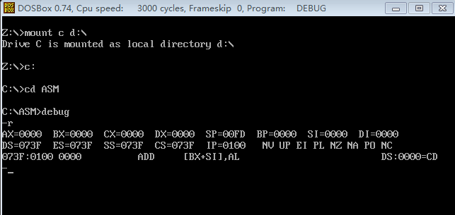
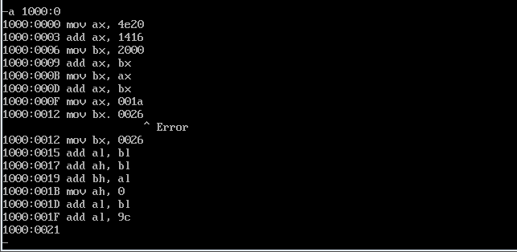
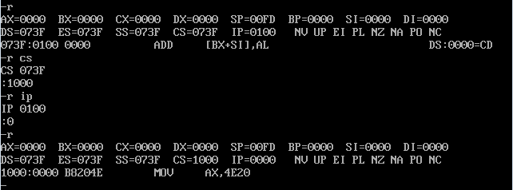
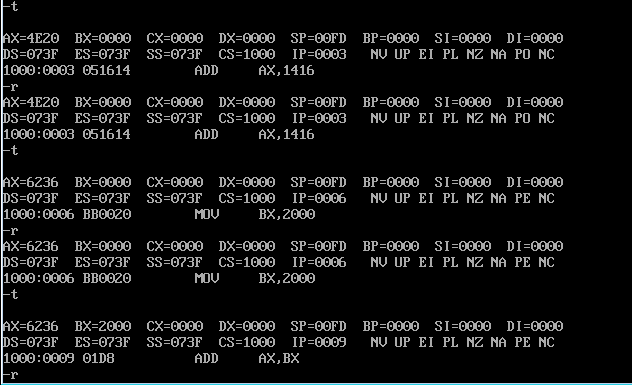
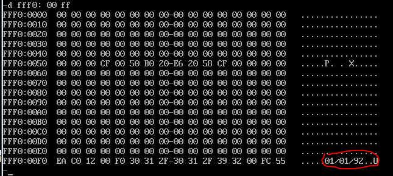

首先Debug的使用方法参见我在[《汇编与逆向基础：Windows 7 64位环境下搭建汇编开发环境》](http://www.xumenger.com/windows-assembly-20161208/)的整理

>以下是我在虚拟机中进行的练习

**(1)使用Debug，将下面的程序写入内存，逐条执行，观察每条指令执行后CPU中相关寄存器中内容的变化**

首先查看当前寄存器中的值



使用`a 1000:0`往地址10000处写入指令



执行`-r cs`、`-r ip`分别修改段寄存器和指令指针寄存器的值，使CPU从10000地址处开始执行



然后执行`t`命令开始单步执行指令，并实时执行`r`命令查看寄存器的值，主要是ax（ah、al）、bx（bh、bl）



这里就不一一分析了

**(2)将下面的指令写入2000:0开始的内存单元中，利用这3条指令计算2的8次方**

方法和上面一样，这里只是简单的分析这三行简单的汇编代码

```
mov ax, 1       ;ax = 1
add ax, ax      ;ax = ax + ax
jmp 2000:0003   ;反复执行地址2000:3处的指令 add ax, ax
```
**查看PC机主板的ROM中的生产日期，在内存FFF00H~FFFFFH的某几个单元中**

执行`d FFFF:00 FF`查看这段内存中的数据


