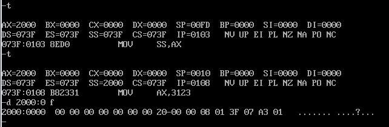

关于栈和栈相关命令的练习

**使用Debug，将下面的程序段写入内存，逐条执行，根据指令执行后的实际运行情况填空**

```
mov ax, ffff
mov ds, ax

mov ax, 2200
mov ss, ax

mov sp, 0100

mov ax, [0]         ;ax = 
add ax, [2]         ;ax = 
mov bx, [4]         ;bx = 
add bx, [6]         ;bx = 

push ax             ;sp = 。修改的内存单元地址是？，内容为？
push bx             ;sp = 。修改的内存单元地址是？，内容为？
pop ax              ;sp = 。ax = 
pop bx              ;sp = 。bx = 

push [4]            ;sp = 。修改的内存单元地址是？，内容为？
push [6]            ;sp = 。修改的内存单元地址是？，内容为？
```

在Debug中输入以下程序，执行程序


对应的分析结果如下

```
mov ax, ffff
mov ds, ax

mov ax, 2200
mov ss, ax

mov sp, 0100

mov ax, [0]         ;ax = c0ea
add ax, [2]         ;ax = c0fc
mov bx, [4]         ;bx = 30f0
add bx, [6]         ;bx = 6021

push ax             ;sp = 00fe。修改的内存单元地址是2200:00fe，内容为c0fc
push bx             ;sp = 00fc。修改的内存单元地址是2200:00fc，内容为6021
pop ax              ;sp = 00fe。ax = 6021
pop bx              ;sp = 0100。bx = c0fc

push [4]            ;sp = 00fe。修改的内存单元地址是2200:00f0，内容为30f0
push [6]            ;sp = 00fc。修改的内存单元地址是2200:00fc，内容为2f31
```

**观察下图的程序，分析为什么2000:0~2000:f中的内容会发生改变**




很明显，首先`a`命令写入了后续将要执行的指令

`mov ax, 2000`、`mov ss, ax`、`mov sp, 10`设置了栈的地址和空间大小（因为中断机制的原因，所以`mov ss, ax`、`mov sp, 10`没有分别单步运行）

初始化的栈底地址是`2000:0`，即20000H。栈顶地址是`2000:10`，即20010H

只执行到了这一步

再进行更详细的分析

这次每执行一步就输出2000:0 f的内容（注意，因为是重新再debug中运行，所以可能地址和上面截图中的地址有出入）


很明显，执行完`mov ax, 2000`之后，这块地址的内容没有变化

只有当执行完`mov ss, ax`和`mov sp, 10`之后，这块内存的值才发生了变化

这块内存正是栈所在的内存地址

>2017-04-15。目前还不清楚是什么原因，难道是CPU在初始化栈的时候，会随机在栈上写一些数据？

继续执行下面的指令呢，看往栈中写入数据会有什么样的现象


执行`mov ax, 3123`，查看栈中的内容已经又发生了变化了。不过看起来还是没有什么规律

继续执行`push ax`，查看已经将3123压入栈顶，并且原来栈中其他的内容都对应向上移动了一下

