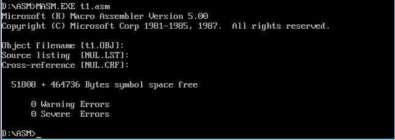

本次将实现一个简单的汇编程序

对应的代码在source中

之前在[《汇编与逆向基础：Windows 7 64位环境下搭建汇编开发环境》](http://www.xumenger.com/windows-assembly-20161208/)中也讲到了编译器、连接器的用法，也实现了一个简单的汇编程序。这里继续做一个

编译程序得到目标文件

连接得到可执行文件

然后使用Debug程序跟踪t1.exe的执行，观察寄存器的内容变化

再次使用Debug加载t1.exe，查看PSP的内容

程序加载后，ds中存放着程序所在内存区的段地址，这个内存区的偏移地址为0，则程序所在的内存区的地址为ds:0，对于这个程序就是075A:0（16进制为075A0）

这个内存区的前256个字节（16进制为100）中存放的是PSP，DOS用来和程序进行通信就是通过PSP

所以查看075A0开始的256（100H）个字节来查看PSP的内容

>PSP的头两个字节是CD 20