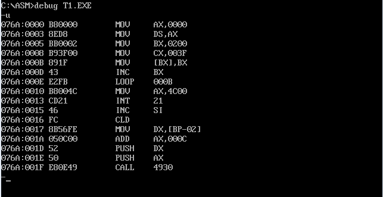
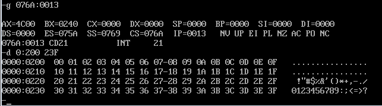

**编写程序，向内存`0:200~0:23F`依次传送数据`0~63（3FH）`，程序只能使用9条指令，9条指令中包括`mov ax, 4c00h`、`int 21h`**

编程如下

```
assume cs:code

code segment
    mov ax, 0H
    mov ds, ax           ;设置数据段寄存器值为0

    mov bx, 200H         ;bx用于数据段偏移
    mov cx, 40H          ;不是3FH，而是40H

s:  mov ds:[bx], bx
    inc bx
    loop s

    mov ax, 4C00H
    int 21H

code ends

end
```

运行效果大致如下






