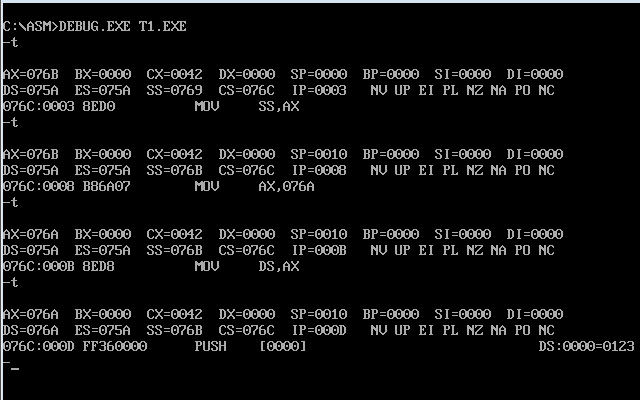
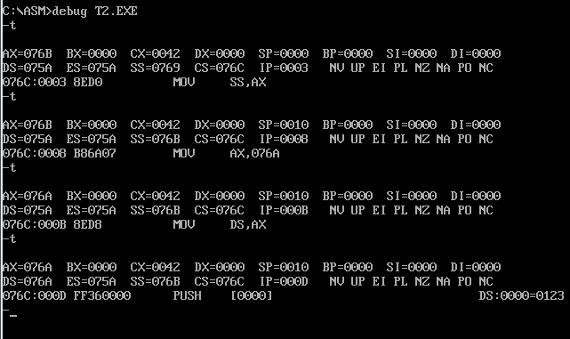
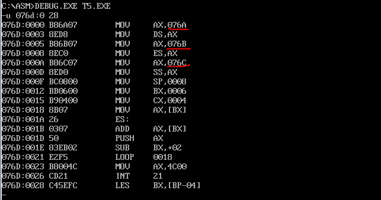
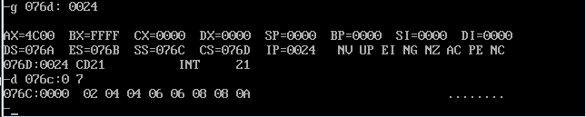

编写几个汇编的练习程序，并且使用Debug跟踪程序分析寄存器变化

## 第一个程序



## 第二个程序



## 最后一个程序

中间的其他几个练习就省略了，直接做第5个练习

程序如下，编写code段中的代码，将
a段和b段中的数据依次相加，将结果存到c段中

```
assume cs:code

a segment
    db 1,2,3,4,5,6,7,8
a ends

b segment
    db 1,2,3,4,5,6,7,8
b ends

c segment
    db 0,0,0,0,0,0,0,0
c ends

code segment
start: ???
       ???
code ends

end start
```

对应代码在source/t5.asm中，编译程序后，使用Debug分析程序

先查看各个段对应的地址

其中c段的地址是076CH



然后我们运行程序到`int 21`指令，也就是`076D:0026`的地址处，然后查看c段所在内存的内容



内容是 02 04 06 08 0A 0C 0E 10，确实是对应的两个段的值相加的结果

详细的代码原理在代码中注释说明，这里不做过多废话了！