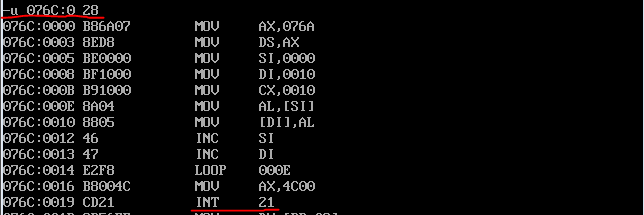

>本章重点讲解的是内存寻址方式

## 拷贝字符串

用si和di实现将字符串'welcome to masm!'复制到它后面的数据区中

对应的程序在t1.asm中实现，编译、连接后，运行效果如下

先查看最开始的时候ds数据段开始部分的数据内容，前16个字节是'welcome to masm!'，接下来16个字节是'................'

查看代码段的地址信息

运行程序到`int 21H`的代码处，再查看ds数据段的数据内容，明显拷贝成功

## 将datasg段中每个单词的头一个字母变成大写

对应的程序在t2.asm中，编译、连接后，运行效果如下

先查看最开始时，数据段的内容，确实是小写的数据

查看`int 21`指令的地址是0770:001B

运行程序到`int 21H的`代码处，然后查看此时数据段中的内容，第一个字母变成了大写的

## 使用栈内存来暂存数据

双层循环，将数据段中的数据转成大写

对应的程序在t3.asm中，编译、连接后，运行效果如下

先查看最开始时，数据段的内容，确实是小写的数据

查看`int 21`指令的地址是076F:002C

运行程序到`int 21H的`代码处，然后查看此时数据段中的内容，第一个字母变成了大写的

