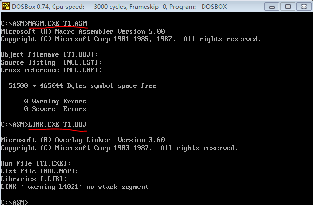
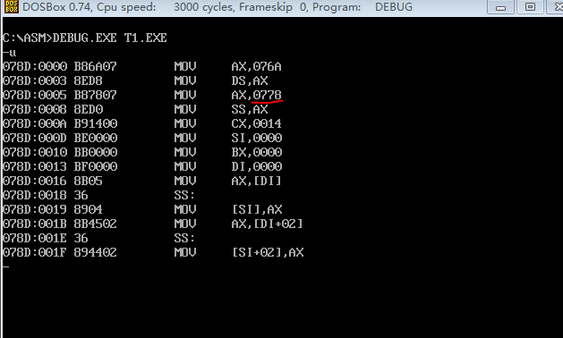
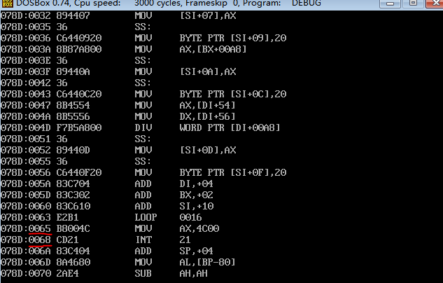
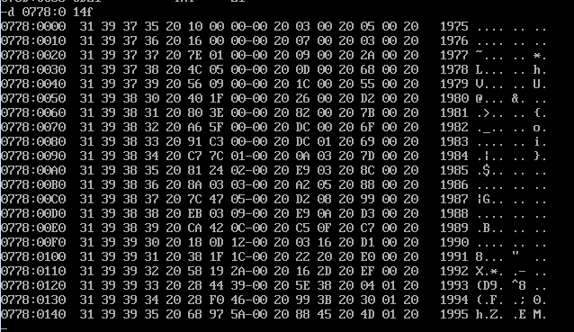

>寻址方式在结构化数据访问中的应用

>下面这个程序时到目前为止最为复杂的程序，它几乎用到了我们以前学过的所有知识和编程技巧。所以这个程序是对我们从前学习的最好的实践总结，请认真完成

>只要去思考、去动手，没有什么难的

---

Power idea公司从1975年成立一直到1995年的基本情况如下

年份     |   收入(千美元)   |   雇员(人)    |   人均收入(千美元)
---------|------------------|---------------|-------------------
1975     | 16               | 3             | ?
1976     | 22               | 7             | ?
1977     | 382              | 9             | ?
1978     | 1356             | 13            | ?
1979     | 2390             | 28            | ?
1980     | 8000             | 38            | ?
....     | ....             | ....          | ....
1995     | 5937000          | 17800         | ?

下面的程序中，已经定义好了这些数据

```
assume cs:codesg

data segment
  db '1975','1976','1977','1978','1979','1980','1981','1982','1983'
  db '1984','1985','1986','1987','1988','1989','1990','1991','1992'
  db '1993','1994','1995'
  ;以上是表示21年的21个字符串

  dd 16,22,382,1356,2390,8000,16000,24486,50065,97479,140417,197514
  dd 345980,590827,803530,1183000,1843000,2759000,3753000,4649000,5937000
  ;以上是表示21年公司总收入的21个dword数据

  dw 3,7,9,13,28,38,130,220,476,778,1001,1442,2258,2793,4037,5635,8226
  dw 11542,14430,15257,17800
  ;以上是表示21年公司雇员人数的21个word型数据
data ends

table segment
  db 21 dup ('year summ ne ??')
table ends
```

编程，将data段中的数据按照如下格式写入到table段中，并计算21年中的人均收入（取整），结果也按照下面的格式保存到table段中

列/行      | 年份(4字节) | 空格 | 收入(4字节)  | 空格 | 雇员数(2字节) | 空格 | 人均收入(2字节) | 空格
-----------|-------------|------|--------------|------|---------------|------|-----------------|------
列/行      | 0 1 2 3     | 4    | 5 6 7 8      | 9    | A B           | C    | D E             | F
table:0    |'1 9 7 5'    |      | 16           |      | 3             |      | ?               |
table:10H  |'1 9 7 6'    |      | 22           |      | 7             |      | ?               |
....       | .......     |      |              |      |               |      |                 |
table:140H |'1 9 9 5'    |      | 5937000      |      | 17800         |      | ?               |

具体的代码实现在source里面

编译、链接程序



调试程序，反汇编可以看到table段的地址为0778H



执行`u 078D:0 65`查看`INT 21`在代码段的地址为`078D:0068`



执行`g 078D:0065`运行到`INT 21`的上一行地方

>在实际的调试过程中发现这样之后，程序一直无法停止，不知道是什么原因导致的，所以只能一步一步执行t单步直到`int 21H`的地方。确实很蛋疼，是一个很繁琐的过程！

单步t执行到`int 21`的地方，然后执行`d 0778:0 14F`查看table段内的内容



>说起来很简单，中间其实花了大量的时间调试这个程序。不过正是自调试的过程中才对汇编、调试有了更深刻的认知