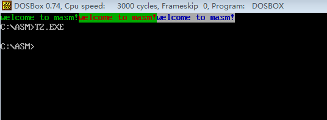

>这一章讲解的是跳转指令

---

编程：在屏幕中间分别显示绿色、绿底红色、红底蓝色的字符串'welcome to masm!'

>这个例子中对于计算机屏幕的一些原理也有所涉及，很有意思

详细的资料参见书中的内容

对应代码参见source/t2.asm

代码对应有注解说明

程序编译、链接后运行，运行效果如下

>注：闪烁的效果必须在全屏DOS方式下（Alt+Enter）才能看到

>非闪烁效果，直接使用DOSBox在普通模式下也可以看到，但需要先cls清屏