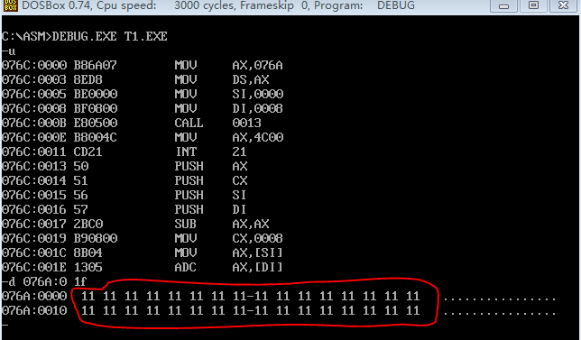
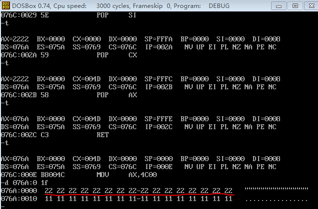

标志寄存器

## 实现一个支持两个128位数相加的函数

功能：两个128位数据进行相加

参数：ds:si指向存储第一个数的内存空间，因为数据为128位，所以需要8个字单元，由低地址单元到高地址单元依次存放128位数据由低到高的各个字

ds:di指向存储第二个数的内存空间

结果：运算结果存储在第一个数的存储空间中

t1.asm

任务启动时，查看其数据段的内容

一步一步单步到最后，再看数据段内容

