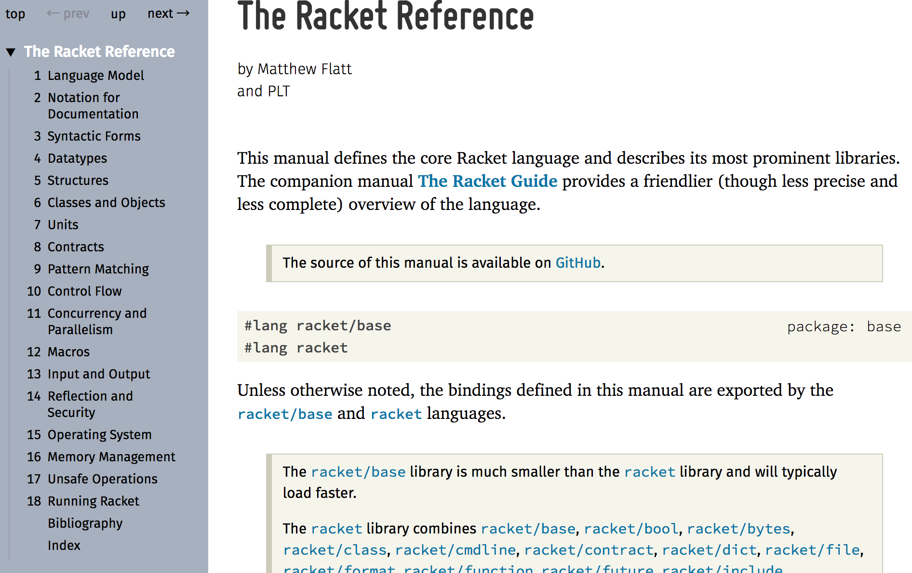

参考自《The Little Schemer--递归与函数式的奥妙》

使用Racket做为开发的IDE

熟悉Racket IDE的开发、调试功能

之前在[《初识Lisp语法》](http://www.xumenger.com/lisp-20170215/)简单总结过Lisp的语法，不过当时比较浅显，这次将通过各种途径进行深入的学习。通过Scheme深入研究函数式编程、研究编译原理

## 我思考编译原理

>以下仅仅是我在现有的水平下的一些思考

将编程语言主要分为指令式编程语言和函数式编程语言

指令式编程语言就是我们常见的C、Java、Delphi、C++这种，面向过程和面向对象本质都是指令式编程语言，基本都是依赖于底层的汇编语言来构建的，所以要想研究指令式编程语言还是要好好研究汇编

而函数式编程语言就是我们常听到的Lisp，Lisp有多种方言，我这里研究主要是使用Scheme

研究不同模式的编程语言，可以很好的扩展自己的思想，因为完全不同模式的编程会要求你用完全不同的思维方式思考！这也是好事，让自己有多方面的思维角度！

## Racket API

Racket的官方API参考文档参考[这里](http://docs.racket-lang.org/reference/index.html)

之前(2017-10-04之前)学习Lisp都是学习它的S-表达式、括号这方面的东西，这是研究它的语法格式，对于研究指令式编程和函数式编程涉及到的编译原理很有帮助

但是就像学习C不能只学习if、else、for一样，还要学习标准库、系统调用、算法与数据结构等，Lisp中同样也有这些内容，在Racket官方文档中有大量这方面的内容

## Scheme十诫

**第一诫**

当对一个原子列表 *lat* 进行递归调用时，询问两个有关lat的问题：`(null? lat)`和`else`

档对一个数字 *n* 进行递归调用时，询问两个有关n的问题：`(zero? n)`和`else`

当对一个S-表达式列表 *l* 进行递归调用时，询问三个有关l的问题`(null? l)`、`(atom? (car l))`和`else`

**第二诫**

使用`cons`来构建列表

**第三诫**

构建一个列表的时候，描述第一个典型元素，之后cons该元素到一般性递归（natural recursion）上

**第四诫**

在递归时总是改变至少一个参数。当对一个原子列表 *lat* 进行递归调用时，使用`(cdr lat)`；当对数字 *n* 进行递归调用时，使用`(sub1 n)`；当对一个S表达式 *l* 进行递归调用时，只要是`(null? l)`和`(atom? (car l))`都不为true，那么就同时使用`(car l)`和`(cdr l)`

在递归时改变的参数，必须向着不断接近结束条件而改变。改变的参数必须在结束条件中得以测试：

* 当使用cdr时，用`null?`测试是否结束
* 当使用sub1时，用`zero?`测试是否结束

**第五诫**

当用`+`构建一个值时，总是使用0做为结束代码行的值，因为加上0不会改变加法的值

当用`*`构建一个值时，总是使用1做为结束代码行的值，因为乘以1不会改变乘法的值

当用`cons`构建一个值时，总是考虑把()做为结束代码行的值

**第六诫**

简化工作只在功能正确之后开展

**第七诫**

对具有相同性质的`subpart`（子部件）进行递归调用：

* 列表的子列表
* 算术表达式的子表达式

**第八诫**

使用辅助函数来抽象表示方法

**第九诫**

用函数来抽象通用模式

**第十诫**

构建函数，一次收集多个值

>以上提到的一些核心概念：原子、列表、S表达式

## Scheme五法

1. 基本元件`car`仅定义为针对非空列表
2. 基本元件`cdr`仅定义为针对非空列表。任意非空列表的cdr总是另一个列表
3. 基本元件`cons`需要两个参数。第二个参数必须为一个列表。结果为一个列表
4. 基本元件`null?`仅定义为针对列表
5. 基本元件`eq?`需要两个参数。每个参数必须都是一个非数字的原子

