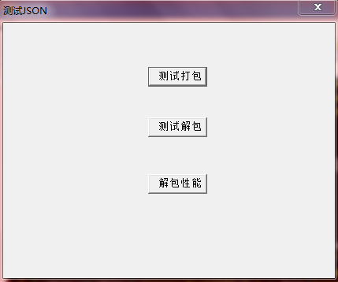
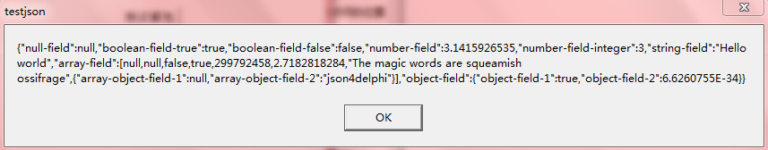
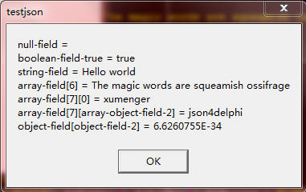
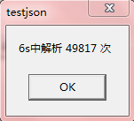

## 关于json4delphi

一个使用Delphi实现的JSON打包解包类

关于JSON格式，可以阅读[http://www.w3school.com.cn/json/](http://www.w3school.com.cn/json/)

关于json4delphi，可以阅读[http://blog.csdn.net/rilyu/article/details/35804517](http://blog.csdn.net/rilyu/article/details/35804517)

## 测试json4delphi

测试程序打开后界面如下



点击【测试打包】



点击【测试解包】



点击【解包性能】，6s的时间，按照测试程序中的方式，解析49817次



## JSON格式的例子

```
{"null-field":null,"boolean-field-true":true,"boolean-field-false":false,"number-field":3.1415926535,"number-field-integer":3,"string-field":"Hello world","array-field":[null,null,false,true,299792458,2.7182818284,"The magic words are squeamish ossifrage",["xumenger",123456],{"array-object-field-1":null,"array-object-field-2":"json4delphi"}],"object-field":{"object-field-1":true,"object-field-2":6.6260755E-34}}
```

将其简单进行格式化处理

```
{
    "null-field":null,
    "boolean-field-true":true,
    "boolean-field-false":false,
    "number-field":3.1415926535,
    "number-field-integer":3,
    "string-field":"Hello world",
    "array-field":
    [
        null,
        null,
        false,
        true,
        299792458,
        2.7182818284,
        "The magic words are squeamish ossifrage",
        [
            "xumenger",
            123456
        ],
        {
            "array-object-field-1":null,
            "array-object-field-2":"json4delphi"
        }
    ],
    "object-field":
    {
        "object-field-1":true,
        "object-field-2":6.6260755E-34
    }
}
```

## JSON和XML的比较

与XML的相同之处

* 是纯文本
* 具有“自我描述性”（人类可读）
* 具有层级结构（值中存在值）

与XML不同之处

* 没有结束标签
* 更短
* 读写的速度更快
* 能够使用內建的JavaScript eval()方法进行解析（当然其他语言也有自己的解析方式）
* 使用数组
* 不适用保留字

## JSON的结构逻辑

* 数据使用键值对表示
* 数据由逗号分隔
* JSON的键是字符串
* JSON的值可以是：
    * 数字（整数或浮点数）
    * 字符串（在双引号""中）
    * 布尔值（true或false）
    * 数组（在方括号[]中）
    * 对象（在花括号{}中）
    * null
* JSON是多层递归的结构
    * 上面说到键值对的值可以是数字、字符串、布尔、数组、对象
    * 而对象内部又是由多个键值对组成的
    * 而数组内部又是由多个值（对象、数组、字符串、数值、布尔……）组成的

## 重点说一下对象和数组结构

对象结构以“{”开始，以“}”结束，之间部分由0或多个以“,”分割的键值对构成，键值对之间以“:”分隔，比如

```
{
    key1:value1,
    key2:value2,
    ...
}
```

数组结构以“[”开始，以“]”结束，中间由0或多个“,”分隔的**值**列表组成，值可以是布尔值、数值型值、字符串值、对象结构值、数组结构值

```
[
    "string",
    12,
    [
        "xumenger",
        666
    ],
    {
        key1:value1;
        key2:value2;
    },
    {
        key3:value3;
        key4:value4;
    }
]
```

>而且Json是可以一层嵌套一层的！所以解包和打包Json需要应用递归的思想

>本Json解包打包类的实现，其实完全是利用了Json的树形结构的特点

更多详细信息参见在该JSON打包解包类中的相关注释，另外建议通过断点跟踪的方式一步一步跟踪这个类是如何实现解包和打包的
