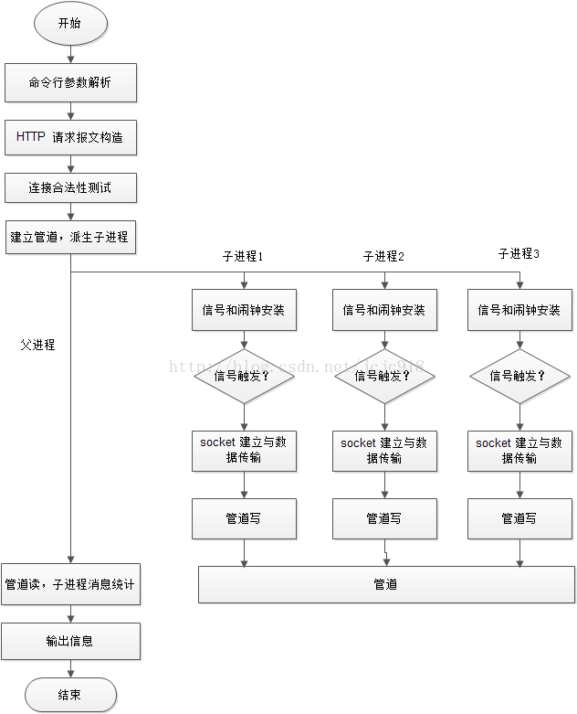

## 简介

在【20170208~20170208-tinyhttpd】研究的是一个简单的http服务器tinyhttpd，对于简单的HTTP协议、服务端编程有了初步了解

不过其中涉及到的多进程、多进程应用管道进行通信的部分还存在一些疑惑

之前在[《使用webbench对tinyhttpd进行压力测试》](http://www.xumenger.com/tinyhttpd-webbench-20161012/)中对于编译webbench、如何应用webbench测试HTTP服务器进行了初步的讲解

本次通过注解源码的方式研究webbench，然后结合tinyhttpd在我的个人博客中整理关于简单网络编程、HTTP、多进程、多进程使用管道通信等相关知识点的总结文章

## webbench流程架构

1. 解析命令行参数，根据命令行指定参数设定变量，可以认为是初始化配置
2. 根据指定的配置构造HTTP请求报文格式
3. 开始执行bench函数，先进行一次socket连接建立和断开，测试是否可以正常访问
4. 建立管道，根据指定进程数派生子进程
5. 每个子进程调用benchcore函数
	* 先通过sigaction安装信号，用alram设置闹钟函数
	* 接着不断建立socket进行通信，与服务器交互数据，直到收到信号结束访问测试
	* 子进程将访问测试结果写进管道
6. 父进程读取管道数据，汇总子进程信息，收到所有子进程消息后，输出汇总信息，结束

**流程图**

