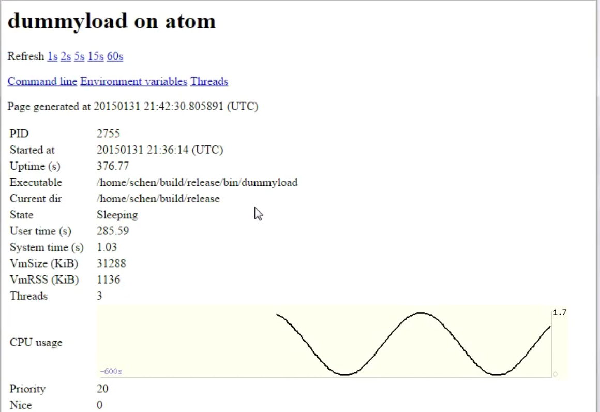

## procmon

procmon在机器上启动起来，就会一直监控进程，然后使用浏览器去查看进程的监控状态。其原理很简单：就是读/proc/虚拟文件系统下面的文件，获取进程的信息，然后做成HTML页面显示出来

在命令行输入`procmon pid port [name]`即可运行procmon程序，监控pid的进程，并且在port端口侦听，允许浏览器访问

然后可以通过浏览器访问，以获取进程的信息，可以看到支持绘制CPU的历史使用率曲线

本程序基于muduo网络库实现

procmon是一个定制的专用HTTP服务器

## dummyload

假负载这个事情是由dummyload程序实现的，是为了让CPU使用率有一个正弦曲线的变化

这个实现起来不难，主要就是控制CPU的使用率，让其随着时间的变化想绘制什么曲线就绘制出什么曲线