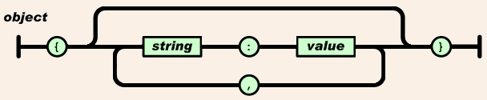
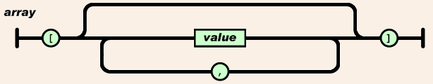
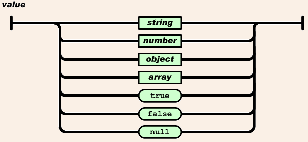
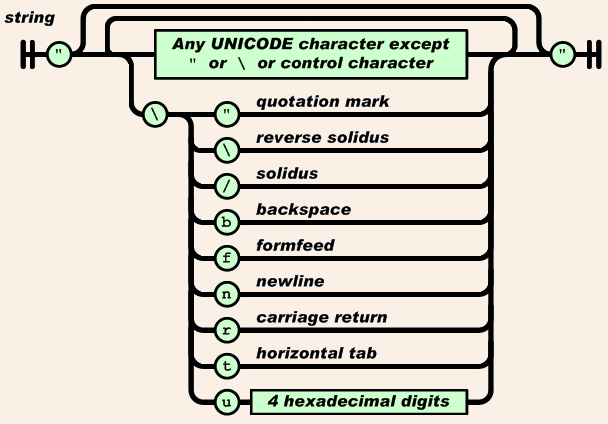
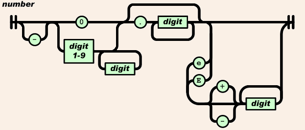
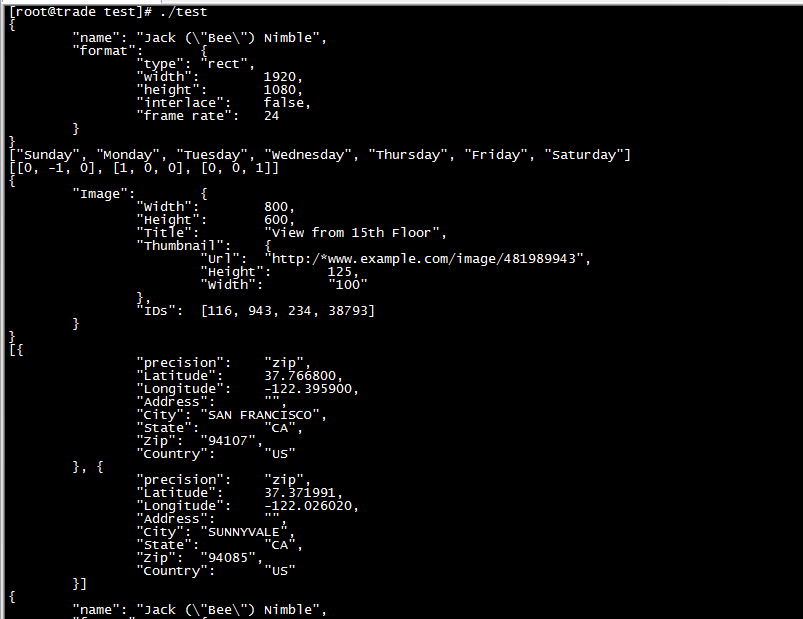

>参考[《cJSON源码分析》](http://blog.csdn.net/yzhang6_10/article/details/51615089)

另外参考以下文章：

* [《从零开始的 JSON 库教程》](https://zhuanlan.zhihu.com/json-tutorial)
* [为什么都反对 XML 而支持使用 JSON？](https://www.zhihu.com/question/25636060)

## 简介

由于C语言汇总，没有直接的字典、字符串等数据结构，所以要借助结构体定义，处理Json

**JSON是一种轻量级的数据交换格式**。JSON采用完全独立于语言的文本格式，易于人阅读和编写。同时也易于机器解析和生成。它是基于JavaScript Programming Language Standard ECMA-262 3rd Edition -December 1999的一个子集。JSON采用完全独立于语言的文本格式，但是也使用类似于C语言家族的习惯（如C、C++、JavaScript、Perl、Python等）。这些特性使JSON成为理想的数据交换语言

>JSON作用：在数据传输时能更好地提取出需要的数据，可以用于客户端和服务器端的数据交换

>实质：JSON是一种信息交换格式，而cJSON就是对JSON格式的字符串进行构建和解析的一个C语言函数库。此外，cJSON作为JSON格式的解析库，其主要功能就是构建和解析JSON格式

## JSON具有的形式

对象是一个无序的“名称/值”对集合。一个对象以“{”开始，以“}”结束。每个“名称”后跟一个“:”；“名称/值”对之间使用“,”分割。其具体形式如下图



数组是值的有序集合，一个数组以“[”开始，“]”结束。值之间使用“,”分割。其具体形式如下图



值可以是双引号括起来的字符串、数值、true、false、null、对象或者数组。这些结构可以嵌套。其具体形式如下：



字符串是由双引号包围起来的任意数量Unicode字符的集合，使用反斜线转义。字符串与C或Java的字符串非常类似，其具体形式如下：



数值（number）也与C或者Java的数值非常相似。除去未曾使用的八进制与十六进制格式。除去一些编码细节。其具体形式如下：



>关于JSON的语法，我在分析[json4delphi](https://github.com/HackerLaboratory/_Open/tree/master/20161230~20170101-json4delphi)项目时也已经很详细的介绍了

JSON格式举例如下：

```
对象：名称/值的集合
例：{"firstName":"Tom"}

数组：值的序列
例：[310,null,0.321,-2.3E+5]

字符串
例："cJson"

数字：
例：500

布尔值：
例：true

一个完整的格式化之后的JSON例子
{
    "null-field":null,
    "boolean-field-true":true,
    "boolean-field-false":false,
    "number-field":3.1415926535,
    "number-field-integer":3,
    "string-field":"Hello world",
    "array-field":
    [
        null,
        null,
        false,
        true,
        299792458,
        2.7182818284,
        "The magic words are squeamish ossifrage",
        [
            "xumenger",
            123456
        ],
        {
            "array-object-field-1":null,
            "array-object-field-2":"json4delphi"
        }
    ],
    "object-field":
    {
        "object-field-1":true,
        "object-field-2":6.6260755E-34
    }
}
```

## cJSON源码注解

主要参见的源码文件是cJSON.h、cJSON.c和test.c，其中test.c是测试函数

由于cJSON为JSON格式的解析库，故主要功能是构建和解析JSON格式。其中的结构体、函数定义实现都是围绕着这两个功能实现的

我在分析[json4delphi](https://github.com/HackerLaboratory/_Open/tree/master/20161230~20170101-json4delphi)的时候，讲到其使用一个树形结构来在内存中管理JSON，那今天继续看看cJSON是如何实现的

cJSON程序中的细节点如下：

* 大量宏替换
* 大量静态函数
* 错误处理机制
* 字符串处理时存在utf16转utf8，编码转换
* 用函数指针封装malloc、free，方便用于处理，比如在申请后初始化，比如在释放前进行一些处理等

详细的注解参见对应的源码

>重点通过其学习编码规范、程序设计、数据结构、内存管理的技巧；同时去类比json4delphi的实现，会有更深刻的体会

## 阅读思路

>先去用，首先熟悉接口的用法，再去去感受接口设计的好坏，然后思考和猜测接口背后的大概实现思路，最后带着前面的思考仔细看其接口是如何实现的

先看test.c中cJson的接口是怎么使用的，先对cJson的使用方法进行了解，对其有个感性化的理解

`gcc cJSON.c test.c -o test -lm`编译程序。`./test`运行程序看到如下结果



结合test.c以及其编译后的运行情况，可以看到其API接口的使用还是很清晰的

再去看cJson.h中接口定义，从接口定义反推其大概是怎么实现的。看完test.c的用法之后再去看cJson的接口，在结合自己对于JSON结构的熟悉，现在看起来接口很清晰

其中cJSON结构体是理解cJson.c解析、管理JSON结构的重点，按照其定义，基本可以猜测其也是使用树形结构管理JSON的

```
typedef struct cJSON {
    struct cJSON *next,*prev;   /* next/prev allow you to walk array/object chains. Alternatively, use GetArraySize/GetArrayItem/GetObjectItem */
    struct cJSON *child;        /* An array or object item will have a child pointer pointing to a chain of the items in the array/object. */

    int type;                   /* The type of the item, as above. */

    char *valuestring;          /* The item's string, if type==cJSON_String */
    int valueint;               /* The item's number, if type==cJSON_Number */
    double valuedouble;         /* The item's number, if type==cJSON_Number */

    char *string;               /* The item's name string, if this item is the child of, or is in the list of subitems of an object. */
} cJSON;
```

再去看cJson.c，确定她具体是怎么实现的！！

## 总结

我在分析[json4delphi](https://github.com/HackerLaboratory/_Open/tree/master/20161230~20170101-json4delphi)的文档中说到，json4delphi是使用树形结构管理Json的，每个父节点通过List存储所有的子节点信息，每个子节点也存储其父节点信息！

上面也提到过，根据cJSON结构体的定义可以确定cJson.c是使用树形结构来解析和管理JSON结构的！

但是存在一些不同的地方：

* json4delphi使用List存储所有子节点，并且使用一个指针存储其父节点
* 但是cJson只用一个指针存储其第一个子节点，那么cJson怎么实现访问父节点的所有字节点呢？cJson是在节点中存储其同级的前后节点。所以cJson是使用双向链表管理同级节点，子节点不存储父节点信息、父节点只存储第一个子节点信息。相当于其是用双向链表模拟出一个树形结构！

>这两种使用数据结构的思路都很扩展我的思维！很好

这个cJSON解析器还是和之前研究的tinyhttpd、webbench一样，都是比较简单、轻巧的开源项目，有了一定的基础之后看起来并不会觉得很难的，后续有必要研究一些比较大型的项目，充分学习大型项目的设计、架构、实现、数据结构使用

## 补充

同时，我最近参考[《从零开始的 JSON 库教程》](https://zhuanlan.zhihu.com/json-tutorial)实现了一个[JSON解析器](https://github.com/HackerLaboratory/_Laboratory/blob/master/_Basic/_Parser/JSON/cJson/readme.md)

对JSON有了更加深刻的理解
