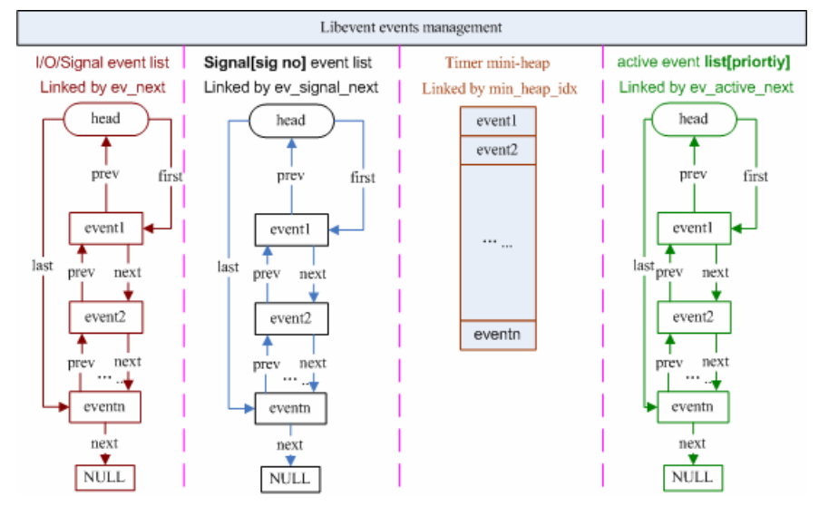

对事件处理流程有了高层的认识后，本节将详细介绍libevent的核心结构event，以及libevent对event的管理

## Libevent的核心：event

Libevent是基于事件驱动（event-driven）的，从名字也可以看到event是整个库的核心。event就是Reactor框架中的事件处理程序组件；它提供了函数接口，供Reactor在事件发生时调用，以执行相应的事件处理，通常它会绑定一个有效的句柄

首先给出event结构体的声明，它位于event.h文件中

```
struct event{
    TAILQ_ENTRY (event) ev_next;
    TAILQ_ENTRY (event) ev_active_next;
    TAILQ_ENTRY (event) ev_signal_next;
    unsigned int max_heap_idx;   //for managing timeouts
    struct event_base *ev_base;
    int ev_fd;
    shrot ev_events;
    short ev_ncalls;
    short *ev_pncalls;   //Allows delete in callback
    struct timeval ev_timeout;
    int ev_pri;          //smaller numbers are higher priority
    void (*ev_callback)(int, short, void *arg);
    void *ev_arg;
    int ev_res;          //result passed to event callback
    int ev_flags;
};
```

下面详细解释一下结构体中个字段的含义

**ev_events**：event关注的事件类型，它可以是以下3种类型
	
* IO事件：EV\_WRITE和EV\_READ
* 定时事件：EV\_TIMEOUT
* 信号：EV\_SIGNAL
* 辅助选项：EV\_PERSIST，表明是一个永久事件

Libevent中的定义为

```
#define EV_TIMEOUT 0x01
#define EV_READ    0x02
#define EV_WRITE   0x04
#define EV_SIGNAL  0x08
#define EV_PERSIST 0x10
```

可以看出事件类型可以使用“|”运算符进行组合，需要说明的是，信号和IO事件不能同时设置

还可以看出，Libevent使用event结构体将这3种事件的处理统一起来

**ev_next**、**ev_active_next**、**ev_signal_next**是双向链表节点指针；它们是Libevent对不同事件类型和在不同的时期，对事件的管理时使用到的字段

Libevent使用双向链表保存所有注册的IO和signal事件，ev\_next就是该IO事件在链表中的位置，称此链表为“已注册事件链表”

同样，ev\_signal\_next就是signal事件在signal事件链表中的位置

ev\_signal\_next：libevent将所有的激活事件放入链表active\_list中，然后遍历active\_list执行调度，ev\_active\_next就指明了event在active list中的位置

**min_heap_idx**和**ev_timeout**，如果是timeout事件，它们是event在小根堆中的索引和超时值，libevent使用小根堆来管理定时事件，这将在后面定时事件处理时专门讲解

**ev\_base**，该事件所属的反应堆实例，这是一个event\_base结构体，下一节将会详细讲解

**ev\_fd**，对于IO事件，是绑定的文件描述符；对于signal事件，是绑定的信号

**ev\_callback**，event的回调函数，被ev\_base调用，执行事件处理程序，这是一个函数指针，原型是

```
void (*ev_callback)(int fd, short events, void *arg)
```

其中参数fd对应于ev_fd，events对应于ev\_events；arg对应于ev\_arg

**ev\_arg**：void\*，表明可以是任意类型的数据，在设置event时指定

**eb\_flags**：libevent用于标记event信息的字段，表明其当前的状态，可能的值有：

```
#define EVLIST_TIMEOUT   0x01   //event在time堆中
#define EVLIST_INSERTED  0x02   //event在已注册事件链表中
#define EVLIST_SIGNAL    0x04   //未见使用
#define EVLIST_ACTIVE    0x08   //event在激活链表中
#define EVLIST_INTERNAL  0x10   //内部使用标记
#define EVLIST_INIT      0x80   //event已被初始化
```

**ev_ncalls**，事件就绪执行时，调用ev\_callback的次数，通常为1

**ev_pncalls**，指针，通常指向ev\_ncalls或NULL

**ev\_res**，记录了当前激活事件的类型

## libevent对event的管理

从event结构体中的三个链表节点指针和一个堆索引触发，大体上也能窥出libevent对event的管理方法了，可以参见下面的示意图

每次当有事件event转变为就绪状态时，libevent就会把它移入到active event list[priority]中，其中priority是event的优先级

接着libevent会根据自己的调度策略选择就绪事件，调用其cb_callback()函数执行事件处理；并根据就绪的句柄和事件类型填充cb\_callback函数的参数



## 事件设置的接口函数

要向libevent添加一个事件，需要首先设置event对象，这通过调用libevent提供的函数有：event\_set()、event\_base\_set()、event\_priority\_set()来完成，下面分别进行讲解

```
void event_set(struct event *ev, int fd, short events,
      void (*callback)(int, short, void *), void *arg)
```

1. 设置事件ev绑定的文件描述符或信号，对于定时事件，设为01即可
2. 设置事件类型，比如EV\_READ|EV\_PERSIST、EV\_WRITE、EV\_SINGAL等
3. 设置事件的回调函数以及参数arg
4. 初始化其他字段，比如缺省的event\_base和优先级

```
int event_base_set(struct event_base *base, struct event *ev)
```

设置event ev将要注册到event\_base

libevent有一个全局event\_base指针current\_base，默认情况下事件ev将被注册到current\_base上，使用该函数可以指定不同的event\_base

如果一个进程中存在多个libevent实例，则必须要调用该函数为event设置不同的event\_base

```
int event_pripority_set(struct event *ev, int pri)
```

设置event ev的优先级，没什么可说的，注意的一点就是：当ev正处于就绪状态时，不能设置，返回-1

## 小结

本节讲述了libevent的核心event结构，以及libevent支持的事件类型和libevent对event的管理模型

接下来将会描述libevent的事件处理框架，以及其中使用的重要的结构体event\_base
