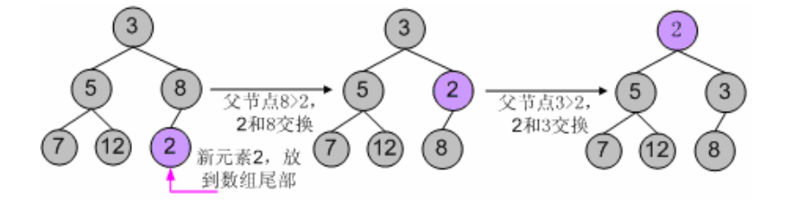
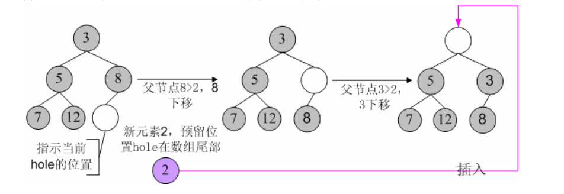

现在再来详细分析libevent中的IO事件和Timer事件的集成，与signal相比，timer事件的集成会直观和简单很多。libevent对堆的调整操作做了一些优化，本节还会描述这些优化方法

## 集成到事件主循环

因为系统的IO机制像select()和epoll\_wait()都允许程序制定一个最大等待时间（也称为最大超时时间）timeout，即使没有IO事件发生，它们也保证能在timeout时间内返回

那么根据所有Timer事件的最小超时时间来设置系统的IO的timeout时间，当系统IO返回时，再激活所有就绪的timer事件就可以了，这样就能将Timer事件完美的融合到系统的IO机制中

具体的代码在源文件event.c的event\_base\_loop()中，现在就对比代码来看看这一处理方法

```
    if(!base->event_count_active && !(flags & EVLOOP_NONBLOCK)){
        //根据Timer事件计算evsel->dispacth的最大等待时间
        timeout_next(base, &tv_p);
    }else{
        //如果还有活动事件，就不要等待，让evsel->dispatch立即返回
        evutil_timerclear(&tv);
    }
    
    //...

    //调用select() or epoll_wait() 等待就绪IO事件
    res = evsel->dispatch(base, evbase, tv_p);

    //...

    //处理超时事件，将超时事件插入到激活链表中
    timeout_process(base);
```

timeout\_next()函数根据堆中具有最小超时值的事件和当前时间来计算等待时间，下面看看代码

```
static int timeout_next(struct event_base *base, struct timeval **tv_p)
{
    struct timeval now;
    struct event *ev;
    struct timeval *tv = *tv_p;

    //堆的首元素具有最小的超时值
    if((ev = min_heap_top(&base->timeheap)) == NULL){
        //如果没有定时事件，将等待时间设置为NULL，表示一直阻塞直到有IO事件发生
        *tv_p = NULL;
        return 0;
    }
    //取得当前时间
    gettime(base, &now);
    //如果超时时间 <= 当前值，不能等待，需要立刻返回
    if(evutil_timercmp(&ev->ev_timeout, &now, <=)){
        evutil_timerclear(tv);
        return 0;
    }
    //计算等待时间 = 当前时间 - 最小的超时时间
    evutil_timersub(&ev->ev_timeout, &now, tv);

    return 0;
}
```

## Timer小根堆

libevent使用堆来管理Timer事件，其key值就是事件的超时时间，源代码位于文件min\_heap.h中

所有的数据结构书中都有关于堆的写详细介绍，向堆中插入、删除元素复杂度都是O(lgN)，N为堆中元素的个数，而获取最小key值（小根堆）的复杂度是O(1)，对是一个完全二叉树，基本存储方式是一个数组

libevent实现的堆还是比较轻巧的，虽然我不喜欢这种编码方式（搞一些复杂的表达式）。轻巧到什么地方呢，就以插入元素为例，来对比说明，下面伪代码中的size表示当前堆的元素个数

```
Heap[size++] <= new;    //先放到数组末尾，元素个数+1
//下面是shift_up()的代码逻辑，不断的将new向上调整
_child = size;
while(_child > 0) //循环
{
    _parent <= (_child-1)/2;    //计算parent
    if(Heap[_parent].key < Heap[_child].key)
        break;    //调整结束，跳出循环
    swap(_parent, child);   //交互parent和child
}
```

而libevent的heap代码对这一过程做了优化，在插入新元素时，只是为新元素预留了一个位置hole（初始时hole位于数组尾部），但并不立即将新元素插入到hole上，而是不断向上调整hole的值，将父节点向下调整，最后确认hole就是新元素的所在位置时，才会真正的将新元素插入到hole上，因此在调整过程中就比上面的代码少了一次赋值的操作，代码的逻辑是

```
//下面就是shift_up()的代码逻辑，不断地将new的预留位置向上调整
_hole = size;    //_hole就是为new预留的位置，但并不立即将new放上
while(_hole > 0)  //循环
{
    _parent <= (_hole-1)/2;   //计算parent
    if(Heap[_parent].key < new.key)
        break;    //调整结束，跳出循环
    Heap[_hole] = Heap[_parent];   //将parent向下调整
    _hole = _parent;    //将_hole调整到_parent
}
Heap[_Hole] = new;    //调整结束，将new插入到_hole指示的位置
size ++;  //元素个数+1
```

由于每次调整都少做一次赋值操作，在调整路径比较长时，调整效率会比第一种有所提高。Libevent中的min\_heap\_shift\_up()函数就是上面逻辑的具体实现，对应的向下调整函数是min\_heap\_shift\_down()

举个例子，向一个小根堆3、5、8、7、17中插入新元素2，使用第一种典型的代码逻辑，调整过程如下



使用Libevent中的堆调整逻辑，调整过程如下



对于删除和元素修改操作，也遵从相同的逻辑

## 小结

通过设置系统IO机制的wait时间，从而简洁的集成timer事件

主要分析了Libevent对堆调整操作的优化
