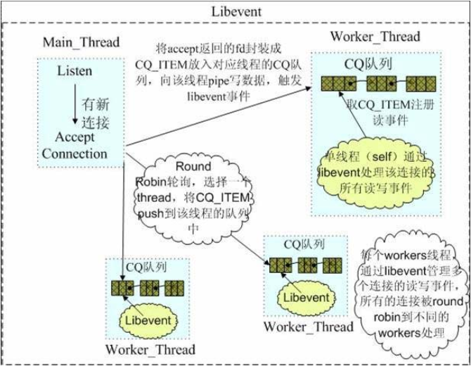

libevent本身不是线程安全的，在多核的时代，如何能充分利用CPU的能力呢，这一节来说说如何在多线程环境中使用libevent，跟源代码并没有太大的关系，纯粹是使用上的技巧

## 错误使用示例

在多核的CPU上只使用一个线程始终是对不起CPU的处理能力的啊，那好吧，就创建多个线程，比如下面的简单服务器场景

1. 主线程创建工作线程1
2. 接着主线程监听在端口上，等待新的连接
3. 在线程1中执行event事件循环，等待事件到来
4. 新连接到来，主线程调用libevent接口event\_add将新连接注册到libevent上

......

上面的逻辑看起来没有什么错误，在很多服务器设计中都可能用到主线程和工作线程的模式

可是就在线程1注册事件时，主线程很可能也在操作事件，比如删除、修改，通过libevent的源代码也能看到，没有同步保护机制，问题麻烦了，看起来不能这样啊，难道只能使用单线程不成？

## 支持多线程的几种模式

libevent并不是线程安全的，但这不代表libevent不支持多线程模式，其实方法在前面已经将signal事件处理时就接触到了，那就是消息通知机制

>一句话：“你发消息通知我，然后再由我在合适的时间来处理”

说到这就再多说几句，再打个比方，把你自己比作一个工作线程，而你的头是主线程，你有一个消息信箱来接收别人发给你的消息，当时头有个新任务要指派给你

**一：暴力抢占**

那么第一节中使用的多线程方法相当于下面的流程：

1. 当时你正在做事，比如在写文档
2. 你的头找到了一个任务，要指派给你，比如帮他搞个PPT，哈
3. 头命令你马上搞PPT，你这是不得不停止手头的工作，把PPT搞定了再接着写文档

**二：纯粹的消息通知机制**

那么基于纯粹的消息通知机制的多线程方式就像下面这样：

1. 当时你正在写文档
2. 你的头找到了一个任务，要指派给你，刚他搞一个PPT
3. 头发个消息给你信箱，有个PPT要帮他搞定，这时你并不鸟他
4. 你写好文档，接着检查消息发现头有个PPT要你搞定，你开始搞PPT

......

第一种的好处是消息可以立即得到处理，但这方法很粗暴，你必须立即处理这个消息，所以你必须处理好切换问题，省得把文档上的内容不小心写到PPT中。在操作系统的进程通信中，消息队列（消息信箱）都是操作系统维护的，你不必关心

第二种的优点是通过消息通知，切换问题省心了，不过消息是不能立即处理的（基于消息通知机制，这个总是难免的），而且所有的内容都是通过消息发送，比如PPT的格式、内容等等信息，这无疑增加了通信开销

**三：消息通知+同步层**

有个折中机制可以减少消息通信的开销，就是提取一个同步层，还拿上面的例子来说，你把工作安排都存放在一个工作队列中，而且你能保证“任何人把新任务扔到这个队列”，“自己取出当前第一个任务”等这些操作都能保证不会把队列搞乱（其实就是个加锁的队列容器）

再来看看处理过程和上面有什么不同：

1. 当时你正在写文档
2. 你的头找到了一个任务，要指派给你，帮他搞个PPT
3. 头有个PPT要你搞定，你把任务push到你的工作队列中，包括PPT格式、内容等信息
4. 头发个消息（一个字节）到你信箱，有个PPT要帮他搞定，这时你并不鸟他
5. 你写好文档，发现有新消息（这预示着新任务来了），检查工作队列知道头有个PPT要你搞定，你开始搞PPT

...

工作队列其实就是一个加锁的容器（队列、链表等），这个很容易实现；而消息通知仅需要一个字节，具体的任务都push到工作队列中，因此比第二种方式减少了不少通信开销

多线程编程有很多陷阱，线程间资源的同步互斥不是一两句能说的清的，而且出现bug很难跟踪调试；这也有很多的经验教训，因此如果让我选择，在绝大多数情况下都会选择机制3作为实现多线程的方法

## memcached

memcached中的网络部分就是基于libevent完成的，其中的多线程模型就是典型的消息通知+同步曾机制。下面的图足够说明其多线程模型，其中有详细的文字说明

## 小节

本节更是libevent的使用方法的技巧，讨论了一下如何让libevent支持多线程，以及几种多线程机制，memcached使用libevent的多线程模型

到此为止，对libevent源码的分析也就结束了，其中的基本数据结构比如链表、红黑树等就不再写了，都是经典的数据结构，好参考资料多多

