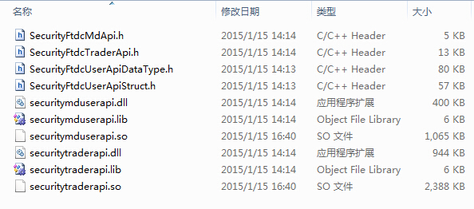

>[Python量化交易平台开发教程系列1-类CTP交易API的工作原理](http://www.vnpy.org/basic-tutorial-1.html)

# 类CTP交易API简介

国内程序化交易技术的爆发式发展几乎就是起源于上期技术公司基于CTP柜台推出了交易API，使得用户可以随意开发自己的交易软件直接连接到交易柜台上进行交易，同时CTP API的设计模式也成为了许多其他柜台上交易API的设计标准，本人已知的类CTP交易API包括：

* 上期CTP
* 飞马
* 华宝证券LTS
* 飞创Xspeed
* 金仕达
* 恒生UFT

所以这个教程系列选择从类CTP交易API中的LTS API开始来介绍API的Python封装方法，真正掌握了以后想要做其他类型的API（比如恒生的T2）的封装也只是大同小异而已

# LTS API文件说明

通常当用户从网上下载API的压缩包，解压后会看到以下的文件：



* .h文件：C++的头文件，包含了API的内部结构信息，开发C++程序时需要包含在项目中
* .dll文件：windows下的动态链接库文件，API的实体，开发C++程序编译和链接时用，使用开发好的程序时也必须放在程序的文件夹中
* .lib文件：windows下的库文件，编译和链接时用，程序开发好后无需放在程序的文件夹中
* .so文件：linux下的动态链接库文件，其他同.dll文件

找不到压缩包的可以在这里直接查看：[https://github.com/vnpy/vnpy/tree/master/vn.lts/ltsapi](https://github.com/vnpy/vnpy/tree/master/vn.lts/ltsapi)

# .h头文件介绍

.dll、.lib、.so文件都是编译好的二进制文件，.h文件是我们在开发时重点需要关注的文件

### ApiDataType.h

该文件中包含了对API中用到的常量的定义，如以下代码定义了一个产品类型常量对应的字符：

```
#define SECURITY_FIDC_PC_Futures '1'
```

以及类型的定义，如以下代码定义了产品名称类型是一个长度为21个字符的字符串

```
typedef char TSecurityFtdcProductNameType[21];
```

# ApiStruct.h

该文件中包含了API中用到的结构体的定义，如以下代码定义了交易所这个结构体的构成：

```
//交易所
struct CSecurityFtdcExchangeField
{
    //交易所代码
    TSecurityFtdcExchangeIDType ExchangeID;
    //交易所名称
    TSecurityFtdcExchangeNameType ExchangeName;
    //交易所属性
    TSecurityFtdcExchangePropertyType ExchangeProperty;
}
```

例如TSecurityFtdcExchangeIDType这个类型的定义，可以在ApiDataType.h中找到

# MdApi.h

该文件中包含了API中的行情相关组件的定义，文件通常开头会有一段这样的内容

```
#if !defined(SECURITY_FTDCMDAPI_H)
#define SECURITY_FIDCMDAPI_H

#if _MSC_VER > 1000
#pragma once
#endif // _MSC_VER > 1000

#include "SecurityFtdcUserApiStruct.h"

#if defined(ISLIB) && defined(WIN32)
#ifdef LIB_MD_API_EXPORT
#define MD_API_EXPORT __declspec(dllexport)
#else
#define MD_API_EXPORT __declspec(dllimport)
#endif
#else
#define MD_API_EXPORT
#endif
```

这些内容主要是一些和操作系统、编译环境相关的定义，一般用户忽略就好（作者其实也不太懂）

然后是两个类CSecurityFtdcMdSpi和CSecurityFtdcMdApi的定义

### CSecurityFtdcMdSpi

MdSpi类中包含了行情功能相关的回调函数接口，什么是回调函数呢？简单来说就是由于柜台向用户端发送信息后才会被系统自动调用的函数（非用户主动调用），对应的主动函数会在下面介绍。CSecurityFtdcMdSpi大概看起来是这么个样子

```
class CSecurityFtdcMdSpi
{
public:
    ......

    //登录请求响应
    virtual void OnRspUserLogin(CSecurityFtdcRspUserLoginField *pRspUserLogin, CSecurityFtdcRspInfoField *pRspInfo, int nRequestID, bool bIsLast) {};

    //深度行情通知
    virtual void OnRtnDepthMarketData(CSecurityFtdcDepthMarketDataField *pDepthMarketData) {};
}
```

......省略了部分代码。从上面的代码中可以注意到：

* 回调函数都是以On开头的
* 柜台端向用户端发送的信息经过API处理后，传给我们的是一个结构体的指针，如CSecurityFtdcRspUserLoginField *pRspUserLogin，这里的pRspUserLogin就是一个C++的指针类型，其指向的结构体对象是CSecurityFtdcRspUserLoginField结构的，而该结构的定义可以在ApiStruct.h中找到
* 不同的回调函数，传过来的参数数量是不同的，OnRspUserLogin中传入的参数包括两个结构体指针，以及一个整数（代表该响应对应的用户请求号）和一个布尔值（该响应是否是这个请求号的最后一次响应）

### CSecurityFtdcMdApi

MdApi类中包含了行情功能相关的主动函数结构，顾名思义，主动函数指的是由用户负责调用的函数，用于向柜台端发送各种请求和指令，大概样子如下：

```
class MD_API_EXPORT CSecurityFtdcMdApi
{
public:
    //创建MdApi
    //@param pszFlowPath 存储订阅信息文件的目录，默认为当前目录
    //@return 创建出的UserApi
    //Modify for udp marketdata
    static CSecurityFtdcMdApi *CreateFtdcMdApi(const char *pszFlowPath = "");

    ......

    //注册回调接口
    //@param pSpi 派生自回调接口类的实例
    virtual void RegisterSpi(CSecurityFtdcMdSpi *pSpi) = 0;

    //订阅行情
    //@param ppInstrucmentID 合约ID
    //@param nCount 要订阅/退订行情的合约个数
    //@remark
    virtual int SubscribeMarketData(char *ppInstrumentID[], int nCount, char *pExchangeID) = 0;

    //用户登录请求
    virtual int ReqUserLogin(CSecurityFtdcReqUserLoginField *pReqUserLoginField, int nRequestID) = 0;

    ......
}
```

以上代码中，需要注意的重点包括：

* MdApi对象不应该直接创建，而应该通过调用类的静态方法CreateFtdcMdApi创建，传入参数为你希望保存API通讯用的.con文件的目录（可以选择留空，则.con文件会被放在程序所在的文件夹下）
* 创建MdSpi对象后，需要使用MdApi对象的RegisterSpi方法将该MdSpi对象的指针注册到MdApi上，也就是告诉MdApi从柜台端收到数据后应该通过哪个对象的回调函数推送给用户。从API的这个设计上作者猜测MdApi后包含了和柜台端通讯、接收和发送数据包的功能，而MdSpi仅仅是用来实现一个通过回调函数向用户程序推送数据的接口
* 绝大部分主动函数（以Req开头）在调用时都会用到一个整数类型的参数nRequestID，该参数在整个API的调用中应该保持递增唯一性，从而在收到回调函数推送的数据时，可以知道是由哪次操作引起的

# TraderApi.h

该文件包含了API中的交易相关组件的定义，文件同样以一段看不懂的定义开头，然后包含了两个类CSecurityFtdcTraderSpi和CSecurityFtdcTraderApi，这两个类和MdApi中的两个类在结构上非常接近，区别仅仅在于类包含的方法函数上

### CSecurityFtdcTraderSpi

```
class CSecurityFtdcTraderSpi
{
public:
    ///当客户端与交易后台建立起通信连接时（还未登录前），该方法被调用。
    virtual void OnFrontConnected(){};

    ...

    ///错误应答
    virtual void OnRspError(CSecurityFtdcRspInfoField *pRspInfo, int nRequestID, bool bIsLast) {};

    ///登录请求响应
    virtual void OnRspUserLogin(CSecurityFtdcRspUserLoginField *pRspUserLogin, CSecurityFtdcRspInfoField *pRspInfo, int nRequestID, bool bIsLast) {};

    ...

    ///报单通知
    virtual void OnRtnOrder(CSecurityFtdcOrderField *pOrder) {};

    ...

    ///报单录入错误回报
    virtual void OnErrRtnOrderInsert(CSecurityFtdcInputOrderField *pInputOrder, CSecurityFtdcRspInfoField *pRspInfo) {};

    ...
};
```

Spi（包括MdSpi和TraderSpi）类的回调函数基本上可以分为以下四种：

* 以On开头，这种回调函数通常是返回API连接相关的信息内容，与业务逻辑无关，返回值（即回调函数的参数）通常为空或是简单的整数类型
* 以OnRsp开头，这种回调函数通常是针对用户的某次特定业务逻辑操作返回信息内容，返回值通常会包含4个参数：业务逻辑相关结构体的指针，错误信息结构体的指针，本次操作的请求号整数，是否是本次操作最后返回信息的布尔值。其中OnRspError主要用于一些通用错误信息的返回，因此返回的值不包含业务逻辑相关结构体指针，只有3个返回值
* 以OnRtn开头，这种回调函数返回的通常是由柜台向用户主动推送的信息内容，如客户报单状态的变化、成交情况的变化、市场行情等等，因此返回值通常只有1个参数，为推送信息内容结构体的指针
* 以OnErrRtn开头，这种回调函数通常由于用户进行的某种业务逻辑操作请求（挂单、撤单等等）在交易所端触发了错误，如用户发出撤单指令，但是该订单在交易所端已经成交，返回值通常是2个参数，即业务逻辑相关结构体的指针和错误信息的指针

### CSecurityFtdcTraderApi

```
class TRADER_API_EXPORT CSecurityFtdcTraderApi
{
public:
    ///创建TraderApi
    ///@param pszFlowPath 存贮订阅信息文件的目录，默认为当前目录
    ///@return 创建出的UserApi
    static CSecurityFtdcTraderApi *CreateFtdcTraderApi(const char *pszFlowPath = "");

    ...

    ///初始化
    ///@remark 初始化运行环境,只有调用后,接口才开始工作
    virtual void Init() = 0;

    ...

    ///用户登录请求
    virtual int ReqUserLogin(CSecurityFtdcReqUserLoginField *pReqUserLoginField, int nRequestID) = 0;

    ...
};
```

Api类包括的主动函数通常分为以下三种：

* Create开头的函数，类的静态方法，用于创建API对象，传入参数是用来保存API通讯.con文件的文件夹路径
* Req开头的函数，可以由用户主动调用的业务逻辑请求，传入参数通常包括2个：业务请求结构指针和一个请求号的整数
* 其他非Req开头的函数，包括初始化、订阅数据流等等参数较为简单的功能，传入参数的数量和类型视乎函数功能不一定

# API工作流

简单介绍一下MdApi和TraderApi的一般工作流程，这里不会包含太多细节，仅仅是让读者有一个概念

### MdApi

* 创建MdSpi对象
* 调用MdApi类以Create开头的静态方法，创建MdApi对象
* 调用MdApi对象的RegisterSpi方法注册MdSpi对象的指针
* 调用MdApi对象的RegisterFront方法注册行情柜台的前置机地址
* 调用MdApi对象的Init方法初始化到前置机的连接，连接成功后通过MdSpi对象的OnFrontConnected回调函数通知用户
* 等待连接成功的通知后，可以调用MdApi的ReqUserLogin方法登录，登录成功后会通过MdSpi对象的OnRspUserLogin通知用户
* 登录成功后就可以开始订阅合约了，使用MdApi对象的SUbscribeMarketData方法，传入参数为想要订阅的合约的代码
* 订阅成功后，当合约有新的行情时，会通过MdApi的OnRtnDepthMarketData回调函数通知用户
* 用户的某次请求发生错误时，会通过OnRspError通知用户
* MdApi同样提供了退订合约、登出的功能，一般 退出程序时就直接杀进程（不太安全）

### TraderApi

* TraderApi和MdApi类似，以下仅仅介绍不同点
* 注册TraderSppi对象的指针后，需要调用TraderApi对象的SubscribePribateTopic和SubscribePublicTopoc方法去选择公开和私有数据流的重传方法（这一步MdApi没有）
* 对于期货柜台而言（CTP、恒生UFT期货等），在每日第一次登录成功后需要先查询前一日的结算单，等待结算单查询结果返回后，确认结算单，才可以进行后面的操作；而证券柜台LTS无此要求
* 上一步完成后，用户可以调用RewQryInstrument的方法查询柜台上所有可以交易的合约信息（包括代码、中文名、涨跌停、最小价位变动、合约乘数等大量细节），一般是在这里获得合约信息列表后，再去MdApi中订阅合约；经常有人问为什么在MdApi中找不到查询可供订阅的合约代码的函数，这里尤其要注意，必须通过TraderApi来获取
* 当用户的报单、成交状态发生变化时，TradereApi会自动通过OnRtnOrder、OnRtnTrade通知用户，无需额外订阅

# 总结

第一篇教程到这里已经接近结束了，如果你是一个没有任何交易API开发经验的读者，并且坚持看了下来，此时你心中很可能有这么个想法：我X，API开发这么复杂？？！！

相信我，这是人之常情（某些读者如果觉得很好理解那作者真是佩服你了），作者刚开始的时候大概在CTP API的头文件和网上的教程资料、示例中纠结了3个多月而不得入门，但是也没有任何C++的开发经验（我是金融工程出身，大学里编程只学了VBA和Matlab，还几乎都是些算法方面的内容），边学语言边研究怎么开发，真心痛苦

在这里，我想告诉读者一个好消息：还剩两篇教程，我们基本就可以和C++ say goodbye，进入Python灵活快速开发的世界了。同时对于绝大部分不打算自己去封装API的读者，这三篇文章可以走马观花看一遍，不会影响任何你未来对于vn.py框架的使用

当然，对于有恒心和毅力的读者，100%自己掌握API的封装技术是一项绝对值得投入时间和精力的事情。在很多人的观念中Python并不适合用来开发低延迟的交易平台，这里作者可以用亲身经验告诉你：那只是在纯用Python的情况下。作为一门胶水语言，Python最大的特点之一就是易于通过混合编程来进行扩展，用户可以在真正需要优化的地方进行最深度的定制优化，把自己有限的时间、精力花在刀刃上。在交易API层面，可以定制的地方包括C++层面的数据结构改变、数据预处理、回调函数传递顺序调整等等诸多的优化，这些只有在你完全掌握API的封装后才能办得到
