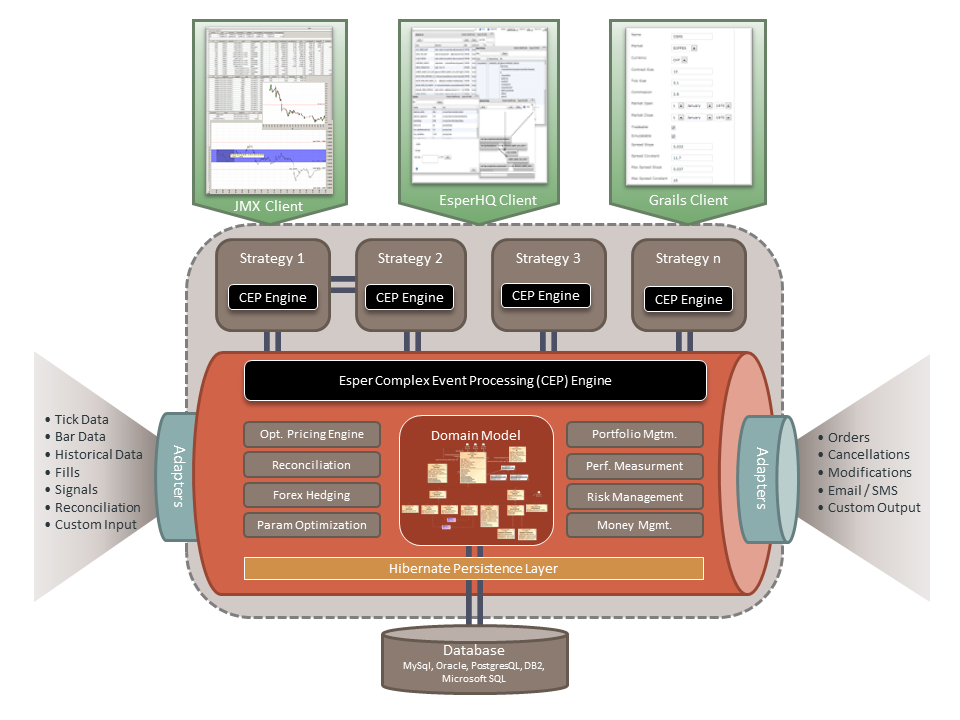

>[Python量化交易平台开发教程系列5-底层接口对接](http://www.vnpy.org/basic-tutorial-5.html)

# 前言

从本篇教程开始，所有的开发都会在Python环境中进行

**通常情况下，一个交易程序的框架会由以下三个部分组成：**

* 底层接口：负责对接行情和交易API，将数据推送到系统核心中，以及发送指令（下单、数据请求等）
* 中层引擎：用于整合程序中的各个组件（包括底层接口、数据库接口等等）到一个对象中，便于顶层UI调用
* 顶层UI：用于显示数据和调用中层引擎暴露的主动函数，实现各项具体功能



上面这张图展示的是国外的一款开源交易平台AlgoTrader的架构：

* 两边的Adapters代表的是底层接口（左边数据，右边交易）
* 中间圆柱形包括的是中层引擎架构，事件驱动方面使用了Esper复杂事件处理（CEP）引擎，同时内置了一些常用的功能引擎，如期权定价引擎、外汇对冲模块、投资组合管理模块等
* 上方的Strategy1、2代表的是顶层应用（算法策略、GUI界面等），通过调用中层引擎的功能来实现用户所需的业务

### vn.py和AlgoTrader的比较

这里对两个项目做一个简单的比较

vn.py优势：

* 语言一用：Java语言比Python啰嗦
* 架构简洁：Java的编程理念（纯面向对象，大量使用框架等）更是比Python的编程理念（人生苦短，我们的目标是搞定问题）繁琐
* 事件驱动引擎：AlgoTrader使用的Esper引擎尽管功能强大，使用起来也过于复杂，对于国内绝大部分的量化业务而言完全用不着
* 本地化：vn.py完全为中国市场设计，在功能设计上更符合国人的使用习惯，而AlgoTrader泽水针对欧美市场设计

AlgoTrader优势：

* 静态语言：Java在开发时可以进行静态检查，同时相对较低的灵活性使得其更适合大型端对使用（即每个成员未必对项目整体非常了解）
* 国外接口：已有大量的国外经纪商和行情提供商接口，如果用户主要做欧美市场基本可以开箱即用
* 成熟度：AlgoTrader从2009年发布至今已经有6年的历史，同时有着相当数量的机构客户

两个项目的相似之处：

* 作者在最初都是为了交易某种期权策略而开发了该项目
* 整体框架设计类似（底层接口、中层引擎、顶层GUI）
* 都可以非常方便的开发全自动交易策略
* 都是开源项目，目前托管在Github上（废话），用户可以根据自己的需求随意定制相关功能
* 都可以应用于高频交易（毫秒级延迟），不适用于超高频交易（微秒级延迟）

### 教程说明

本篇教程将会介绍底层接口的开发，后面的若干篇则是关于中层引擎和各种顶层GUI组件。

相关的示例都是基于vn.demo中的LTS接口DEMO，发布在：[https://github.com/vnpy/vnpy/tree/master/vn.demo/ltsdemo](https://github.com/vnpy/vnpy/tree/master/vn.demo/ltsdemo)

# 底层接口对接

通过前面的教程，我们已经获得了和原生C++ API功能完全相同的Python封装API。通常情况下，为了将某个API对接到我们的程序中，需要以下两步：

1. 将API的回调函数收到的数据推送到程序的中层引擎中，等待处理
2. 将API的主动函数进行一定的简化封装，便于中层引擎调用

vn.lts的API接口在使用时需要由用户继承后实现回调函数对应的具体功能，下面的内容以行情接口为例

### 接口对象设计

```
class DemoMdApi(MdApi):
    """
    Demo中的行情API封装
    封装后所有数据自动推送到事件驱动引擎中，由其负责推送到各个监听该事件的回调函数上

    对用户暴露的主动函数包括：
    登录 login
    订阅合约 subscribe

    #--------------------------------------------
    def __init__(self, eventEngine):
        """
        API对象的初始化函数
        """
        super(DemoMdApi, self).__init__()

        # 事件引擎，所有数据都推送到其中，再由事件引擎进行分发
        self.__eventEngine = eventEngine

        # 请求编号，由api负责管理
        self.__reqid = 0

        # 以下变量用于实现连接和重连后的自动登录
        self.__userid = ''
        self.__password = ''
        self.__brokerid = ''

        # 以下集合用于重连后自动订阅之前已订阅的合约，使用集合为了防止重复
        self.__setSubscribed = set()

        # 初始化.con文件的保存目录为\mdconnection，注意这个目录必须已经存在，否则会报错
        self.createFtdcMdApi(os.getcwd() + '\\mdconnection\\')
```

1. DemoMdApi类继承自MdApi类，并实现了回调函数的具体功能
2. 创建DemoMdApi的对象时，用户需要传入的参数是事件驱动引擎对象eventEngine
3. 每次调用API的主动函数时，需要传入一个reqid的参数，作为本次请求的唯一标识，绝大部分情况下我们不需要在意每个请求的标识情况，因此选择将该参数交给DemoMdApi对象来维护，每次调用主动函数时自动加1
4. 我们在DemoMdApi的对象中保存用户名、密码和经纪商编号，用于前置机连接完成后的自动登录，以及断线重连相关的操作
5. __setSubscribed对应的是一个Python集合，用于保存我们通过订阅函数订阅过的合约，在断线重连后自动进行订阅，之所以选择set而不是list是为了保证合约的唯一性，避免重复订阅（尽管重复订阅没有影响）
6. 在创建对象DemoMdApi对象的同时，自动调用createFtdcMdApi来初始化连接接口，选择使用当前目录下的mdconection文件来保存.con通讯文件

### 回调函数

```
    #---------------------------------------------
    def onFrontConnected(self):
        """服务器连接"""
        event = Event(type_ = EVENT_LOG)
        event.dict_['log'] = u'行情服务器连接成功'
        self.__eventEngine.put(event)

        # 如果用户已经填入了用户名等等，则自动尝试连接
        if self.__userid:
            req = {}
            req['UserID'] = self.__userid
            req['Password'] = self.__password
            req['BrokerID'] = self.__brokerid
            self.__reqid = self.__reqid + 1
            self.reqUserLogin(req, self.__reqid)

...

    #-----------------------------------------------
    def onRspUserLogin(self, data, error, n, last):
        """登录回报"""
        event = Event(type_ = EVENT_LOG)

        if error['ErrorID'] == 0:
            log = u'行情服务器登录成功'
        else:
            log = u'登录回报，错误代码：' + unicode(error['ErrorID']) + u'，错误信息：' + error['ErrorMsg'].decode('gbk')

        event.dict_['log'] = log
        self.__eventEngine.put(event)

        # 重连后自动订阅之前已经订阅过的合约
        if self.__setSubscribed:
            for instrument in self.__setSubscribed:
                self.subscribe(instrument[0], instrument[1])

...

    #-----------------------------------------------
    def onRtnDepthMarketData(self, data):
        """行情推送"""
        # 行情推送收到后，同时触发常规行情事件，以及特定合约行情事件，用于满足不同类型的监听

        # 常规行情事件
        event1 = Event(type_ = EVENT_MARKETDATA)
        event1.dict_['data'] = data
        self.__eventEngine.put(event1)

        # 特定合约行情事件
        event2 = Event(type_ = (EVENT_MARKETDATA_CONTRACT + data['InstrumentID']))
        event2.dict_['data'] = data
        self.__eventEngine.put(event2)
```

1. 通过回调函数接收到API的数据推送后，创建不同类型的事件Event对象（来自于事件驱动引擎模块），在事件对象的数据字典dict_中保存需要具体推送的数据，然后推送到事件驱动引擎中，由其负责处理
2. 回调函数收到的数据中，data和error分别对应的是保存主要数据（如行情）和错误信息的字典，n是该回调函数对应的请求号（即调用主动函数时的reqid），last是一个布尔值，代表是否为该次调用的最后返回信息
3. 我们主要对data字典感兴趣，因此选择在事件中整体推送
4. 而error字典每次收到后应当立即检查是否包含错误信息（因为即使没有发生错误也会推送），若有则自动保存为一个日志事件（通过日志监控控件显示出来）
5. 服务器连接完成后（onFrontConnected），检查是否已经填入了用户名等登录信息，若有则自动登录（请参考后面主动函数中的示例）
6. 登录完成后（onRspUserLogin），自动订阅__setSubscribed中之前已经订阅过的合约
7. 收到行情推送后（onRtnDepthMarketData），我们选择创建两种事件，一种是常规行情事件（通常适用于市场行情监控GUI等对所有行情推送都关注的组价），另一种是特定合约行情事件（通常适用于算法等仅关注特定合约行情的组件
8. 当我们调用会有返回信息的主动函数时，需要传入本次请求的编号，此时我们将__reqid自加1，再作为参数传入主动函数这种

### 主动函数

```
    #-----------------------------------------------
    def login(self, address, userid, password, brokerid):
        """登录服务器"""
        self.__userid = userid
        self.__password = password
        self.__brokerid = brokerid

        # 注册服务器地址
        self.registerFront(address)

        # 初始化连接，成功会调用onFrontConnected
        self.init()

    #------------------------------------------------
    def subscribe(self, instrumentid, exchangeid):
        """订阅合约"""
        req = {}
        req['InstrumentID'] = instrumentid
        req['ExchangeID'] = exchangeid
        self.subscribeMarketData(req)

        instrument = (instrumentid, exchangeid)
        self.__setSubscribed.add(instrument)
```

1. 主动函数仅封装了两个功能，登录login和订阅合约subscribe。这里假设通常我们不会做登出（直接杀进程）和退订合约（不一定）之类的操作，有需求的话可以自己封装对应的函数
2. 对于登录函数login而言传入参数包括服务器前置机地址address、用户名userid、密码password以及经纪商代码brokerid。函数调用后，我们先将userid、password和brokerid保存下来，然后注册服务器地址registerFront，并初始化连接init。连接完成后，onFrontConnected回调函数会自动调用，然后发生的操作请参考前一段的回调函数工作流程
3. LTS的API在订阅行情后，需要传入合约的代码以及合约所在的交易所（因为存在两个证券交易所相同代码的情况），而CTP的API在期货方面则不存在该问题，只需要传入合约代码。发送订阅请求后，将该订阅请求保存在__setSubscribed集合中，使得断线重连时可以自动重新订阅

# 总结

在交易程序的开发中，所有的API对接原理均大同小异，除了类CTP API以外，国内的恒生接口、FIX引擎接口等等也可以同样遵循以上的原理进行对接设计

文章中的例子是行情接口，交易接口因为包含了更多的回调函数和主动函数，在设计上更为复杂，建议读者直接阅读demo中的源代码
