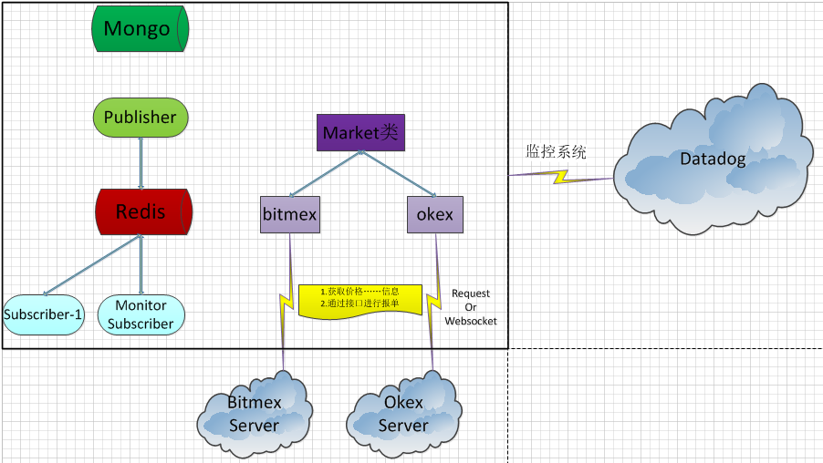

阅读dquant的源码，并梳理其架构

# 源码模块

### util.py

定义了一些常用的工具方法，比如解析`123.abc.def`获取按照`.`分隔的第一个字符子串

### entrypoint.py

启动任务的命令是

`bash cli.sh`

其中cli.sh的内容是

```
#!/bin/bash
#  pass all arguments to python entrypoint
export DQUANTENV="dev"
cd dquant && python3 entrypoint.py "$@"
```

下面是entrypoint.py中argparse模块的用法

```
Python 2.7.13 (v2.7.13:a06454b1afa1, Dec 17 2016, 20:53:40) [MSC v.1500 64 bit (AMD64)] on win32
Type "copyright", "credits" or "license()" for more information.
>>> import argparse
>>> parser = argparse.ArgumentParser()
>>> 
>>> parser.add_argument("-d", "--debug", help="debug verbose mode", action="store_true")
_StoreTrueAction(option_strings=['-d', '--debug'], dest='debug', nargs=0, const=True, default=False, type=None, choices=None, help='debug verbose mode', metavar=None)
>>> 
>>> parser.add_argument("-m", "--markets", type=str, help="markets, example: -mokexusd")
_StoreAction(option_strings=['-m', '--markets'], dest='markets', nargs=None, const=None, default=None, type=<type 'str'>, choices=None, help='markets, example: -mokexusd', metavar=None)
>>> 
>>> parser.add_argument("-s","--strategy",type=str, help="strategy, example:-smaker")
_StoreAction(option_strings=['-s', '--strategy'], dest='strategy', nargs=None, const=None, default=None, type=<type 'str'>, choices=None, help='strategy, example:-smaker', metavar=None)
>>> 
>>> parser.add_argument("command", nargs='*', default="watch", help='verb: "feed|exec|rexec"')
_StoreAction(option_strings=[], dest='command', nargs='*', const=None, default='watch', type=None, choices=None, help='verb: "feed|exec|rexec"', metavar=None)
>>> 
>>> args = parser.parse_args(['--d', '--markets=123,abc', '-s=test', 'command=watch|exec|do'])
>>> 
>>> print args.command
['command=watch|exec|do']
>>> print args.markets
123,abc
>>> print args.debug
True
>>> 
>>> args = parser.parse_args(['--d', '--markets=123,abc', '-s=test', 'watch|exec|do'])
>>> print args.command
['watch|exec|do']
```

### datafeed.py

看着这个模块的名称，直译起来就是**数据传送专线**

应该是定义的各个市场的数据源模块，用于发布一些数据信息

### constants.py

定义所有用到的常量名

### config.py

定义开发环境、生产环境等的配置信息

```
cfg = MyConfiguration(os.path.join(os.path.dirname(__file__), '../config/dev.cfg'),
                      os.path.join(os.path.dirname(__file__), '../config/pro.cfg'))
```

### stragegy\diff.py

首先调用创建市场的工厂方法，创建市场类对象

```
if __name__ == '__main__':
    os.environ[Constants.DQUANT_ENV] = "dev"
    diff = Diff()
    diff.markets = create_markets(["bitmex_future_btcusd","okex_future_btcusd_thisweek"])
    diff.calc_diff()
```

计算不同市场之间的某些量的差，为量化策略提供基础。先列出一些变量名词的解释，然后列出代码

* bid是指卖出外汇的价格，即我要卖出外汇，标一个价格为bid
* ask是指买入外汇的价格，即我要买入外汇，询问得价格为ask

```
def calc_diff(self):
    try:
        while True:
            for market in self.markets:
                self.markets[market].update()

            okex_market = self.markets["okex_future_btcusd_thisweek"] # type: Market
            bitmex_market = self.markets["bitmex_future_btcusd"] # type: Market
            okex_ticker = okex_market.get_ticker()
            bitmex_ticker = bitmex_market.get_ticker()
            # 
            ask_diff = okex_ticker['ask']['price']  - bitmex_ticker['ask']['price']
            bid_diff = okex_ticker['bid']['price']  - bitmex_ticker['bid']['price']
            print(ask_diff)
            print(bid_diff)

    except Exception as e:
        logging.exception("message")
```

### pipeline里面实现了订阅者和发布者

订阅者和发布者模块的实现是通过使用redis来实现的

>发布者publiser.py

在代码的构造方法中先获取redis的IP、端口，然后实例化redis对象

```
def __init__(self):
    self.host = cfg.get_config(Constants.REDIS_HOST)
    self.port = cfg.get_config(Constants.REDIS_PORT)
    self.redis = redis.Redis(host=self.host, port=self.port)
```

比如发布价格的方法实现如下

```
def publish_price(self,data):
    '''
    data should be json encodes
    :return:
    '''
    self.redis.publish('price',json.dumps(data))
```

>订阅者monitor_subscriber.py

在其构造方法中的代码实现为

```
def __init__(self, channels):
    threading.Thread.__init__(self)
    self.host = cfg.get_config(Constants.REDIS_HOST)
    self.port = cfg.get_config(Constants.REDIS_PORT)
    self.redis = redis.Redis(host=self.host, port=self.port)
    self.pubsub = self.redis.pubsub()
    self.pubsub.subscribe(channels)
    self.methods = {'price' : self.price_handler}
```

现在需要找时间专门研究一下python下redis的开发技巧！

>猜测其作用是：将收集到的价格信息存储到redis，然后通过Redis来发布，所有需要使用价格的地方来进行订阅

### markets

market_factory.py里面定义了创建市场类对象的工厂方法

```
def create_markets(exchangeNames):
    markets = {}
    for name in exchangeNames:
        if (name == 'bitmex_future_btcusd'):
            exchange = BitmexFutureWs('btc_usd')
        elif (name == 'okex_future_btcusd_thisweek'):
            exchange = OkexFutureWs('btc_usd_this_week')
        exchange.name = name
        logging.info('%s market initialized' % (exchange.name))
        exchange.update()
        markets[name] = exchange
    return markets
```

market.py这个文件里面对市场进行了封装`class Market(Thread):`，其继承自Thread，是一个线程类，定义了大概以下方法：

* get_ticker()，获取买一卖一价
* keep_connect()，使用websocket连接到市场的base_url，应该是通过websocket获取市场信息

### markets\okex

**_okex_future_rest.py**，定义了okex市场类，其`class OkexFutureRest(Market):`

其中常见函数的解释：

* long：开多
* short：开空
* close_long：平多
* close_short：平空
* delete_order：取消订单
* trade：通过调用request方法向okex的市场发起请求！
	* request方法里面通过调用request模块的方法来向市场的HTTP服务器发起请求
	* 比如获取价格信息等调用`self.session.get`，是发起get请求，获取信息
	* 比如删除订单等调用`self.session.post`是post请求

>其通过request接口来获取市场上的行情数据、进行报单处理！request是同步的模式，请求和应答一一对应

**_okex_future_ws.py**，也是定义了一个okex的市场类，其`class OkexFutureWs( Market):`，它和_okex_future_rest的区别是，这个类使用的是websocket实现和市场服务器的异步通信，而_okex_future_rest则是使用的request实现和市场服务器的同步通信

>可以先简单的看一下我最近整理的文章[《什么是WebSocket？》](http://www.xumenger.com/websocket-async-awit-20171211/)来对WebSocket进行简单的了解

大概梳理内容是下面这些

* okex交易所的request同步请求模式和websocket异步请求模式的URL是不同的
* get_order、close_short等都是调用trade_message按照交易所规定的接口来进行格式化
    * 然后将格式化的消息放入队列中
    * send方法则是将队列中的消息取出来，调用websocket的send方法发给交易所
    * 这部分涉及到消息管理、websocket的使用、交易所接口等内容

这个模块中，还有一个回调的编码技巧值得学习技巧

定义了methods这个dict，在register_callbacks中注册回调

```
def register_callbacks(self):
    self.methods["ok_sub_future_btc_depth_this_week_usd"] = self.update_depth
    self.methods[Constants.OKEX_FUTURE_TRADE_WS] = self.update_trade
    self.methods[Constants.OKEX_FUTURE_DELETE_ORDER_WS] = self.update_trade
    self.methods[Constants.OKEX_FUTURE_GET_ORDER_WS] = self.update_get_order
```

在remove_callbacks中移除注册的回调

```
def remove_callbacks(self):
    del self.methods["ok_sub_future_btc_depth_this_week_usd"]
    del self.methods[Constants.OKEX_FUTURE_TRADE_WS]
    del self.methods[Constants.OKEX_FUTURE_DELETE_ORDER_WS]
    del self.methods[Constants.OKEX_FUTURE_GET_ORDER_WS]
```

另在还有一个重要的update方法

```
def update(self, flags):
    '''
    :param flags: {"depth": True, 'trade': False}
    :return:
    '''
    self.unset_flags(flags)     # 该方法将所有flag设置为false
    self.register_callbacks()   # 像上面写到的，注册回调

    while True:
        asyncio.sleep(1)        # 一直等待
        if (self.check_flags(flags)):   # 直到等待这个条件成功才break跳出循环
            break
    self.remove_callbacks()     # 移除回调
    return self
```

比如在获取close_short的时候就调用了这个方法

```
def close_short(self, amount, price=''):
    message = self.trade_message(price=price, amount=amount, type='4')
    self.q.put(message)
    self.update()
    return self.trade
```

很明显，通过使用这个update可以将websocket这个异步接口同步化：

* 先调用trade_message按照交易所接口打包
* 将请求放入队列，等待异步（因为Market是一个线程子类）从队列中取出message
* 异步线程取出message后，发起请求
* 然后这里调用update
    * update方法里面则是循环等待，直到等到websocket的应答
    * 这样就可以将异步化的websocket给同步化！
* 然后将等到的应答返回给调用者

再去看一下run方法

```
def run(self):
    asyncio.set_event_loop(self.loop)
    self.loop.run_until_complete(self.keep_connect())
    self.loop.run_until_complete(self.ws_init())
    self.loop.run_until_complete(self.ws_handler())
```

目前存在的一些问题：

* 这个市场类的封装中大量使用了asyncio、websockets的技术点，目前这些是我所不熟悉的，需要好好学习、好好理解
* websocket的详细原理？
* 如何将websocket同步化？
* asyncio的用法和详细的原理机制？
* muduo里面的EventLoop和asyncio的event_loop有什么异同
* 比特币市场的接口文档怎么看？和我现在做的沪、深、黄金等市场的接口文档有什么区别？

# 项目架构

根据以上对代码的梳理，下面简单的整理了一下系统的架构图



### 使用到的模块

* influxdb，[influxdb是Go编写的时序数据库](https://www.linuxdaxue.com/influxdb-principle.html)
    * [《influxdb的简单使用》](http://www.361way.com/influxdb-user/5291.html)
* redis
    * 数据存储
    * 发布信息、订阅信息
* mongodb
* datadog，是一款目前很流行的云监控平台

### 技术点

* 异步IO，在各个市场的websocket实现中大量用到异步IO
    * websockts，异步IO还不是很熟悉
    * asyncio，异步IO还不是很熟悉
* concurrent.futures.ProcessPoolExecutor，进程池怎么用

### btc市场

* okex
* bitmex

### 模块和架构简述

* tests，测试模块，用于单元测试、自动化测试、回归测试，保证系统开发的质量
    * tests下面封装了对代码中各种实现的测试，比如对配置功能、市场类等的测试封装
* datafeed
* pipeline，里面依赖redis实现订阅者、发布者模型
    * 同时在订阅者模块实现简单的事件驱动引擎，当收到某频道的数据时，回调对应处理方法
* strategy，里面是量化策略的实现   
    * diff模块，提供比较不同市场价差的接口等
    * ticker模块，
* markets，实现对各个比特币市场的封装，market.py里面定义的市场类是一个线程
    * 比如okex市场分别提供了同步和异步接口，同步用requests模块编写、异步用websockets模块编写

### websockets详解

在我整理的文章[什么是WebSocket？](http://www.xumenger.com/websocket-async-awit-20171211/)对WebSocket进行了简单的讲解，包括WebSocket简单原理、python的websockets模块、python的asyncio模块

但是还是不够清晰，这里讲参考dquant中market模块的代码进行详细的总结

在market.py中有简单对websocket的使用

```
    # 保持连接
    async def keep_connect(self):
        if self.websocket == None:
            self.websocket = await websockets.connect(self.base_url)
        else:
            if not self.websocket.open:
                self.websocket.close()
                self.websocket = await websockets.connect(self.base_url)
        await self.sub_channel()
```

再去看_okex_future_ws.py中的代码细节，对websockets能有个深刻的理解

同时会在`dquant_dev-monitor\dquant\markets\_okex_future_ws.py`添加详细的注释！更详细的用法直接去这份代码里面看详细的注释说明！

在`dquant_dev-monitor\dquant\markets\_okex_future_ws.py`里面有详细的如何将websocket进行同步化的代码实现！
