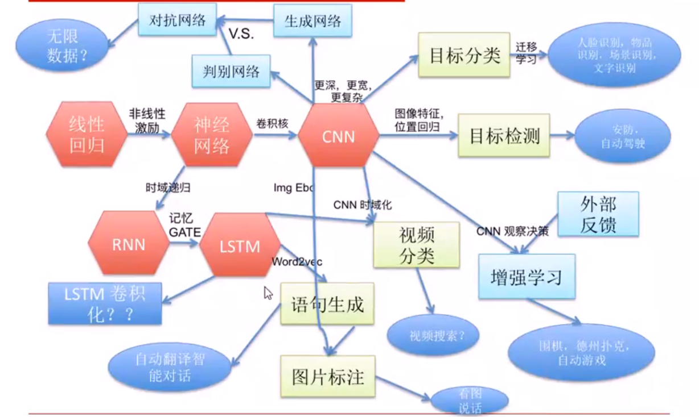

>[《怎么学习深度学习》](http://www.chinahadoop.cn/course/918/learn#lesson/17301)

>[斯坦福CS231n——深度学习与计算机视觉](http://study.163.com/course/courseMain.htm?courseId=1003223001)

>了解深度学习发展；串联深度学习基础概念；掌握深度学习模型设计基本思想

## 简介：深度学习背景和概念

深度学习发展的里程碑：

* 1990s，Yann Lecun CNN文章
* 2009，ImageNet大型分类数据集发布
* 2012，AlexNet提出GPU训练的深度学习网络，获得ImageNet冠军
* 2016，Google DeelMind围棋程序Alpha Go战胜人类顶尖选手

怎样学习？

* 理论讲解、背后的数学知识（矩阵……），模型分析
* Tensorflow实例运行、调试
* 思想总结、资源分享、论文推荐

会学到什么，该达成什么样的技能？

* 掌握深度学习基础。理解先进模型的思路
* 能够运用模型展开具体应用开发
* 根据具体问题设计新的模型

## 深度学习知识结构图

深度学习有以下的知识点和应用领域

第一次看到上面的图，总会想上面好多领域看起来没有什么相关性，那它们是如何关联起来的、背后的知识点该如何梳理？下图对各个点的相关性做一个简单的串联

**深度学习的基础**

线性回归和神经网络：这个是整个机器学习的数学基础

什么是线性回归？什么是神经网络？线性回归和神经网络之间的关系？

CNN（卷积神经网络）是传统神经网络在空间上的扩展；RNN（递归神经网络）是传统神经网络在时间上的扩展；LSTM是对RNN的再扩展

**CNN、RNN、LSTM的应用**

CNN是传统神经网络在空间上的扩展。主要用于图像处理方面的应用

RNN是传统神经网络在时间上的扩展。比如一个人说话，那么说出的词语之间是有一个依赖关系的，有时间上的跨度。其主要应用于自然语言处理

有些任务既有空间上的信息，又有时间上的信息，那么就可以结合应用CNN和RNN，比如视频即在时间上有一个前后依赖的顺序，另外又是由一帧帧的图片构成，所以也有空间上的顺序，所以视频处理可以将CNN和RNN结合起来处理

**增强学习和生成对抗网络**

对抗网络：如上图，由一个CNN生成网络来生成一张图片，再由一个CNN判别网络来判断生成的图片是不是对的，这样两个任务进行对抗，慢慢的生成的图片越来越正确，判别网络也越来越能正确的判别图片

增强学习：模拟人类思考的这么一个过程，比如让CNN玩游戏，做不同的动作会有不同的分数，用这个分析来作为一个反馈，慢慢的引导其训练，最后它就知道面对某个场景该做什么样的行为是最好的！

**深度学习的工程实践**

人脸识别、文字识别、自动驾驶、自动翻译智能对话、围棋……

**接下来的发展方向**

使用对抗网络无限生成数据、LSTM卷积化、视频搜索……

## 追本溯源：深度学习数学基础

上面提到线性回归和神经网络是深度学习的数学基础，但还是存在很多疑问：

* 什么是线性回归
* 什么是神经网络
* 线性回归和神经网络之间的关系是什么样的

数学的知识在任何领域都是最基本的，在计算机领域也是一样的，所以弄清楚最基础的知识点、最基础的数学概念是极其必要的

线性回归大概是这样的，如下图左，给了一个数据集合Data=[(x1,y1);(x2,y2)...;(xn,yn)]，然后对其进行线性回归，要求得目标直线的方程：ax+by=1。可以使用最小二乘的方式，但这里用梯度下降的方式：知道目标是要得到ax+by=1，但不用代数的方法计算这个模型，而是用慢慢逼近的方法

线性回归存在缺陷，它只能解决线性问题，但实际中大量问题都是非线性的，所以就在线性回归方程上加一个非线性方程，得到神经网络。非线性方程有很多种，后续都会慢慢接触到各种非线程方程和它们的特点

线性方程回归器和非线性激励结合就形成了一个神经元。把神经元好多好多阵列起来，变得再更有层次，就形成了传统神经网络

传统神经网络在空间上扩展得到卷积神经网络，有卷积核（filter或“滤镜”）来实现扩展的，卷积核的数学形式就是一个二维矩阵（比如在Python中就可以使用numpy来表示和存储）。比如一张图片其实也是可以表示成一个二维矩阵的，进行卷积运算，其实就是将卷积核二维矩阵对原始图像进行处理和计算，最终得到新的图片（这部分涉及到矩阵计算等基础的数学知识）。下图是通过卷积核对图片做一个模糊的处理，也有的卷积核可以对图片进行清晰化等的处理

如下图，C1有96个卷积核，就能生成96张图片；C2有256个卷积核，就能生成256张图片……这些卷积核合在一起就形成了卷积神经网络

CNN还是有局限的：

* 没有记忆，只对单张图片有效
* 视频处理，简单多帧叠加，无法学习前后关系
* 3D CNN，参数多、数据少、效果差

递归神经网络是神经网络在时间上的扩展。不看下图中的箭头表示的前后关系的话，那就是传统神经网络，有4个输入，2个中间的神经元，接受前面的输入得到后面的输出。但是RNN多了一个逻辑：得到一个输出后，将其存储起来，下一刻计算的时候，将其作为新的输入，这样在计算过程中就会考虑到之前的模型激励的一个结果，就会对实际信息有一个更好的理解

RNN是考虑了大量的之前输出的关系，但它也是有一定的问题的，因为它直接得到上一刻的输出，上一刻通过一个转换关系得到上上一刻的输出……这样非常远的地方传过来的输入经过多层衰减，对最后的输出就没有太大的影响了，但有时候距离远的输入对最后的输出有着很大的影响，所以RNN经过改进为LSTM。LSTM能够记住比较远的那个时刻的某一个量

>这里是一些基础的东西，但完全没有涉及到更多的细节、技术性的东西！

## 什么正在发生：研究方向、应用方向

**更先进的CNN模型**

一些理论和实际的运用：

* 目标识别：人脸识别、文字识别、物品识别
* 目标探测：无人驾驶过程中对人的定位
* RNN：语句生成
* 视频分类
* 增强学习：尝试->反馈->学习->尝试

对抗网络可以通过提供大量逼真数据，直接完成图片转化

## 一个深度学习开发实例的分析

[https://github.com/wiibrew/DeepLearningCourseCodes](https://github.com/wiibrew/DeepLearningCourseCodes)

