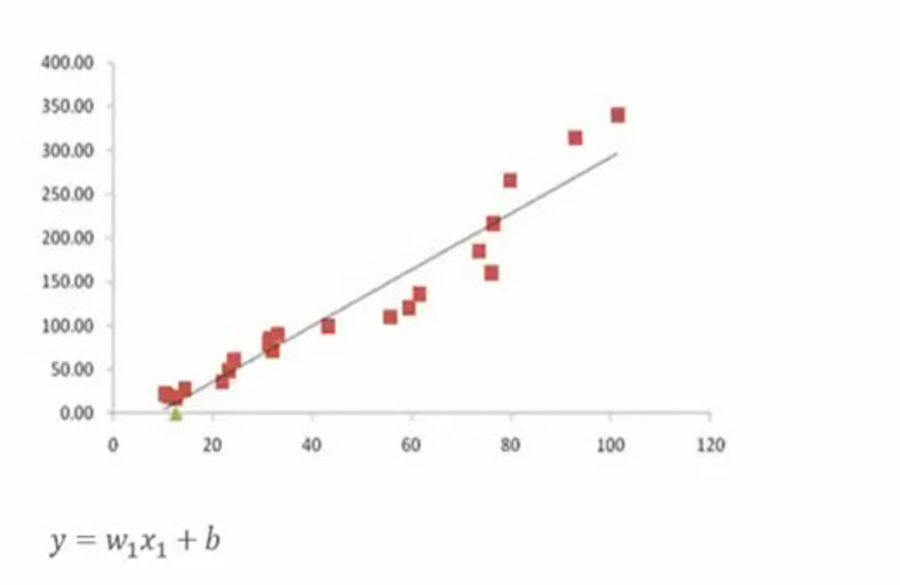

>[1小时入门机器学习经典模型](http://new.stuq.org/open/course/18)

这里讲到的东西都是极其基础的简单的知识，距离实战、工业化还差的很远！

## 决策树

比如现在有顾客在天气、温度、湿度、风向等条件下是否来打高尔夫的数据

针对这些数据可以构建一个简单的决策树

这里省略了中间过程中的如何筛选数据等过程，只是展示了最终的结果！涉及到信息熵等概念，所以说这里只是一个入门的介绍而已

>机器学习的世界中，概率非常重要

## Logistic回归

如上图，各个点(x, y)就是手中现有的数据，然后根据这些点找出(x, y)之间的关系：`y = wx + b`

但是现实中的问题往往没有这么简单，会有更多的变量，所以就有多元回归的概念，下图也只是有两个自变量而已

可以看到上图中有矩阵乘法的公式应用

>回归就是拟合现实中一系列变化的值

上面图中展示的其实是一种连续的情况，实际中还有离散的情况，比如根据天气、温度等的条件判断后结果只有打高尔夫和不打高尔夫两种情况！这就是分类问题

那怎么用回归来做分类呢？这就要用到一个在神经网络中很常用的工具：`Sigmoid函数`

Sigmoid函数的特点：

* 阶跃函数
* 输出：0或者1
* 在0点产生阶跃
* 可以分类
* 用连续值模拟阶跃函数

Sigmoid的自变量是z，可以将z替换为回归函数中的`f(x) = w1x1 + w2x2 + ... + wnxn + b`，就可以推导下面这些函数

>Logistic回归：对数几率回归

## (朴素)贝叶斯模型

概率基础知识

贝叶斯模型公式

## 机器学习实际生产应用

**基础篇**

* 机器学习基础
    * 机器学习简介
    * 机器学习的主要任务
    * 基本算法介绍
* 常用软件集合和环境配置
    * 为什么选择用Python
    * Python
    * Numpy
    * sckit-learm
* 数据分组和关联分析算法
    * 通过Python实现K-means算法
    * 通过Python实现Apriori算法
    * 通过Python实现FP-growth算法
* 分类器
    * 决策树
    * K-邻近算法（KNN）
    * Logistic回归
    * 支持向量机（SVM）
    * 贝叶斯网络
        * 朴素贝叶斯算法
        * 贝叶斯网络

**神经网络篇**

* 神经网络
    * 神经网络简介
    * 正向传播算法
    * 矢量化编程
    * 神经网络向量化
* 稀疏自编码器
    * 稀疏自编码器简介
    * 反向传播算法
    * 自编码算法与稀疏性
    * 训练结果可视化
* 数据处理
    * 主成分分析（PCA）
    * 白化
    * 实践
* Softmax回归
    * softmax回归
    * 实践

**深度学习篇**

* 深度网络简介
    * 简介
    * 深度网络优势
    * 训练的困难
    * 逐层贪婪训练算法
* 自编码算法（AE）
    * 栈式自编码算法
    * 微调多层自编码算法
* 大型图片处理
    * 线性解码器
    * 全联通与部分联通网络
    * 卷积
    * 池化
    * 卷积神经网络

**C++编程篇**

* C++11与C++14
    * 基于Socket的通信
    * C++中的内存与资源管理
    * 编码
    * C++98的编码缺陷
    * C++14编码支持
    * 进程间通信
* 高性能C++服务器编程：基础-高效的内存管理和数据调度
    * 轻量级分身——线程
    * C++14线程
    * 竞争问题与解决方案
    * 多线程优化
    * 异步IO
    * 内存分配与内存碎片
    * tcmalloc
    * 内存池
* 高性能C++服务器编程：进阶-充分利用CPU和GPU
    * OpenMP
    * OpenBLAS
    * OpenCL
    * CUDA

**编程实战篇**

* 云端服务器架构设计
* 通信系统设计
* 通过Caffe实现深度神经网络
    * 为什么是Caffe
    * 准备Caffe依赖
    * 编译Caffe
    * 使用Caffe训练手写数字识别
    * 使用Caffe训练AutoEncoder
    * 调用Caffe使用训练后的模型
* 通过Hurricane实时处理系统实现分布式网络拓扑
    * 实现Spout：获取数据
    * 实现Bolt：预处理
    * 实现Bolt：调用Caffe
* 实战：基于循环神经网络的图片全分辨率压缩
    * 再看Autoencoder
    * 利用Autoencoder实现图像压缩
    * RNN（循环神经网络）介绍
    * 利用RNN优化图像压缩
    * 实践：编写收集训练数据的高性能分布式爬虫
    * 实践：整理训练数据集
    * 实践：在Caffe中实现RNN
    * 实践：训练与测试
    * 实践：压缩接口设计与封装
    * 实践：Web服务器搭建
    * 实践：计算服务搭建
    * 实践：完成深度学习服务
* 基于macOS开发的云服务客户端

