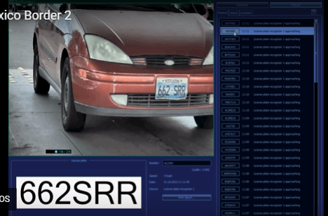
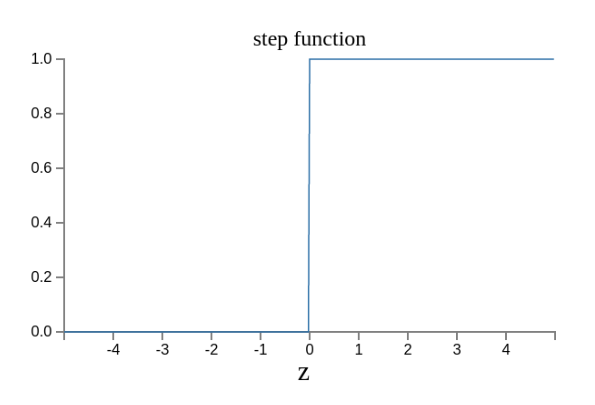

[《神经网络入门》](http://www.ruanyifeng.com/blog/2017/07/neural-network.html)

>保持怀疑！[《AlphaGo与人工智能》](http://www.yinwang.org/blog-cn/2016/03/09/alpha-go)

---

眼下最热门的技术，绝对是人工智能

人工智能的底层模型是[神经网络](http://baike.baidu.com/item/%E4%BA%BA%E5%B7%A5%E7%A5%9E%E7%BB%8F%E7%BD%91%E7%BB%9C)。许多复杂的应用（比如模式识别、自动控制）和高级模型（比如深度学习）都是基于它。学习人工智能，一定是从它开始


什么是神经网络？互联网上似乎[缺乏](https://www.zhihu.com/question/22553761)通俗的解释

前两天，我读到了Michael Nielsen的开源教材[《神经网络和深度学习》](http://neuralnetworksanddeeplearning.com/index.html)，意外发现里面的解释而非常好懂

## 感知器

历史上，科学家一直希望模拟人的大脑，造出可以思考的机器。人为什么能够思考？科学家发现，原因在于人体的神经网络


* 外部刺激通过神经末梢，转化为电信号，转导到神经细胞（神经元）
* 无数神经元构成神经中枢
* 神经中枢综合各种信号，做出判断
* 人体根据神经中枢的指令，对外部刺激做出反应

既然思考的基础是神经元，如果能够“人造神经元”，就能组成人工神经网络，模拟思考。上世纪60年代，提出了最早的“人造神经元”模型，叫做“[感知器](https://zh.wikipedia.org/wiki/%E6%84%9F%E7%9F%A5%E5%99%A8)”直到今天你还在用


上面的圆圈就代表一个感知器。它接受多个输入（x1、x2、x3……），产生一个输出（output），好比神经末梢感受各种外部环境的变化，最后产生电信号

为了简化模型，我们约定每种输入只有两种可能：1或0,。如果所有输入都是1，表示所有条件都成立，输出就是1；如果所有输入都是0，表示条件都不成立，输出就是0

## 感知器的例子

下面来看一个例子。城里正在举办一年一度的游戏动漫展览，小明拿不定主意，周末要不要去参观


他决定考虑三个因素：

* 天气：周末是否晴天？
* 同伴：能否找到人一起去？
* 价格：门票的是否可承受？

这就构成了一个感知器。上面三个因素就是外部输入，最后的决定就是感知器的输出。如果三个因素都是Yes（使用1表示），输出就是1（去参加）；如果都是No（使用0表示），输出就是0（不去参加）

## 权重和阈值

看到这里，你肯定会问：如果某些因素成立，另一些因素不成立，输出是什么？比如周末是好天气、门票也不贵，但是小明找不到同伴，他还要不要去参观呢？

现实中，各种因素很少具有同等重要性：某些因素是决定性因素，另一些因素是次要因素。因此可以给这些因素指定权重，代表它们不同的重要性：

* 天气：权重为8
* 同伴：权重为4
* 价格：权重为4

上面的权重表示，天气是决定性因素，同伴和价格都是次要因素

如果三个因素都是1，它们乘以权重的综合就是8+4+5=16。如果天气和价格因素是1，同伴因素是0，总和就变为8+0+4=12

这时，还需要指定一个阈值。如果总和大于阈值，感知器输出1，否则输出0,。假定阈值是8，那么12>8，小明决定去参观。阈值的高低代表了意愿的弱强，阈值越低就表示越想去，越高就越不想去

上面的决策过程用数学表达如下


上面公式中，`x`表示外部因素，`w`表示对应的权重，`threshold`代表阈值

## 决策模型

单个的感知器构成了一个简单的决策模型，已经可以拿来用了。真实世界中，实际的决策模型要复杂得多，是由多个感知器组成的多层网络


上图中，底层感知器接收到外部输入，做出判断以后，再发出信号，作为上层感知器的输入，直至得到最后的结果。（注意：感知器的输出依然只要有一个，但是可以发送给多个目标）

这种图中，信号都是单向的，即下层感知器的输出总是上层感知器的输入。现实中，有可能发生循环递归，即A传给B，B传给C，C又传给A，这称为“[递归神经网络](https://zh.wikipedia.org/wiki/%E9%80%92%E5%BD%92%E7%A5%9E%E7%BB%8F%E7%BD%91%E7%BB%9C)”，本文不涉及


## 矢量化

为了方便后面的讨论，需要对上面的模型进行一些数学处理

* 外部因素x1、x2、x3写成矢量<x1, x2, x3>，简写为 x
* 权重w1、w2、w3也写成矢量(w1, w2, w3)，简写为w
* 定义运算`w·x = ∑ wx`，即w和x的点运算，等于因素与权重的乘积之和
* 定义b等于负的阈值，`b = -threshold`

感知器模型就变成下面这样


## 神经网络的运作过程

一个神经网络的搭建，需要满足三个条件：

* 输入和输出
* 权重（w）和阈值（b）
* 多层感知器的结构

也就是说，需要实现画出上面出现的那张图


其中最困难的部分就是确定权重`w`和阈值`b`。目前为止，这两个值都是主观给出的，但现实中很难估计它们的值，必须由一种方法，可以找出答案

这种方法就是试错法。其他参数都不变，`w`（或`b`）的微小变动，记做`Δw`（或`Δb`），然后观察输出有什么变化。不断重复这个过程，直至得到对应最精确输出的那组`w`和`b`，这就是我们要的值。这个过程称为模型的训练


因此，神经网络的运行过程如下：

* 确定输入和输出
* 找出一种或多种算法，可以从输入得到输出
* 找到一组已知答案的数据集，用来训练模型，估算w和b
* 一旦新的数据产生，输入模型，就可以得到结果，同时对w和b进行校正

可以看到，整个过程需要海量计算。所以，神经网络直到最近这几年才有实用价值，而且一般的CPU还不行，要使用专门为机器学习定制的GPU来计算


## 神经网络的例子

下面通过车牌自动识别的例子，来解释神经网络


所谓“车牌自动识别”，就是高速公路的探头拍下车牌照片，计算机识别出照片中的数字


这个例子中，车牌照片就是输入，车牌号码就是输出，照片的清晰度可以设置权重`w`。然后找出一种或多种[图像对比算法](http://www.ruanyifeng.com/blog/2011/07/principle_of_similar_image_search.html)，作为感知器。算法的得到结果是一个概率，比如75%的概率可以确定是数字1,。这就需要设置一个阈值`b`（比如85%的可信度），低于这个门槛结果就无效

一组已经识别好的车牌照片，作为训练集数据，输入模型。不断调整各种参数，直至找出正确率最高的参数组合。以后拿到新照片，就可以直接给出结果



## 输出的连续性

上面的模型有一个问题没有解决，按照假设，输出只有两种结果：0、1。但是模型要求w或b的微小变化，会引起输出的变化。如果只输出0、1，未免也太不敏感了，无法保证训练的正确性，因此必须将“输出”改造成一个连续性函数

这就需要进行一点简单的数学改造

首先，这个感知器的计算结果`wx+b`记为`z`

```
z = wx + b
```

然后，计算下面的式子，将结果记为`σ(z)`

```
σ(z) = 1 / (1 + e^(-z))
```

这是因为如果`z`趋向于正无穷`z → +∞`（表示感知器强烈匹配），那么`σ(z) → 1`；如果`z`趋向于负无穷`z → -∞`（表示感知器强烈不匹配），那么`σ(z) → 0`。也就是说，只要使用`σ(z)`当做输出结果，那么输出就会变成一个连续性函数

原来的输出曲线是下面这样



现在变成了这样


实际上，还可以证明`Δσ`满足下面的公式


即`Δσ`和`Δw`和`Δb`之间是线性关系，变化率是偏导数。这就有利于精确推算出`w`和`b`的值了

## 疑问

* 什么是偏导数？
