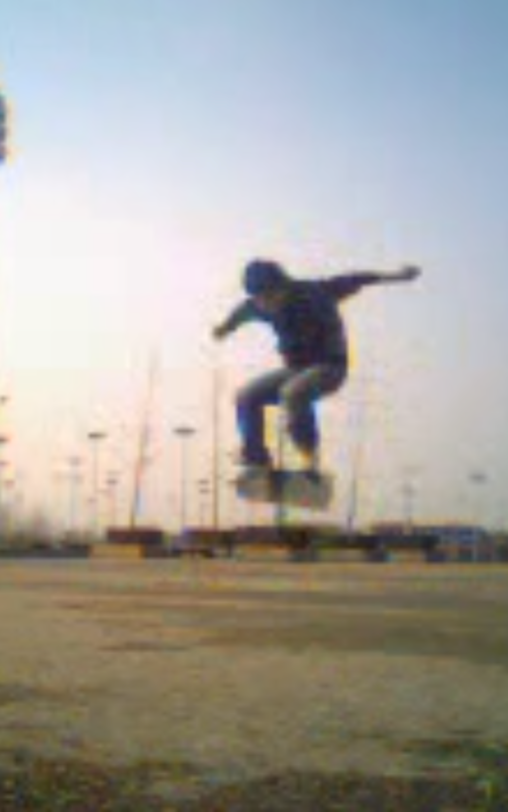

从高中的时候因为电视上的极限运动的节目，初次对滑板产生了兴趣

到了大学，终于有机会接触滑板，虽然很有天赋，各种动作也比较容易出，但无奈自己的懒惰，基本就是偶尔玩玩、长期荒废

进入工作两年，除了用小鱼板作为上下班的代步工具之外，也很少再玩滑板了

但自己总觉得不好，很多出于初心的事情真的不能随便放弃。就算再难也要坚持啊！这才是人生的乐趣所在啊！

>每个人都会说，如果自己当年好好做，现在就很厉害了，可惜啊！但这都是废话，要想自己不在一年后再说这样的话，那么就应该从现在就开始做！

在这里，我会从最基础的踩板、弹板接板、ollie等基础动作逐个规范的练习，并且在自己从头再学的过程中同步出一套记录自己学习过程的教学课程，输出一套科学的方法论！

---

这是自己在大一时候练习滑板起跳的照片，满满的回忆！

>滑板动作最重要的就是要舒展，就是要帅！